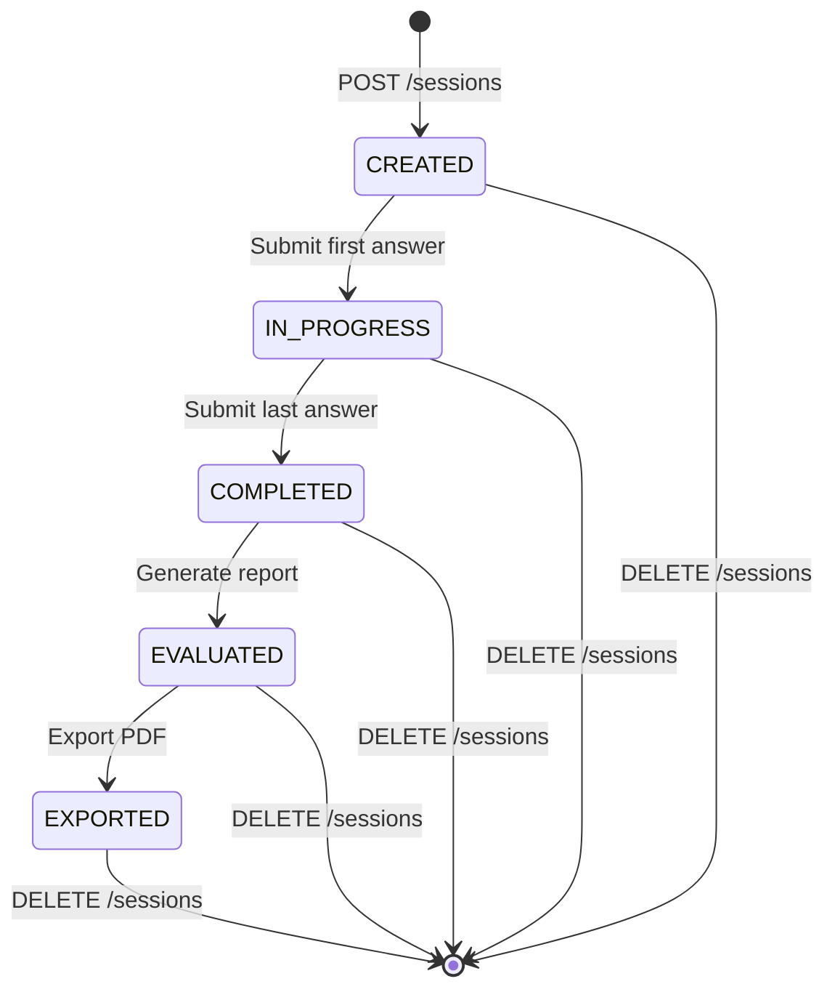

## Endpoint

```
DELETE /api/interview/sessions/{sessionId}
```

Permanently deletes an interview session and all associated data including questions, answers, evaluation results, and generated reports. This operation is irreversible.

<Warning>
  This action is **permanent and cannot be undone**. Make sure to export any reports or data you need before deleting the session.
</Warning>

## Path Parameters

<ParamField path="sessionId" type="string" required>
  The unique session identifier for the interview session to delete.
</ParamField>

## Response

<ResponseField name="code" type="integer">
  Response status code. `200` indicates successful deletion.
</ResponseField>

<ResponseField name="message" type="string">
  Response message. Returns `"success"` on successful deletion.
</ResponseField>

<ResponseField name="data" type="null">
  Always `null` for delete operations.
</ResponseField>

## Example Request

```bash
curl -X DELETE https://api.example.com/api/interview/sessions/a1b2c3d4-e5f6-4789-g0h1-i2j3k4l5m6n7
```

## Example Response

```json
{
  "code": 200,
  "message": "success",
  "data": null
}
```

## What Gets Deleted

Deleting a session removes all associated data:

<Steps>
  <Step title="Session Metadata">
    Session ID, creation timestamp, status, and configuration (question count, resume ID reference).
  </Step>
  
  <Step title="All Questions">
    Original questions, follow-up questions, question types, and categories.
  </Step>
  
  <Step title="All Answers">
    User's submitted answers for each question.
  </Step>
  
  <Step title="Evaluation Data">
    Scores, feedback, category breakdowns, strengths, and improvement suggestions.
  </Step>
  
  <Step title="Generated Reports">
    Any generated evaluation reports and their cached data.
  </Step>
</Steps>

<Note>
  The associated **resume is NOT deleted**. Only the interview session data is removed. The resume remains in the system and can be used for future interviews.
</Note>

## Use Cases

<CardGroup cols={2}>
  <Card title="Cleanup" icon="broom">
    Remove old or test interview sessions to keep the database clean.
  </Card>
  
  <Card title="Privacy" icon="user-shield">
    Delete sensitive interview data when no longer needed for privacy compliance.
  </Card>
  
  <Card title="Retry" icon="rotate">
    Delete a session to start fresh with a new interview for the same resume.
  </Card>
  
  <Card title="Storage Management" icon="database">
    Remove sessions to free up storage space in the system.
  </Card>
</CardGroup>

## Error Responses

<ResponseField name="code" type="integer">
  Error code. Non-200 values indicate an error.
</ResponseField>

<ResponseField name="message" type="string">
  Error message describing what went wrong.
</ResponseField>

<ResponseField name="data" type="null">
  Always `null` for error responses.
</ResponseField>

### Common Errors

| Code | Message | Description |
|------|---------|-------------|
| 404 | Session not found | Invalid session ID or session already deleted |
| 500 | Server error | Database error or internal server error |

<Tip>
  A 404 error on delete is **idempotent** - if the session doesn't exist, the desired state (deleted) is already achieved. You can safely treat 404 as a successful delete in your client code.
</Tip>

## Related Endpoints

<CardGroup cols={2}>
  <Card title="Export Report" icon="download" href="/api/interview/export">
    Export report as PDF before deleting
  </Card>
  
  <Card title="Get Session" icon="eye" href="/api/interview/create-session#get-session">
    Verify session exists before deleting
  </Card>
  
  <Card title="Create Session" icon="plus" href="/api/interview/create-session">
    Create a new interview session
  </Card>
  
  <Card title="Get Report" icon="file-chart-column" href="/api/interview/get-report">
    View report one last time before deletion
  </Card>
</CardGroup>

## Best Practices

<AccordionGroup>
  <Accordion title="Export Before Delete">
    Always offer users the option to export their report before deleting:
    
    ```javascript
    async function deleteSessionSafely(sessionId) {
      // Confirm with user
      const confirmed = await showConfirmDialog({
        title: 'Delete Interview Session?',
        message: 'This action cannot be undone. Would you like to export the report first?',
        buttons: ['Export & Delete', 'Delete Only', 'Cancel']
      });
      
      if (confirmed === 'Cancel') return;
      
      if (confirmed === 'Export & Delete') {
        await exportReport(sessionId);
      }
      
      // Proceed with deletion
      await fetch(`/api/interview/sessions/${sessionId}`, {
        method: 'DELETE'
      });
      
      showSuccess('Session deleted successfully');
    }
    ```
  </Accordion>
  
  <Accordion title="Confirmation Dialog">
    Always require explicit confirmation before deletion:
    
    ```javascript
    function ConfirmDeleteDialog({ sessionId, onConfirm, onCancel }) {
      return (
        <Dialog>
          <DialogTitle>Delete Interview Session?</DialogTitle>
          <DialogContent>
            <Alert severity="warning">
              This will permanently delete:
              <ul>
                <li>All interview questions and answers</li>
                <li>Evaluation scores and feedback</li>
                <li>Generated reports</li>
              </ul>
              This action cannot be undone.
            </Alert>
          </DialogContent>
          <DialogActions>
            <Button onClick={onCancel}>Cancel</Button>
            <Button onClick={onConfirm} color="error">
              Delete Permanently
            </Button>
          </DialogActions>
        </Dialog>
      );
    }
    ```
  </Accordion>
  
  <Accordion title="Bulk Delete">
    When deleting multiple sessions, handle failures gracefully:
    
    ```javascript
    async function bulkDeleteSessions(sessionIds) {
      const results = await Promise.allSettled(
        sessionIds.map(id => 
          fetch(`/api/interview/sessions/${id}`, { method: 'DELETE' })
        )
      );
      
      const succeeded = results.filter(r => r.status === 'fulfilled').length;
      const failed = results.filter(r => r.status === 'rejected').length;
      
      showMessage(`Deleted ${succeeded} sessions. ${failed} failed.`);
      
      return { succeeded, failed };
    }
    ```
  </Accordion>
  
  <Accordion title="Soft Delete Option">
    Consider implementing a soft delete with recovery period:
    
    ```javascript
    // Mark as deleted but keep data for 30 days
    async function softDeleteSession(sessionId) {
      await fetch(`/api/interview/sessions/${sessionId}`, {
        method: 'PATCH',
        body: JSON.stringify({ 
          status: 'DELETED',
          deletedAt: new Date().toISOString(),
          permanentDeleteAt: new Date(Date.now() + 30 * 24 * 60 * 60 * 1000)
        })
      });
    }
    
    // Later: actual deletion via cron job
    async function permanentlyDeleteExpired() {
      const expired = await getExpiredSessions();
      await bulkDeleteSessions(expired.map(s => s.sessionId));
    }
    ```
  </Accordion>
  
  <Accordion title="Update UI After Delete">
    Ensure UI reflects the deletion immediately:
    
    ```javascript
    async function handleDelete(sessionId) {
      try {
        // Optimistic UI update
        removeSessionFromList(sessionId);
        
        await fetch(`/api/interview/sessions/${sessionId}`, {
          method: 'DELETE'
        });
        
        showSuccess('Session deleted successfully');
      } catch (error) {
        // Rollback UI change
        restoreSessionToList(sessionId);
        showError('Failed to delete session');
      }
    }
    ```
  </Accordion>
  
  <Accordion title="Handle 404 Gracefully">
    Treat 404 as successful deletion (idempotent):
    
    ```javascript
    async function deleteSession(sessionId) {
      const response = await fetch(
        `/api/interview/sessions/${sessionId}`,
        { method: 'DELETE' }
      );
      
      // 200 = deleted, 404 = already deleted
      if (response.ok || response.status === 404) {
        return { success: true };
      }
      
      throw new Error('Delete failed');
    }
    ```
  </Accordion>
</AccordionGroup>

## Complete Delete Flow

<Steps>
  <Step title="User Initiates Delete">
    User clicks delete button for a specific interview session.
  </Step>
  
  <Step title="Show Confirmation">
    Display a confirmation dialog explaining what will be deleted and that the action is irreversible.
  </Step>
  
  <Step title="Offer Export Option">
    Provide a button to export the report before deletion, especially if the report hasn't been exported yet.
  </Step>
  
  <Step title="User Confirms">
    User explicitly confirms the deletion action.
  </Step>
  
  <Step title="Call Delete API">
    Send DELETE request to the endpoint with the session ID.
  </Step>
  
  <Step title="Update UI">
    Remove the session from the UI list and show success message.
  </Step>
  
  <Step title="Handle Errors">
    If deletion fails, show error message and allow retry. Treat 404 as success.
  </Step>
</Steps>

## Implementation Example

Complete React component for session deletion:

```jsx
import { useState } from 'react';
import { 
  Button, 
  Dialog, 
  DialogTitle, 
  DialogContent, 
  DialogActions,
  Alert 
} from '@/components/ui';

function DeleteSessionButton({ sessionId, sessionName, onDeleted }) {
  const [showDialog, setShowDialog] = useState(false);
  const [loading, setLoading] = useState(false);
  const [error, setError] = useState(null);
  
  const handleDelete = async () => {
    setLoading(true);
    setError(null);
    
    try {
      const response = await fetch(
        `/api/interview/sessions/${sessionId}`,
        { method: 'DELETE' }
      );
      
      const data = await response.json();
      
      // Handle success or 404 (idempotent)
      if (response.ok || response.status === 404) {
        setShowDialog(false);
        onDeleted?.(sessionId);
        return;
      }
      
      throw new Error(data.message || 'Delete failed');
      
    } catch (err) {
      setError(err.message);
    } finally {
      setLoading(false);
    }
  };
  
  const handleExportAndDelete = async () => {
    try {
      // Export first
      await downloadReport(sessionId);
      // Then delete
      await handleDelete();
    } catch (err) {
      setError('Export failed. Session not deleted.');
    }
  };
  
  return (
    <>
      <Button 
        onClick={() => setShowDialog(true)}
        variant="outlined"
        color="error"
      >
        Delete Session
      </Button>
      
      <Dialog open={showDialog} onClose={() => setShowDialog(false)}>
        <DialogTitle>Delete Interview Session?</DialogTitle>
        
        <DialogContent>
          <Alert severity="warning" className="mb-4">
            <strong>This action cannot be undone.</strong>
            <br />
            The following will be permanently deleted:
            <ul className="mt-2 ml-4">
              <li>All interview questions and answers</li>
              <li>Evaluation scores and feedback</li>
              <li>Generated reports and analysis</li>
            </ul>
          </Alert>
          
          {sessionName && (
            <p className="text-sm text-gray-600">
              Session: <strong>{sessionName}</strong>
            </p>
          )}
          
          {error && (
            <Alert severity="error" className="mt-2">
              {error}
            </Alert>
          )}
        </DialogContent>
        
        <DialogActions>
          <Button 
            onClick={() => setShowDialog(false)}
            disabled={loading}
          >
            Cancel
          </Button>
          
          <Button 
            onClick={handleExportAndDelete}
            disabled={loading}
            variant="outlined"
          >
            Export & Delete
          </Button>
          
          <Button 
            onClick={handleDelete}
            disabled={loading}
            color="error"
          >
            {loading ? 'Deleting...' : 'Delete Only'}
          </Button>
        </DialogActions>
      </Dialog>
    </>
  );
}

export default DeleteSessionButton;
```

## Data Retention Policy

Consider implementing an automated data retention policy:

```javascript
// Example: Auto-delete sessions older than 90 days
const RETENTION_DAYS = 90;

async function cleanupOldSessions() {
  const cutoffDate = new Date();
  cutoffDate.setDate(cutoffDate.getDate() - RETENTION_DAYS);
  
  const oldSessions = await fetchSessions({
    createdBefore: cutoffDate,
    status: ['COMPLETED', 'EVALUATED']
  });
  
  // Notify users before deletion
  await notifyUsersOfPendingDeletion(oldSessions);
  
  // Delete after grace period
  setTimeout(async () => {
    await bulkDeleteSessions(oldSessions.map(s => s.sessionId));
    console.log(`Deleted ${oldSessions.length} old sessions`);
  }, 7 * 24 * 60 * 60 * 1000); // 7 days grace period
}
```

<Note>
  Consider implementing a data retention policy that automatically deletes old sessions after a certain period (e.g., 90 days) to comply with privacy regulations and manage storage costs.
</Note>

## Interview Session Lifecycle



<Tip>
  Sessions can be deleted at any stage of the lifecycle, not just after completion. However, it's best practice to complete and export reports before deletion to preserve valuable interview data.
</Tip>