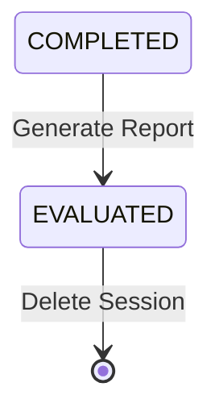

## Endpoint

```
GET /api/interview/sessions/{sessionId}/report
```

Generates a comprehensive interview evaluation report using AI analysis. The report includes overall scoring, category-based breakdowns, detailed feedback for each answer, strengths identification, improvement suggestions, and reference answers for comparison.

<Warning>
  This endpoint should only be called after the interview session is completed (status: `COMPLETED`). Calling it on an incomplete session may result in partial or invalid results.
</Warning>

## Path Parameters

<ParamField path="sessionId" type="string" required>
  The unique session identifier for the completed interview session.
</ParamField>

## Response

<ResponseField name="code" type="integer">
  Response status code. `200` indicates success.
</ResponseField>

<ResponseField name="message" type="string">
  Response message. Returns `"success"` when report is generated.
</ResponseField>

<ResponseField name="data" type="object">
  The comprehensive interview evaluation report.
  
  <Expandable title="InterviewReportDTO">
    <ResponseField name="sessionId" type="string">
      The session identifier for this report.
    </ResponseField>
    
    <ResponseField name="totalQuestions" type="integer">
      Total number of questions answered in the interview.
    </ResponseField>
    
    <ResponseField name="overallScore" type="integer">
      Overall interview score ranging from 0 to 100.
      - **90-100**: Excellent - Strong candidate with comprehensive knowledge
      - **75-89**: Good - Solid understanding with minor gaps
      - **60-74**: Adequate - Basic knowledge but needs improvement
      - **Below 60**: Needs improvement - Significant knowledge gaps
    </ResponseField>
    
    <ResponseField name="categoryScores" type="array">
      Breakdown of scores by technical category.
      
      <Expandable title="CategoryScore[]">
        <ResponseField name="category" type="string">
          Category name (e.g., "项目经历", "Java基础", "Spring", "MySQL", "Redis").
        </ResponseField>
        
        <ResponseField name="score" type="integer">
          Average score for this category (0-100).
        </ResponseField>
        
        <ResponseField name="questionCount" type="integer">
          Number of questions in this category.
        </ResponseField>
      </Expandable>
    </ResponseField>
    
    <ResponseField name="questionDetails" type="array">
      Detailed evaluation for each answered question.
      
      <Expandable title="QuestionEvaluation[]">
        <ResponseField name="questionIndex" type="integer">
          Zero-based index of the question.
        </ResponseField>
        
        <ResponseField name="question" type="string">
          The interview question text.
        </ResponseField>
        
        <ResponseField name="category" type="string">
          Question category.
        </ResponseField>
        
        <ResponseField name="userAnswer" type="string">
          The candidate's answer.
        </ResponseField>
        
        <ResponseField name="score" type="integer">
          Score for this specific answer (0-100).
        </ResponseField>
        
        <ResponseField name="feedback" type="string">
          AI-generated feedback explaining the score, highlighting what was good, and what could be improved.
        </ResponseField>
      </Expandable>
    </ResponseField>
    
    <ResponseField name="overallFeedback" type="string">
      Comprehensive summary of the candidate's overall performance, technical depth, communication skills, and readiness.
    </ResponseField>
    
    <ResponseField name="strengths" type="array">
      List of identified strengths based on the interview answers.
      
      ```
      ["深入理解Spring Cloud微服务架构", "有实际的分布式系统经验"]
      ```
    </ResponseField>
    
    <ResponseField name="improvements" type="array">
      List of suggested areas for improvement with actionable recommendations.
      
      ```
      ["需要加强对MySQL索引优化的理解", "建议深入学习Redis高可用方案"]
      ```
    </ResponseField>
    
    <ResponseField name="referenceAnswers" type="array">
      Reference answers and key points for each question to help candidates learn.
      
      <Expandable title="ReferenceAnswer[]">
        <ResponseField name="questionIndex" type="integer">
          Zero-based index matching the question.
        </ResponseField>
        
        <ResponseField name="question" type="string">
          The interview question text.
        </ResponseField>
        
        <ResponseField name="referenceAnswer" type="string">
          A comprehensive reference answer demonstrating best practices.
        </ResponseField>
        
        <ResponseField name="keyPoints" type="array">
          Critical points that should be covered in a complete answer.
          
          ```
          ["服务注册与发现机制", "负载均衡策略", "熔断降级方案", "配置中心应用"]
          ```
        </ResponseField>
      </Expandable>
    </ResponseField>
  </Expandable>
</ResponseField>

## Example Request

```bash
curl https://api.example.com/api/interview/sessions/a1b2c3d4-e5f6-4789-g0h1-i2j3k4l5m6n7/report
```

## Example Response

```json
{
  "code": 200,
  "message": "success",
  "data": {
    "sessionId": "a1b2c3d4-e5f6-4789-g0h1-i2j3k4l5m6n7",
    "totalQuestions": 8,
    "overallScore": 82,
    "categoryScores": [
      {
        "category": "项目经历",
        "score": 85,
        "questionCount": 2
      },
      {
        "category": "Spring",
        "score": 88,
        "questionCount": 3
      },
      {
        "category": "MySQL",
        "score": 75,
        "questionCount": 2
      },
      {
        "category": "Redis",
        "score": 78,
        "questionCount": 1
      }
    ],
    "questionDetails": [
      {
        "questionIndex": 0,
        "question": "请介绍一下你在电商平台项目中如何使用Spring Cloud构建微服务架构的？",
        "category": "项目经历",
        "userAnswer": "在电商平台项目中，我们使用Spring Cloud构建了微服务架构。主要包括以下组件：使用Eureka作为服务注册中心，Zuul作为API网关，Feign实现服务间调用，Hystrix提供熔断降级功能。我们将系统拆分为订单服务、商品服务、用户服务等多个微服务，通过配置中心统一管理配置，使用消息队列实现异步解耦。",
        "score": 85,
        "feedback": "回答全面，涵盖了Spring Cloud的核心组件。提到了服务注册、API网关、服务调用、熔断降级等关键点。服务拆分思路清晰。建议补充具体的技术挑战和解决方案，比如如何处理分布式事务、如何保证服务间调用的幂等性等。"
      },
      {
        "questionIndex": 1,
        "question": "你提到使用Hystrix实现熔断降级，能具体说说在什么场景下会触发熔断吗？你们是如何配置熔断参数的？",
        "category": "Spring",
        "userAnswer": "当下游服务响应时间过长或者频繁失败时会触发熔断。我们设置了超时时间为2秒，失败率超过50%时触发熔断。熔断后会返回默认值或者走降级逻辑。",
        "score": 78,
        "feedback": "理解了熔断的基本概念和触发条件。提到了超时时间和失败率阈值。但是对熔断的具体机制理解不够深入，建议补充：1) 熔断器的三种状态（关闭、打开、半开）及其转换条件；2) 时间窗口的概念；3) 最小请求数阈值；4) 半开状态下的恢复机制。"
      }
    ],
    "overallFeedback": "候选人展现了扎实的Java后端开发经验，对Spring Cloud微服务架构有较好的理解和实践经验。在项目经历和Spring框架方面表现优秀，能够清晰描述技术方案。在数据库优化和缓存设计方面有一定经验，但深度还可以提升。建议加强对底层原理的理解，特别是分布式系统的理论基础、MySQL的执行计划分析、Redis的持久化和高可用方案。整体来说，适合中高级Java开发岗位。",
    "strengths": [
      "深入理解Spring Cloud微服务架构，有实际项目经验",
      "熟悉分布式系统设计，了解服务治理的各个方面",
      "有大规模项目的实战经验，处理过高并发场景",
      "技术表达清晰，能够系统性地阐述技术方案"
    ],
    "improvements": [
      "需要加强对熔断降级机制的深入理解，包括状态转换和参数调优",
      "建议深入学习MySQL的执行计划和索引优化策略",
      "Redis的持久化机制和高可用方案需要进一步掌握",
      "可以补充更多关于分布式事务的实践经验"
    ],
    "referenceAnswers": [
      {
        "questionIndex": 0,
        "question": "请介绍一下你在电商平台项目中如何使用Spring Cloud构建微服务架构的？",
        "referenceAnswer": "在电商平台项目中，我们采用Spring Cloud全家桶构建了微服务架构。具体技术选型和实施方案如下：\n\n1. 服务注册与发现：使用Eureka Server作为注册中心，各微服务启动时自动注册，实现服务的动态发现和负载均衡。\n\n2. API网关：使用Zuul/Gateway统一对外提供服务，实现路由转发、权限校验、限流熔断等功能。\n\n3. 服务间调用：使用Feign声明式服务调用，集成Ribbon实现客户端负载均衡。\n\n4. 熔断降级：使用Hystrix实现服务保护，当依赖服务异常时自动降级，保证系统整体可用性。\n\n5. 配置中心：使用Spring Cloud Config统一管理各环境配置，支持动态刷新。\n\n6. 链路追踪：集成Sleuth+Zipkin实现分布式链路追踪，便于问题定位。\n\n7. 服务拆分：按业务领域拆分为订单服务、商品服务、用户服务、支付服务等，每个服务独立部署、独立扩展。\n\n在实施过程中，我们还解决了分布式事务（Seata）、服务间认证（JWT）、日志收集（ELK）等关键问题，整体架构支撑了日均10万+订单的业务量。",
        "keyPoints": [
          "服务注册与发现机制（Eureka）",
          "API网关功能（路由、鉴权、限流）",
          "服务间调用和负载均衡（Feign + Ribbon）",
          "熔断降级方案（Hystrix）",
          "配置中心应用（Config）",
          "链路追踪实现（Sleuth + Zipkin）",
          "服务拆分原则和实践",
          "分布式问题解决方案（事务、认证等）"
        ]
      },
      {
        "questionIndex": 1,
        "question": "你提到使用Hystrix实现熔断降级，能具体说说在什么场景下会触发熔断吗？你们是如何配置熔断参数的？",
        "referenceAnswer": "Hystrix熔断机制的工作原理和配置如下：\n\n熔断触发场景：\n1. 服务超时：依赖服务响应时间超过设定阈值\n2. 服务异常：依赖服务抛出异常\n3. 线程池/信号量满：资源耗尽无法处理请求\n\n熔断器状态：\n1. CLOSED（关闭）：服务正常，请求正常通过\n2. OPEN（打开）：达到熔断条件，快速失败，执行降级逻辑\n3. HALF_OPEN（半开）：尝试恢复，允许部分请求通过测试\n\n关键配置参数：\n1. circuitBreaker.requestVolumeThreshold: 20  // 时间窗口内最小请求数\n2. circuitBreaker.errorThresholdPercentage: 50  // 错误率阈值50%\n3. circuitBreaker.sleepWindowInMilliseconds: 5000  // 熔断后5秒进入半开状态\n4. execution.isolation.thread.timeoutInMilliseconds: 2000  // 超时时间2秒\n\n降级策略：\n1. 返回默认值或缓存数据\n2. 返回友好提示信息\n3. 调用备用服务\n\n在实际项目中，我们根据不同服务的重要性和性能特征，设置了差异化的熔断参数，并通过监控面板实时观察熔断情况。",
        "keyPoints": [
          "熔断触发条件（超时、异常、资源耗尽）",
          "熔断器三种状态及转换逻辑",
          "时间窗口和最小请求数概念",
          "错误率阈值配置",
          "半开状态的恢复机制",
          "降级策略的具体实现",
          "差异化配置和监控"
        ]
      }
    ]
  }
}
```

## Report Structure

The interview report provides multi-level insights:

<Steps>
  <Step title="Overall Score">
    High-level assessment (0-100) indicating the candidate's overall performance.
  </Step>
  
  <Step title="Category Breakdown">
    Scores grouped by technical category (Java, Spring, databases, etc.) to identify strengths and weaknesses.
  </Step>
  
  <Step title="Question-level Details">
    Individual feedback for each answer explaining what was good and what could be improved.
  </Step>
  
  <Step title="Comprehensive Feedback">
    Overall assessment summarizing performance, technical depth, and readiness for the role.
  </Step>
  
  <Step title="Actionable Insights">
    Specific strengths to leverage and improvements to focus on for growth.
  </Step>
  
  <Step title="Reference Materials">
    Model answers and key points to help candidates learn and improve.
  </Step>
</Steps>

## Related Endpoints

<CardGroup cols={2}>
  <Card title="Export Report" icon="file-pdf" href="/api/interview/export">
    Download the report as a formatted PDF
  </Card>
  
  <Card title="Get Details" icon="eye" href="#get-interview-details">
    Retrieve complete interview session details
  </Card>
  
  <Card title="Delete Session" icon="trash" href="/api/interview/delete">
    Remove the interview session and report
  </Card>
  
  <Card title="Create Session" icon="plus" href="/api/interview/create-session">
    Start a new interview session
  </Card>
</CardGroup>

## Additional Operations

### Get Interview Details

Retrieve the complete interview session including questions, answers, and evaluation details.

```
GET /api/interview/sessions/{sessionId}/details
```

<ParamField path="sessionId" type="string" required>
  The session identifier.
</ParamField>

**Example:**

```bash
curl https://api.example.com/api/interview/sessions/a1b2c3d4-e5f6-4789-g0h1-i2j3k4l5m6n7/details
```

**Response:** Returns `InterviewDetailDTO` with complete session history, all questions, answers, and evaluation data.

## Error Responses

<ResponseField name="code" type="integer">
  Error code. Non-200 values indicate an error.
</ResponseField>

<ResponseField name="message" type="string">
  Error message describing what went wrong.
</ResponseField>

<ResponseField name="data" type="null">
  Always `null` for error responses.
</ResponseField>

### Common Errors

| Code | Message | Description |
|------|---------|-------------|
| 404 | Session not found | Invalid session ID |
| 400 | Interview not completed | Cannot generate report for incomplete interview |
| 500 | AI service error | Failed to generate evaluation |
| 500 | Server error | Internal server error |

## Best Practices

<AccordionGroup>
  <Accordion title="Cache Reports">
    Report generation may take a few seconds. Cache the report once generated to avoid regenerating:
    
    ```javascript
    let cachedReport = null;
    
    async function getReport(sessionId) {
      if (cachedReport && cachedReport.sessionId === sessionId) {
        return cachedReport;
      }
      
      const response = await fetch(`/api/interview/sessions/${sessionId}/report`);
      cachedReport = response.data;
      return cachedReport;
    }
    ```
  </Accordion>
  
  <Accordion title="Display Progress Indicators">
    Show loading state while the AI generates the report:
    
    ```javascript
    showLoadingMessage('Analyzing your answers...');
    const report = await generateReport(sessionId);
    hideLoadingMessage();
    displayReport(report);
    ```
  </Accordion>
  
  <Accordion title="Visualize Category Scores">
    Use charts to make category scores more digestible:
    
    ```javascript
    // Radar chart for category comparison
    const categories = report.categoryScores.map(c => c.category);
    const scores = report.categoryScores.map(c => c.score);
    renderRadarChart(categories, scores);
    ```
  </Accordion>
  
  <Accordion title="Highlight Learning Points">
    Emphasize reference answers and key points for educational value:
    
    ```javascript
    report.referenceAnswers.forEach(ref => {
      displayReferenceAnswer(ref.question, ref.referenceAnswer);
      displayKeyPoints(ref.keyPoints);
    });
    ```
  </Accordion>
  
  <Accordion title="Export Options">
    Provide export options immediately after showing the report:
    
    ```javascript
    displayReport(report);
    showExportButton(`/api/interview/sessions/${sessionId}/export`);
    ```
  </Accordion>
</AccordionGroup>

## Report Interpretation

<Note>
  **Score Ranges:**
  - **90-100**: Excellent performance - Strong candidate with deep knowledge
  - **75-89**: Good performance - Solid understanding with room to grow
  - **60-74**: Adequate performance - Basic knowledge, needs improvement
  - **Below 60**: Needs significant improvement - Consider additional training
  
  **Category Scores** help identify specific areas of strength and weakness for targeted improvement.
</Note>

## AI Evaluation Features

The report generation uses advanced AI to:

- Evaluate technical accuracy and depth of answers
- Assess communication clarity and structure
- Identify specific knowledge gaps
- Generate personalized improvement suggestions
- Create relevant reference answers
- Provide actionable learning paths

<Tip>
  The report is designed to be educational. Encourage candidates to review reference answers and key points to learn from the interview experience.
</Tip>

## Session State Update

After generating a report, the session status automatically changes from `COMPLETED` to `EVALUATED`. This prevents duplicate report generation and marks the interview as fully processed.

