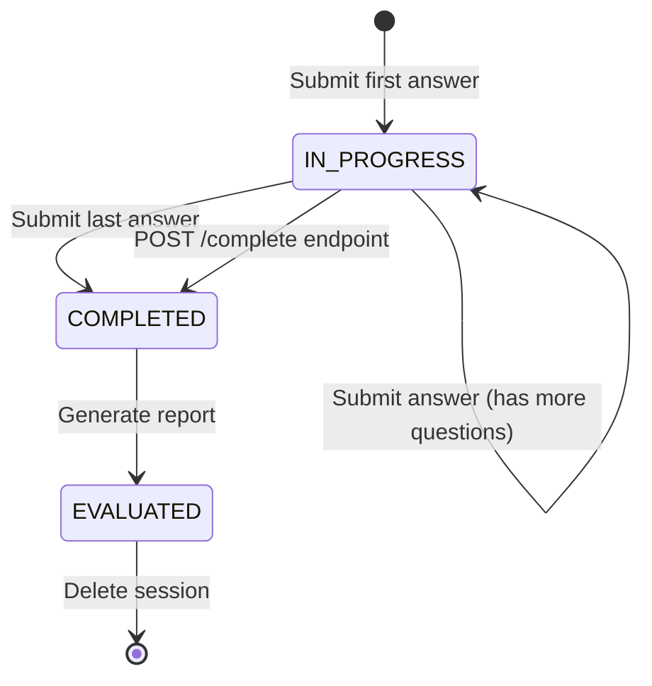

## Endpoint

```
POST /api/interview/sessions/{sessionId}/answers
```

Submits the user's answer to the current interview question and returns the next question. The system automatically advances to the next question and may generate intelligent follow-up questions based on the submitted answer.

<Info>
  This endpoint is rate-limited to 10 requests globally to ensure fair usage and prevent abuse.
</Info>

## Path Parameters

<ParamField path="sessionId" type="string" required>
  The unique session identifier obtained from the [create session](/api/interview/create-session) endpoint.
</ParamField>

## Request Body

<ParamField body="questionIndex" type="integer" required>
  The zero-based index of the question being answered. Must match the current question index in the session to prevent out-of-order submissions.
</ParamField>

<ParamField body="answer" type="string" required>
  The user's answer to the interview question. Cannot be empty.
</ParamField>

## Response

<ResponseField name="code" type="integer">
  Response status code. `200` indicates success.
</ResponseField>

<ResponseField name="message" type="string">
  Response message. Returns `"success"` on successful submission.
</ResponseField>

<ResponseField name="data" type="object">
  Contains information about the next question or completion status.
  
  <Expandable title="SubmitAnswerResponse">
    <ResponseField name="hasNextQuestion" type="boolean">
      Indicates whether there are more questions to answer.
      - `true`: More questions available, proceed to next question
      - `false`: Interview completed, all questions answered
    </ResponseField>
    
    <ResponseField name="nextQuestion" type="object" nullable>
      The next interview question. `null` if `hasNextQuestion` is `false`.
      
      <Expandable title="InterviewQuestionDTO">
        <ResponseField name="questionIndex" type="integer">
          Zero-based index of the next question.
        </ResponseField>
        
        <ResponseField name="question" type="string">
          The interview question text.
        </ResponseField>
        
        <ResponseField name="type" type="string">
          Question type: `PROJECT`, `JAVA_BASIC`, `JAVA_COLLECTION`, `JAVA_CONCURRENT`, `MYSQL`, `REDIS`, `SPRING`, `SPRING_BOOT`
        </ResponseField>
        
        <ResponseField name="category" type="string">
          Human-readable category name (e.g., "Java基础", "Spring", "MySQL").
        </ResponseField>
        
        <ResponseField name="userAnswer" type="string" nullable>
          Always `null` for new questions.
        </ResponseField>
        
        <ResponseField name="score" type="integer" nullable>
          Always `null` until evaluation.
        </ResponseField>
        
        <ResponseField name="feedback" type="string" nullable>
          Always `null` until evaluation.
        </ResponseField>
        
        <ResponseField name="isFollowUp" type="boolean">
          Whether this question is a follow-up generated based on the previous answer.
        </ResponseField>
        
        <ResponseField name="parentQuestionIndex" type="integer" nullable>
          Index of the parent question if this is a follow-up. `null` otherwise.
        </ResponseField>
      </Expandable>
    </ResponseField>
    
    <ResponseField name="currentIndex" type="integer">
      The index that was just answered (same as request `questionIndex`).
    </ResponseField>
    
    <ResponseField name="totalQuestions" type="integer">
      Total number of questions in the interview session.
    </ResponseField>
  </Expandable>
</ResponseField>

## Example Request

```bash
curl -X POST https://api.example.com/api/interview/sessions/a1b2c3d4-e5f6-4789-g0h1-i2j3k4l5m6n7/answers \
  -H "Content-Type: application/json" \
  -d '{
    "questionIndex": 0,
    "answer": "在电商平台项目中，我们使用Spring Cloud构建了微服务架构。主要包括以下组件：使用Eureka作为服务注册中心，Zuul作为API网关，Feign实现服务间调用，Hystrix提供熔断降级功能。我们将系统拆分为订单服务、商品服务、用户服务等多个微服务，通过配置中心统一管理配置，使用消息队列实现异步解耦。"
  }'
```

## Example Response (Has Next Question)

```json
{
  "code": 200,
  "message": "success",
  "data": {
    "hasNextQuestion": true,
    "nextQuestion": {
      "questionIndex": 1,
      "question": "你提到使用Hystrix实现熔断降级，能具体说说在什么场景下会触发熔断吗？你们是如何配置熔断参数的？",
      "type": "SPRING",
      "category": "Spring",
      "userAnswer": null,
      "score": null,
      "feedback": null,
      "isFollowUp": true,
      "parentQuestionIndex": 0
    },
    "currentIndex": 0,
    "totalQuestions": 8
  }
}
```

## Example Response (Interview Completed)

```json
{
  "code": 200,
  "message": "success",
  "data": {
    "hasNextQuestion": false,
    "nextQuestion": null,
    "currentIndex": 7,
    "totalQuestions": 8
  }
}
```

## Related Endpoints

<CardGroup cols={2}>
  <Card title="Save Answer" icon="floppy-disk" href="#save-answer-without-advancing">
    Save answer without advancing to next question
  </Card>
  
  <Card title="Get Current Question" icon="question" href="#get-current-question">
    Retrieve the current question without submitting
  </Card>
  
  <Card title="Generate Report" icon="file-chart-column" href="/api/interview/get-report">
    Get AI evaluation after completing interview
  </Card>
  
  <Card title="Complete Early" icon="flag-checkered" href="/api/interview/create-session#complete-interview">
    Finish interview before answering all questions
  </Card>
</CardGroup>

## Additional Operations

### Save Answer Without Advancing

Save the user's answer without advancing to the next question. Useful for auto-save functionality or allowing users to edit their answer.

```
PUT /api/interview/sessions/{sessionId}/answers
```

<ParamField path="sessionId" type="string" required>
  The unique session identifier.
</ParamField>

<ParamField body="questionIndex" type="integer" required>
  The zero-based index of the question being answered.
</ParamField>

<ParamField body="answer" type="string" required>
  The user's answer to save.
</ParamField>

**Example:**

```bash
curl -X PUT https://api.example.com/api/interview/sessions/a1b2c3d4-e5f6-4789-g0h1-i2j3k4l5m6n7/answers \
  -H "Content-Type: application/json" \
  -d '{
    "questionIndex": 0,
    "answer": "在电商平台项目中，我们使用Spring Cloud..."
  }'
```

**Response:**

```json
{
  "code": 200,
  "message": "success",
  "data": null
}
```

### Get Current Question

Retrieve the current question without submitting an answer. Useful for recovering session state or displaying the current question.

```
GET /api/interview/sessions/{sessionId}/question
```

<ParamField path="sessionId" type="string" required>
  The unique session identifier.
</ParamField>

**Example:**

```bash
curl https://api.example.com/api/interview/sessions/a1b2c3d4-e5f6-4789-g0h1-i2j3k4l5m6n7/question
```

**Response:**

```json
{
  "code": 200,
  "message": "success",
  "data": {
    "questionIndex": 0,
    "question": "请介绍一下你在电商平台项目中如何使用Spring Cloud构建微服务架构的？",
    "type": "PROJECT",
    "category": "项目经历",
    "totalQuestions": 8,
    "currentQuestionIndex": 0,
    "previousAnswer": null
  }
}
```

## Interview Flow

<Steps>
  <Step title="Submit First Answer">
    Submit the answer to question 0 using POST endpoint. Store the `nextQuestion` returned in the response.
  </Step>
  
  <Step title="Continue Until Complete">
    Repeat submission for each question. The system tracks progress automatically using `currentIndex`.
  </Step>
  
  <Step title="Handle Follow-up Questions">
    The AI may generate follow-up questions (marked with `isFollowUp: true`) based on your answers for deeper exploration.
  </Step>
  
  <Step title="Check Completion">
    When `hasNextQuestion` returns `false`, the interview is complete. Proceed to generate the evaluation report.
  </Step>
  
  <Step title="Generate Report">
    Call the [Get Report](/api/interview/get-report) endpoint to retrieve detailed evaluation, scores, and feedback.
  </Step>
</Steps>

## Error Responses

<ResponseField name="code" type="integer">
  Error code. Non-200 values indicate an error.
</ResponseField>

<ResponseField name="message" type="string">
  Error message describing what went wrong.
</ResponseField>

<ResponseField name="data" type="null">
  Always `null` for error responses.
</ResponseField>

### Common Errors

| Code | Message | Description |
|------|---------|-------------|
| 400 | 会话ID不能为空 | Session ID is required |
| 400 | 问题索引不能为空 | Question index is required |
| 400 | 问题索引无效 | Question index must be >= 0 |
| 400 | 答案不能为空 | Answer cannot be empty |
| 404 | Session not found | Invalid session ID |
| 400 | Question index mismatch | Submitted wrong question index |
| 429 | Rate limit exceeded | Too many requests |
| 500 | Server error | Internal server error |

## Best Practices

<AccordionGroup>
  <Accordion title="Auto-save Answers">
    Implement auto-save functionality using the PUT endpoint to prevent data loss:
    
    ```javascript
    // Auto-save every 30 seconds
    const autoSave = debounce(() => {
      fetch(`/api/interview/sessions/${sessionId}/answers`, {
        method: 'PUT',
        body: JSON.stringify({
          questionIndex: currentIndex,
          answer: answerText
        })
      });
    }, 30000);
    
    // User typing triggers auto-save
    answerInput.addEventListener('input', autoSave);
    ```
  </Accordion>
  
  <Accordion title="Track Progress">
    Display progress to users using `currentIndex` and `totalQuestions`:
    
    ```javascript
    const progress = (currentIndex / totalQuestions) * 100;
    progressBar.style.width = `${progress}%`;
    progressText.innerText = `Question ${currentIndex + 1} of ${totalQuestions}`;
    ```
  </Accordion>
  
  <Accordion title="Handle Follow-up Questions">
    Follow-up questions provide deeper insight. Display them with context:
    
    ```javascript
    if (nextQuestion.isFollowUp) {
      const parentQ = questions[nextQuestion.parentQuestionIndex];
      showContextBadge(`Follow-up to: ${parentQ.question}`);
    }
    ```
  </Accordion>
  
  <Accordion title="Validate Question Index">
    Always verify you're submitting the correct question index:
    
    ```javascript
    if (submittedIndex !== currentQuestionIndex) {
      console.error('Question index mismatch!');
      // Reload current question
      await getCurrentQuestion(sessionId);
    }
    ```
  </Accordion>
  
  <Accordion title="Session Recovery">
    Allow users to resume interrupted sessions:
    
    ```javascript
    // On page load
    const session = await getSession(sessionId);
    if (session.status === 'IN_PROGRESS') {
      const currentQ = await getCurrentQuestion(sessionId);
      resumeInterview(currentQ);
    }
    ```
  </Accordion>
</AccordionGroup>

## Answer Quality Tips

<Note>
  **For better evaluation results**, encourage candidates to:
  - Provide specific examples and scenarios
  - Mention concrete technologies and tools used
  - Explain the reasoning behind technical decisions
  - Include quantitative metrics where applicable
  - Describe challenges faced and solutions implemented
</Note>

## State Transitions



<Tip>
  After completion, the session status changes to `COMPLETED`. Generate the evaluation report immediately to provide feedback while the interview is fresh in the candidate's mind.
</Tip>