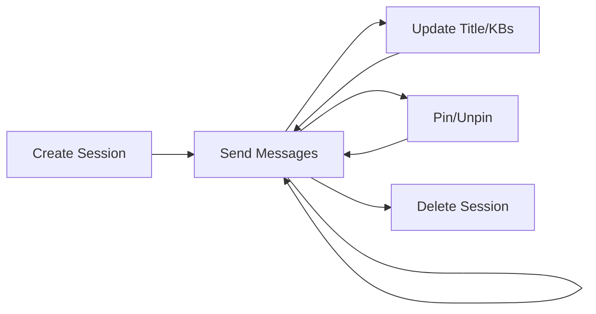

The RAG Chat API provides endpoints for creating and managing persistent chat sessions that integrate with knowledge bases using Retrieval-Augmented Generation (RAG).

## Base URL

```
http://localhost:8080/api/rag-chat
```

## Available Endpoints

<CardGroup cols={2}>
  <Card title="Create Session" icon="plus" href="/api/rag-chat/endpoints#create-session">
    POST /sessions - Start a new chat session
  </Card>
  <Card title="Send Message" icon="message" href="/api/rag-chat/endpoints#send-message-streaming">
    POST /sessions/{id}/messages/stream - Send message with streaming response
  </Card>
  <Card title="List Sessions" icon="list" href="/api/rag-chat/endpoints#list-sessions">
    GET /sessions - Get all chat sessions
  </Card>
  <Card title="Get Details" icon="info" href="/api/rag-chat/endpoints#get-session-details">
    GET /sessions/{id} - Get session with full message history
  </Card>
  <Card title="Update Title" icon="pen" href="/api/rag-chat/endpoints#update-session-title">
    PUT /sessions/{id}/title - Change session title
  </Card>
  <Card title="Pin Session" icon="thumbtack" href="/api/rag-chat/endpoints#toggle-pin-status">
    PUT /sessions/{id}/pin - Toggle pin status
  </Card>
  <Card title="Update Knowledge Bases" icon="database" href="/api/rag-chat/endpoints#update-knowledge-bases">
    PUT /sessions/{id}/knowledge-bases - Change queried knowledge bases
  </Card>
  <Card title="Delete Session" icon="trash" href="/api/rag-chat/endpoints#delete-session">
    DELETE /sessions/{id} - Remove session and messages
  </Card>
</CardGroup>

## Authentication

Currently, the API does not require authentication. In production deployments, implement authentication and authorization to ensure users can only access their own sessions.

## Response Format

All endpoints (except streaming) return responses in this format:

```json
{
  "code": 200,
  "message": "success",
  "data": { /* endpoint-specific data */ }
}
```

Error responses:

```json
{
  "code": 400,
  "message": "Invalid request: knowledgeBaseIds cannot be empty",
  "data": null
}
```

## Common Error Codes

| Code | Description |
|------|-------------|
| 200 | Success |
| 400 | Bad Request - Invalid input |
| 404 | Not Found - Session does not exist |
| 500 | Internal Server Error |

## Session Lifecycle



## See Also

- [RAG Chat Feature Overview](/features/rag-chat)
- [Knowledge Base API](/api/knowledgebase/query)
- [Streaming Responses Guide](/development/frontend/api-integration)
