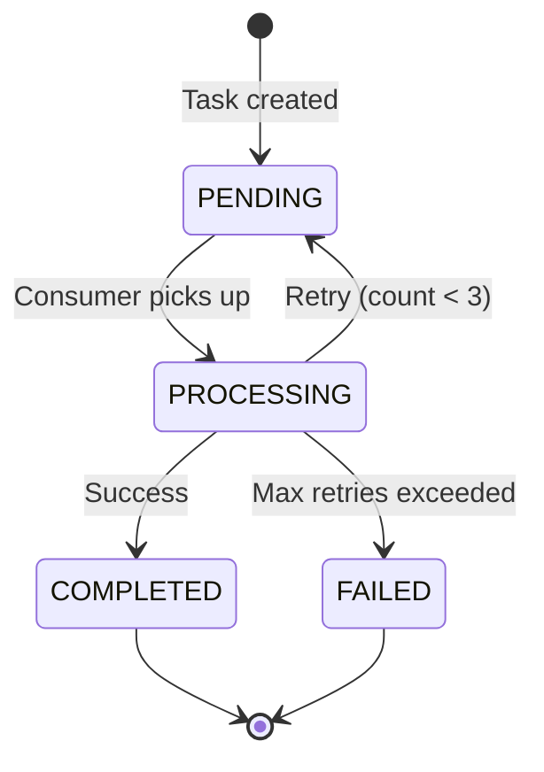

## Overview

InterviewGuide uses Redis Streams for asynchronous processing of long-running AI operations. This architecture decouples request handling from compute-intensive tasks, providing:

- **Immediate response**: API returns task ID instantly
- **Background processing**: AI analysis runs without blocking
- **Horizontal scaling**: Add more consumers to increase throughput
- **Reliability**: Automatic retries and failure handling
- **Progress tracking**: Real-time status updates via polling

<Note>
Redis Streams provide message queue semantics (consumer groups, acknowledgments, delivery guarantees) without the operational complexity of Kafka or RabbitMQ.
</Note>

## Architecture Pattern

### Template Method Pattern

All async processing follows a consistent pattern using abstract base classes:

```
AbstractStreamProducer<T>          AbstractStreamConsumer<T>
         ↑                                   ↑
         |                                   |
    ┌────┴────┐                      ┌──────┴──────┐
    |         |                      |             |
Resume    Knowledge             Resume         Knowledge
Analyze   Vectorize             Analyze        Vectorize
Producer  Producer              Consumer       Consumer
```

**Benefits**:
- **Code reuse**: Common logic (retries, state transitions, error handling) in base classes
- **Consistency**: All async tasks follow same patterns
- **Type safety**: Generic `<T>` payload ensures compile-time checking
- **Maintainability**: Business logic isolated in concrete implementations

## State Machine

### Task Lifecycle

All async tasks follow this state machine:



### State Definitions

<Tabs>
  <Tab title="PENDING">
    **Initial state after task creation**
    
    ```java
    // app/src/main/java/interview/guide/common/model/AsyncTaskStatus.java
    public enum AsyncTaskStatus {
        PENDING,      // Task queued, waiting for consumer
        PROCESSING,   // Consumer actively processing
        COMPLETED,    // Successfully finished
        FAILED        // Failed after max retries
    }
    ```
    
    **Characteristics**:
    - Task exists in database and Redis Stream
    - No consumer has claimed the message yet
    - Frontend can display "Queued" or "Waiting" status
    - Typical duration: under 100ms (consumer picks up quickly)
  </Tab>
  
  <Tab title="PROCESSING">
    **Consumer is actively working on the task**
    
    ```java
    // app/modules/resume/listener/AnalyzeStreamConsumer.java:86
    @Override
    protected void markProcessing(AnalyzePayload payload) {
        updateAnalyzeStatus(payload.resumeId(), AsyncTaskStatus.PROCESSING, null);
    }
    ```
    
    **Characteristics**:
    - Consumer has read message from stream
    - Database record updated to PROCESSING
    - LLM API call in progress
    - Frontend displays loading animation
    - Typical duration: 5-30 seconds (depends on LLM response time)
  </Tab>
  
  <Tab title="COMPLETED">
    **Task finished successfully**
    
    ```java
    // app/modules/resume/listener/AnalyzeStreamConsumer.java:108
    @Override
    protected void markCompleted(AnalyzePayload payload) {
        updateAnalyzeStatus(payload.resumeId(), AsyncTaskStatus.COMPLETED, null);
    }
    ```
    
    **Characteristics**:
    - Analysis results saved to database
    - Message ACK'd and removed from stream
    - Frontend displays results
    - PDF export becomes available
  </Tab>
  
  <Tab title="FAILED">
    **Task failed after all retry attempts**
    
    ```java
    // app/modules/resume/listener/AnalyzeStreamConsumer.java:113
    @Override
    protected void markFailed(AnalyzePayload payload, String error) {
        updateAnalyzeStatus(payload.resumeId(), AsyncTaskStatus.FAILED, error);
    }
    ```
    
    **Characteristics**:
    - Error message truncated to 500 chars and stored
    - Message ACK'd (won't retry again)
    - Frontend displays error with retry button
    - User can manually trigger re-analysis
  </Tab>
</Tabs>

## Producer Pattern

### AbstractStreamProducer

Base class providing message sending infrastructure:

```java
// app/src/main/java/interview/guide/common/async/AbstractStreamProducer.java
@Slf4j
public abstract class AbstractStreamProducer<T> {

    private final RedisService redisService;

    protected AbstractStreamProducer(RedisService redisService) {
        this.redisService = redisService;
    }

    protected void sendTask(T payload) {
        try {
            String messageId = redisService.streamAdd(
                streamKey(),                          // e.g., "resume:analyze:stream"
                buildMessage(payload),                // Map<String, String>
                AsyncTaskStreamConstants.STREAM_MAX_LEN  // 1000 messages
            );
            log.info("{}任务已发送到Stream: {}, messageId={}",
                taskDisplayName(), payloadIdentifier(payload), messageId);
        } catch (Exception e) {
            log.error("发送{}任务失败: {}, error={}",
                taskDisplayName(), payloadIdentifier(payload), e.getMessage(), e);
            onSendFailed(payload, "任务入队失败: " + e.getMessage());
        }
    }

    // Abstract methods to be implemented by subclasses
    protected abstract String taskDisplayName();  // e.g., "简历分析"
    protected abstract String streamKey();        // e.g., "resume:analyze:stream"
    protected abstract Map<String, String> buildMessage(T payload);
    protected abstract String payloadIdentifier(T payload);  // e.g., "resumeId=123"
    protected abstract void onSendFailed(T payload, String error);
}
```

### Concrete Producer Example: Resume Analysis

```java
// app/src/main/java/interview/guide/modules/resume/listener/AnalyzeStreamProducer.java
@Slf4j
@Component
public class AnalyzeStreamProducer extends AbstractStreamProducer<AnalyzeStreamProducer.AnalyzeTaskPayload> {

    private final ResumeRepository resumeRepository;

    // Immutable payload using Java record
    record AnalyzeTaskPayload(Long resumeId, String content) {}

    public AnalyzeStreamProducer(RedisService redisService, ResumeRepository resumeRepository) {
        super(redisService);
        this.resumeRepository = resumeRepository;
    }

    /**
     * Public API to send analysis task
     */
    public void sendAnalyzeTask(Long resumeId, String content) {
        sendTask(new AnalyzeTaskPayload(resumeId, content));
    }

    @Override
    protected String taskDisplayName() {
        return "分析";
    }

    @Override
    protected String streamKey() {
        return AsyncTaskStreamConstants.RESUME_ANALYZE_STREAM_KEY;  // "resume:analyze:stream"
    }

    @Override
    protected Map<String, String> buildMessage(AnalyzeTaskPayload payload) {
        return Map.of(
            AsyncTaskStreamConstants.FIELD_RESUME_ID, payload.resumeId().toString(),
            AsyncTaskStreamConstants.FIELD_CONTENT, payload.content(),
            AsyncTaskStreamConstants.FIELD_RETRY_COUNT, "0"  // Initial attempt
        );
    }

    @Override
    protected String payloadIdentifier(AnalyzeTaskPayload payload) {
        return "resumeId=" + payload.resumeId();
    }

    @Override
    protected void onSendFailed(AnalyzeTaskPayload payload, String error) {
        // If we can't even queue the task, mark it as failed immediately
        resumeRepository.findById(payload.resumeId()).ifPresent(resume -> {
            resume.setAnalyzeStatus(AsyncTaskStatus.FAILED);
            resume.setAnalyzeError(truncateError(error));
            resumeRepository.save(resume);
        });
    }
}
```

**Usage in Service Layer**:

```java
@Service
public class ResumeUploadService {
    private final AnalyzeStreamProducer analyzeProducer;
    private final ResumeRepository repository;
    
    public ResumeUploadResponse uploadResume(MultipartFile file) {
        // 1. Parse file content
        String content = fileParser.extractText(file.getInputStream());
        
        // 2. Save to database with PENDING status
        ResumeEntity resume = new ResumeEntity();
        resume.setFileName(file.getOriginalFilename());
        resume.setContent(content);
        resume.setAnalyzeStatus(AsyncTaskStatus.PENDING);
        resume = repository.save(resume);
        
        // 3. Queue async task
        analyzeProducer.sendAnalyzeTask(resume.getId(), content);
        
        // 4. Return immediately with task ID
        return new ResumeUploadResponse(resume.getId(), "PENDING");
    }
}
```

## Consumer Pattern

### AbstractStreamConsumer

Base class managing consumer lifecycle and message processing:

```java
// app/src/main/java/interview/guide/common/async/AbstractStreamConsumer.java
@Slf4j
public abstract class AbstractStreamConsumer<T> {

    private final RedisService redisService;
    private final AtomicBoolean running = new AtomicBoolean(false);
    private ExecutorService executorService;
    private String consumerName;

    protected AbstractStreamConsumer(RedisService redisService) {
        this.redisService = redisService;
    }

    @PostConstruct
    public void init() {
        // Generate unique consumer name
        this.consumerName = consumerPrefix() + UUID.randomUUID().toString().substring(0, 8);

        // Create consumer group (idempotent operation)
        try {
            redisService.createStreamGroup(streamKey(), groupName());
            log.info("Redis Stream 消费者组已创建或已存在: {}", groupName());
        } catch (Exception e) {
            log.warn("创建消费者组时发生异常（可能已存在）: {}", e.getMessage());
        }

        // Start consumer thread
        this.executorService = Executors.newSingleThreadExecutor(r -> {
            Thread t = new Thread(r, threadName());
            t.setDaemon(true);  // Don't block JVM shutdown
            return t;
        });

        running.set(true);
        executorService.submit(this::consumeLoop);
        log.info("{}消费者已启动: consumerName={}", taskDisplayName(), consumerName);
    }

    @PreDestroy
    public void shutdown() {
        running.set(false);
        if (executorService != null) {
            executorService.shutdown();
        }
        log.info("{}消费者已关闭: consumerName={}", taskDisplayName(), consumerName);
    }

    /**
     * Main consumer loop - runs until application shutdown
     */
    private void consumeLoop() {
        while (running.get()) {
            try {
                redisService.streamConsumeMessages(
                    streamKey(),
                    groupName(),
                    consumerName,
                    AsyncTaskStreamConstants.BATCH_SIZE,        // 10 messages per batch
                    AsyncTaskStreamConstants.POLL_INTERVAL_MS,  // 1000ms blocking timeout
                    this::processMessage
                );
            } catch (Exception e) {
                if (Thread.currentThread().isInterrupted()) {
                    log.info("消费者线程被中断");
                    break;
                }
                log.error("消费消息时发生错误: {}", e.getMessage(), e);
            }
        }
    }

    /**
     * Process individual message with retry logic
     */
    private void processMessage(StreamMessageId messageId, Map<String, String> data) {
        T payload = parsePayload(messageId, data);
        if (payload == null) {
            ackMessage(messageId);  // Invalid message, skip
            return;
        }

        int retryCount = parseRetryCount(data);
        log.info("开始处理{}任务: {}, messageId={}, retryCount={}",
            taskDisplayName(), payloadIdentifier(payload), messageId, retryCount);

        try {
            markProcessing(payload);
            processBusiness(payload);  // Subclass implements actual logic
            markCompleted(payload);
            ackMessage(messageId);
            log.info("{}任务完成: {}", taskDisplayName(), payloadIdentifier(payload));
            
        } catch (Exception e) {
            log.error("{}任务失败: {}, error={}", 
                taskDisplayName(), payloadIdentifier(payload), e.getMessage(), e);
            
            // Retry logic
            if (retryCount < AsyncTaskStreamConstants.MAX_RETRY_COUNT) {  // 3 retries
                retryMessage(payload, retryCount + 1);
            } else {
                markFailed(payload, truncateError(
                    taskDisplayName() + "失败(已重试" + retryCount + "次): " + e.getMessage()
                ));
            }
            ackMessage(messageId);  // Always ACK to prevent infinite loops
        }
    }

    // Abstract methods to be implemented by subclasses
    protected abstract String taskDisplayName();
    protected abstract String streamKey();
    protected abstract String groupName();
    protected abstract String consumerPrefix();
    protected abstract String threadName();
    protected abstract T parsePayload(StreamMessageId messageId, Map<String, String> data);
    protected abstract String payloadIdentifier(T payload);
    protected abstract void markProcessing(T payload);
    protected abstract void processBusiness(T payload);  // Core business logic here
    protected abstract void markCompleted(T payload);
    protected abstract void markFailed(T payload, String error);
    protected abstract void retryMessage(T payload, int retryCount);
}
```

### Concrete Consumer Example: Resume Analysis

```java
// app/src/main/java/interview/guide/modules/resume/listener/AnalyzeStreamConsumer.java
@Slf4j
@Component
public class AnalyzeStreamConsumer extends AbstractStreamConsumer<AnalyzeStreamConsumer.AnalyzePayload> {

    private final ResumeGradingService gradingService;      // AI analysis service
    private final ResumePersistenceService persistenceService;
    private final ResumeRepository resumeRepository;

    public AnalyzeStreamConsumer(
        RedisService redisService,
        ResumeGradingService gradingService,
        ResumePersistenceService persistenceService,
        ResumeRepository resumeRepository
    ) {
        super(redisService);
        this.gradingService = gradingService;
        this.persistenceService = persistenceService;
        this.resumeRepository = resumeRepository;
    }

    record AnalyzePayload(Long resumeId, String content) {}

    @Override
    protected String taskDisplayName() {
        return "简历分析";
    }

    @Override
    protected String streamKey() {
        return AsyncTaskStreamConstants.RESUME_ANALYZE_STREAM_KEY;
    }

    @Override
    protected String groupName() {
        return AsyncTaskStreamConstants.RESUME_ANALYZE_GROUP_NAME;  // "analyze-group"
    }

    @Override
    protected String consumerPrefix() {
        return AsyncTaskStreamConstants.RESUME_ANALYZE_CONSUMER_PREFIX;  // "analyze-consumer-"
    }

    @Override
    protected String threadName() {
        return "analyze-consumer";
    }

    @Override
    protected AnalyzePayload parsePayload(StreamMessageId messageId, Map<String, String> data) {
        String resumeIdStr = data.get(AsyncTaskStreamConstants.FIELD_RESUME_ID);
        String content = data.get(AsyncTaskStreamConstants.FIELD_CONTENT);
        
        if (resumeIdStr == null || content == null) {
            log.warn("消息格式错误，跳过: messageId={}", messageId);
            return null;
        }
        
        return new AnalyzePayload(Long.parseLong(resumeIdStr), content);
    }

    @Override
    protected String payloadIdentifier(AnalyzePayload payload) {
        return "resumeId=" + payload.resumeId();
    }

    @Override
    protected void markProcessing(AnalyzePayload payload) {
        updateAnalyzeStatus(payload.resumeId(), AsyncTaskStatus.PROCESSING, null);
    }

    /**
     * Core business logic: Call AI service and save results
     */
    @Override
    protected void processBusiness(AnalyzePayload payload) {
        Long resumeId = payload.resumeId();
        
        // Check if resume still exists (user might have deleted it)
        if (!resumeRepository.existsById(resumeId)) {
            log.warn("简历已被删除，跳过分析任务: resumeId={}", resumeId);
            return;
        }

        // Call AI service (may take 5-30 seconds)
        ResumeAnalysisResponse analysis = gradingService.analyzeResume(payload.content());
        
        // Save results
        ResumeEntity resume = resumeRepository.findById(resumeId).orElse(null);
        if (resume == null) {
            log.warn("简历在分析期间被删除，跳过保存结果: resumeId={}", resumeId);
            return;
        }
        
        persistenceService.saveAnalysis(resume, analysis);
    }

    @Override
    protected void markCompleted(AnalyzePayload payload) {
        updateAnalyzeStatus(payload.resumeId(), AsyncTaskStatus.COMPLETED, null);
    }

    @Override
    protected void markFailed(AnalyzePayload payload, String error) {
        updateAnalyzeStatus(payload.resumeId(), AsyncTaskStatus.FAILED, error);
    }

    /**
     * Retry logic: Send message back to stream with incremented retry count
     */
    @Override
    protected void retryMessage(AnalyzePayload payload, int retryCount) {
        Long resumeId = payload.resumeId();
        String content = payload.content();
        
        try {
            Map<String, String> message = Map.of(
                AsyncTaskStreamConstants.FIELD_RESUME_ID, resumeId.toString(),
                AsyncTaskStreamConstants.FIELD_CONTENT, content,
                AsyncTaskStreamConstants.FIELD_RETRY_COUNT, String.valueOf(retryCount)
            );

            redisService().streamAdd(
                AsyncTaskStreamConstants.RESUME_ANALYZE_STREAM_KEY,
                message,
                AsyncTaskStreamConstants.STREAM_MAX_LEN
            );
            
            log.info("简历分析任务已重新入队: resumeId={}, retryCount={}", resumeId, retryCount);

        } catch (Exception e) {
            log.error("重试入队失败: resumeId={}, error={}", resumeId, e.getMessage(), e);
            updateAnalyzeStatus(resumeId, AsyncTaskStatus.FAILED, 
                truncateError("重试入队失败: " + e.getMessage()));
        }
    }

    /**
     * Update resume status in database
     */
    private void updateAnalyzeStatus(Long resumeId, AsyncTaskStatus status, String error) {
        try {
            resumeRepository.findById(resumeId).ifPresent(resume -> {
                resume.setAnalyzeStatus(status);
                resume.setAnalyzeError(error);
                resumeRepository.save(resume);
                log.debug("分析状态已更新: resumeId={}, status={}", resumeId, status);
            });
        } catch (Exception e) {
            log.error("更新分析状态失败: resumeId={}, status={}, error={}", 
                resumeId, status, e.getMessage(), e);
        }
    }
}
```

## Stream Configuration

### Constants

```java
// app/src/main/java/interview/guide/common/constant/AsyncTaskStreamConstants.java
public final class AsyncTaskStreamConstants {

    // ========== Consumer Configuration ==========
    
    /**
     * Maximum retry attempts before marking as FAILED
     */
    public static final int MAX_RETRY_COUNT = 3;
    
    /**
     * Number of messages to fetch per batch
     */
    public static final int BATCH_SIZE = 10;
    
    /**
     * Blocking timeout for stream read (milliseconds)
     * Redis will wait up to this duration for new messages
     */
    public static final long POLL_INTERVAL_MS = 1000;
    
    /**
     * Maximum stream length (auto-trim old messages)
     */
    public static final int STREAM_MAX_LEN = 1000;

    // ========== Resume Analysis Stream ==========
    
    public static final String RESUME_ANALYZE_STREAM_KEY = "resume:analyze:stream";
    public static final String RESUME_ANALYZE_GROUP_NAME = "analyze-group";
    public static final String RESUME_ANALYZE_CONSUMER_PREFIX = "analyze-consumer-";
    public static final String FIELD_RESUME_ID = "resumeId";
    
    // ========== Knowledge Base Vectorization Stream ==========
    
    public static final String KB_VECTORIZE_STREAM_KEY = "knowledgebase:vectorize:stream";
    public static final String KB_VECTORIZE_GROUP_NAME = "vectorize-group";
    public static final String KB_VECTORIZE_CONSUMER_PREFIX = "vectorize-consumer-";
    public static final String FIELD_KB_ID = "kbId";
    
    // ========== Interview Evaluation Stream ==========
    
    public static final String INTERVIEW_EVALUATE_STREAM_KEY = "interview:evaluate:stream";
    public static final String INTERVIEW_EVALUATE_GROUP_NAME = "evaluate-group";
    public static final String INTERVIEW_EVALUATE_CONSUMER_PREFIX = "evaluate-consumer-";
    public static final String FIELD_SESSION_ID = "sessionId";
    
    // ========== Common Fields ==========
    
    public static final String FIELD_RETRY_COUNT = "retryCount";
    public static final String FIELD_CONTENT = "content";
}
```

## Redis Service Layer

### Stream Operations

Low-level Redis Stream operations wrapped in `RedisService`:

```java
// app/src/main/java/interview/guide/infrastructure/redis/RedisService.java
@Service
@RequiredArgsConstructor
public class RedisService {

    private final RedissonClient redissonClient;

    /**
     * Create consumer group (idempotent)
     */
    public void createStreamGroup(String streamKey, String groupName) {
        RStream<String, String> stream = redissonClient.getStream(streamKey, StringCodec.INSTANCE);
        try {
            stream.createGroup(StreamCreateGroupArgs.name(groupName).makeStream());
            log.info("创建 Stream 消费者组: stream={}, group={}", streamKey, groupName);
        } catch (Exception e) {
            // Group already exists, ignore BUSYGROUP error
            if (!e.getMessage().contains("BUSYGROUP")) {
                log.warn("创建消费者组失败: {}", e.getMessage());
            }
        }
    }

    /**
     * Add message to stream with optional length limit
     */
    public String streamAdd(String streamKey, Map<String, String> message, int maxLen) {
        RStream<String, String> stream = redissonClient.getStream(streamKey, StringCodec.INSTANCE);
        StreamAddArgs<String, String> args = StreamAddArgs.entries(message);
        
        if (maxLen > 0) {
            args.trimNonStrict().maxLen(maxLen);  // MAXLEN ~ 1000 (approximate trim)
        }
        
        StreamMessageId messageId = stream.add(args);
        log.debug("发送 Stream 消息: stream={}, messageId={}, maxLen={}", 
            streamKey, messageId, maxLen);
        return messageId.toString();
    }

    /**
     * Consume messages using blocking read
     * 
     * This method blocks at the Redis server level, not client level.
     * Redis waits up to `blockTimeoutMs` for new messages, which is
     * much more efficient than client-side polling.
     */
    public boolean streamConsumeMessages(
            String streamKey,
            String groupName,
            String consumerName,
            int count,
            long blockTimeoutMs,
            StreamMessageProcessor processor) {

        RStream<String, String> stream = redissonClient.getStream(streamKey, StringCodec.INSTANCE);

        // XREADGROUP GROUP <groupName> <consumerName> BLOCK <blockTimeoutMs> COUNT <count>
        Map<StreamMessageId, Map<String, String>> messages = stream.readGroup(
            groupName,
            consumerName,
            StreamReadGroupArgs.neverDelivered()  // Only read new messages (>)
                .count(count)
                .timeout(Duration.ofMillis(blockTimeoutMs))
        );

        if (messages == null || messages.isEmpty()) {
            return false;  // Timeout, no messages
        }

        // Process all messages in batch
        for (Map.Entry<StreamMessageId, Map<String, String>> entry : messages.entrySet()) {
            processor.process(entry.getKey(), entry.getValue());
        }

        return true;
    }

    /**
     * Acknowledge message (remove from pending list)
     */
    public void streamAck(String streamKey, String groupName, StreamMessageId... ids) {
        RStream<String, String> stream = redissonClient.getStream(streamKey, StringCodec.INSTANCE);
        stream.ack(groupName, ids);  // XACK <streamKey> <groupName> <id1> <id2> ...
    }

    @FunctionalInterface
    public interface StreamMessageProcessor {
        void process(StreamMessageId messageId, Map<String, String> data);
    }
}
```

## Retry Mechanism

### Exponential Backoff

Retries are immediate (no backoff delay) but limited to 3 attempts:

```
Attempt 1: Immediate processing
    ↓ (fails)
Attempt 2: Re-queue with retryCount=1
    ↓ (fails)
Attempt 3: Re-queue with retryCount=2
    ↓ (fails)
Attempt 4: Re-queue with retryCount=3
    ↓ (fails)
FAILED: Mark as FAILED, no more retries
```

**Why no backoff delay?**

- **Transient failures**: Most LLM API failures are rate limits (429) that resolve within seconds
- **Fast feedback**: Users see results sooner when retries succeed quickly
- **Simple implementation**: No need for delayed message scheduling

**Future enhancement**: Add exponential backoff for production deployments:

```java
// Potential implementation with Redis sorted set for delayed retry
public void retryWithBackoff(AnalyzePayload payload, int retryCount) {
    long delayMs = Math.min(1000 * (1L << retryCount), 60000);  // Max 60s
    long executeAt = System.currentTimeMillis() + delayMs;
    
    // Add to delayed queue (Redis sorted set)
    redisService.zAdd("retry:delayed", executeAt, serializePayload(payload));
}
```

## Error Handling

### Error Categories

<Accordion title="Transient Errors (Retryable)">

**Network issues, API rate limits, temporary service unavailability**

```java
// Caught in AbstractStreamConsumer.processMessage()
try {
    processBusiness(payload);
} catch (Exception e) {
    // Retry if attempts remaining
    if (retryCount < MAX_RETRY_COUNT) {
        retryMessage(payload, retryCount + 1);
    }
}
```

**Common transient errors**:
- LLM API rate limit (429 Too Many Requests)
- Network timeout (SocketTimeoutException)
- Database connection pool exhausted
- Temporary Redis unavailability

</Accordion>

<Accordion title="Permanent Errors (Not Retryable)">

**Data validation failures, logical errors, missing resources**

```java
@Override
protected void processBusiness(AnalyzePayload payload) {
    // Check if resource exists before processing
    if (!resumeRepository.existsById(payload.resumeId())) {
        log.warn("简历已被删除，跳过分析任务: resumeId={}", payload.resumeId());
        return;  // Don't throw exception, just skip
    }
    
    // Process...
}
```

**Permanent errors should skip retry**:
- User deleted the resume during processing
- Invalid resume content (empty file)
- Unsupported file format
- Malformed data in database

</Accordion>

### Error Truncation

Errors are truncated to 500 characters to prevent database bloat:

```java
// app/common/async/AbstractStreamConsumer.java:123
protected String truncateError(String error) {
    if (error == null) {
        return null;
    }
    return error.length() > 500 ? error.substring(0, 500) : error;
}

// Usage
markFailed(payload, truncateError(
    "简历分析失败(已重试3次): " + e.getMessage()
));
```

## Performance Optimization

### Blocking Read vs Polling

<Tabs>
  <Tab title="Blocking Read (Current)">
    **Redis server waits for messages**
    
    ```java
    // Consumer blocks at Redis server level
    stream.readGroup(
        groupName, consumerName,
        StreamReadGroupArgs.neverDelivered()
            .timeout(Duration.ofMillis(1000))  // Block up to 1 second
    );
    ```
    
    **Benefits**:
    - Low latency: Sub-millisecond response when message arrives
    - Low CPU: No busy-waiting on client
    - Low network: Single long-lived connection
    - Scalable: Thousands of consumers can block efficiently
  </Tab>
  
  <Tab title="Polling (Anti-pattern)">
    **Client repeatedly checks for messages**
    
    ```java
    // DON'T DO THIS - wasteful polling
    while (running.get()) {
        var messages = stream.readGroup(groupName, consumerName, ...);
        if (messages.isEmpty()) {
            Thread.sleep(100);  // Wait and retry
        }
    }
    ```
    
    **Problems**:
    - Higher latency: 50ms average delay (half of sleep duration)
    - Higher CPU: Constant wake-up cycles
    - Higher network: Frequent empty requests
    - Poor scalability: N consumers × polling rate = network overhead
  </Tab>
</Tabs>

### Batch Processing

Consumers fetch up to 10 messages per read:

```java
public static final int BATCH_SIZE = 10;

// Each read can return multiple messages
stream.readGroup(
    groupName, consumerName,
    StreamReadGroupArgs.neverDelivered()
        .count(BATCH_SIZE)  // Fetch up to 10
);
```

**Benefits**:
- **Reduced Redis round-trips**: 1 call for 10 messages instead of 10 calls
- **Higher throughput**: Process 10 tasks per second → 100 tasks per second
- **Better resource utilization**: Amortize network/CPU overhead

**Trade-offs**:
- **Increased latency**: Message 10 waits for messages 1-9 to process
- **Memory pressure**: All 10 payloads loaded simultaneously
- **Failure blast radius**: If consumer crashes, lose 10 in-flight messages

For this application, batch size of 10 balances throughput and latency.

## Monitoring and Observability

### Log Structure

All async operations produce structured logs:

```java
// Producer logs
log.info("{}任务已发送到Stream: {}, messageId={}",
    taskDisplayName(), payloadIdentifier(payload), messageId);
// Output: 分析任务已发送到Stream: resumeId=123, messageId=1234567890-0

// Consumer logs
log.info("开始处理{}任务: {}, messageId={}, retryCount={}",
    taskDisplayName(), payloadIdentifier(payload), messageId, retryCount);
// Output: 开始处理简历分析任务: resumeId=123, messageId=1234567890-0, retryCount=0

log.info("{}任务完成: {}", taskDisplayName(), payloadIdentifier(payload));
// Output: 简历分析任务完成: resumeId=123
```

### Metrics to Track

<CardGroup cols={2}>
  <Card title="Throughput" icon="gauge">
    - Messages processed per second
    - Average processing time per message
    - Stream length (pending messages)
  </Card>
  
  <Card title="Reliability" icon="shield-check">
    - Retry rate (% of messages retried)
    - Failure rate (% marked as FAILED)
    - Consumer lag (time from enqueue to process)
  </Card>
  
  <Card title="Resource Usage" icon="server">
    - Redis memory (stream + cache)
    - Consumer CPU/memory
    - Database connections
  </Card>
  
  <Card title="Business KPIs" icon="chart-line">
    - Resume analysis completion rate
    - Average analysis time
    - User satisfaction (failed tasks)
  </Card>
</CardGroup>

### Redis Commands for Debugging

```bash
# Check stream length
XLEN resume:analyze:stream

# View consumer groups
XINFO GROUPS resume:analyze:stream

# View pending messages
XPENDING resume:analyze:stream analyze-group

# View last 10 messages
XREVRANGE resume:analyze:stream + - COUNT 10

# Monitor in real-time
MONITOR
```

## Comparison with Alternatives

<Tabs>
  <Tab title="Redis Stream (Current)">
    **Pros**:
    - ✅ Single dependency (also used for caching)
    - ✅ Low operational complexity
    - ✅ Sub-millisecond latency
    - ✅ Consumer groups built-in
    - ✅ Message persistence (AOF)
    - ✅ Sufficient for under 10k msg/s
    
    **Cons**:
    - ❌ No built-in DLQ (dead letter queue)
    - ❌ Limited to single Redis instance (no partitioning)
    - ❌ Manual retry logic required
  </Tab>
  
  <Tab title="Kafka">
    **Pros**:
    - ✅ Horizontal partitioning (millions of msg/s)
    - ✅ Long-term message retention
    - ✅ Rich ecosystem (Kafka Connect, Streams API)
    
    **Cons**:
    - ❌ Complex setup (Zookeeper, multiple brokers)
    - ❌ High memory/disk requirements
    - ❌ Overkill for this application's scale
    - ❌ Additional service to maintain
  </Tab>
  
  <Tab title="RabbitMQ">
    **Pros**:
    - ✅ Easy DLQ and retry configuration
    - ✅ Flexible routing (exchanges, bindings)
    - ✅ Better for complex workflows
    
    **Cons**:
    - ❌ Additional service to maintain
    - ❌ Higher latency than Redis (5-10ms)
    - ❌ Erlang runtime unfamiliar to Java teams
  </Tab>
  
  <Tab title="Spring @Async">
    **Pros**:
    - ✅ Zero external dependencies
    - ✅ Simple annotation-based API
    
    **Cons**:
    - ❌ No message persistence (lost on restart)
    - ❌ Limited to single JVM (can't scale horizontally)
    - ❌ No retry or DLQ support
    - ❌ Difficult to monitor/debug
  </Tab>
</Tabs>

## Best Practices

<Steps>
  <Step title="Idempotent Processing">
    Design consumers to handle duplicate messages gracefully:
    
    ```java
    @Override
    protected void processBusiness(AnalyzePayload payload) {
        ResumeEntity resume = resumeRepository.findById(payload.resumeId()).orElse(null);
        
        // Skip if already completed (idempotency check)
        if (resume.getAnalyzeStatus() == AsyncTaskStatus.COMPLETED) {
            log.info("Resume already analyzed, skipping: resumeId={}", payload.resumeId());
            return;
        }
        
        // Proceed with analysis...
    }
    ```
  </Step>
  
  <Step title="Resource Cleanup">
    Check if resources still exist before processing:
    
    ```java
    if (!resumeRepository.existsById(payload.resumeId())) {
        log.warn("Resume deleted, skipping task");
        return;  // Don't fail, just skip
    }
    ```
  </Step>
  
  <Step title="Graceful Degradation">
    Provide meaningful error messages to users:
    
    ```java
    resume.setAnalyzeError(
        "分析失败: LLM API限流，请稍后重试"
    );
    ```
  </Step>
  
  <Step title="Monitoring Alerts">
    Set up alerts for:
    - Stream length > 100 (backlog building up)
    - Failure rate > 10% (systemic issue)
    - Consumer stopped (no messages processed in 5 min)
  </Step>
</Steps>

## Next Steps

<CardGroup cols={2}>
  <Card title="Architecture Overview" icon="sitemap" href="/architecture/overview">
    Return to system architecture overview
  </Card>
  
  <Card title="Tech Stack" icon="layer-group" href="/architecture/tech-stack">
    Explore technology choices and dependencies
  </Card>
</CardGroup>