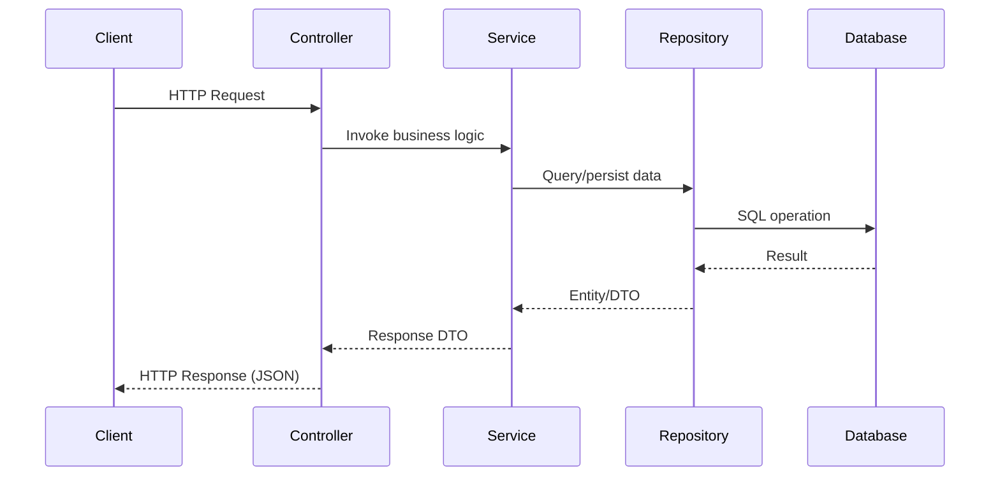
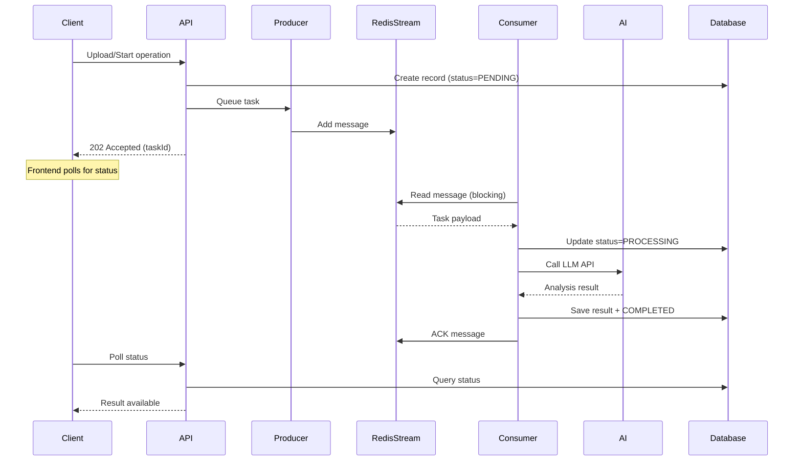

## Architecture Diagram

InterviewGuide is built as a modular monolithic application with clear separation of concerns between frontend, backend, and infrastructure layers.


## High-Level Architecture

The system follows a layered architecture pattern:

<CardGroup cols={3}>
  <Card title="Frontend Layer" icon="browser">
    React 18.3 + TypeScript 5.6 SPA with Vite 5.4 build system
  </Card>
  <Card title="Backend Layer" icon="server">
    Spring Boot 4.0 + Java 21 with modular service architecture
  </Card>
  <Card title="Data Layer" icon="database">
    PostgreSQL + pgvector for relational and vector data storage
  </Card>
</CardGroup>

## Project Structure

The backend follows a modular architecture organized by business domain:

```
app/src/main/java/interview/guide/
├── App.java                      # Main application entry point
├── common/                       # Shared utilities and abstractions
│   ├── ai/                       # AI integration utilities
│   ├── annotation/               # Custom annotations (e.g., @RateLimit)
│   ├── aspect/                   # AOP aspects for cross-cutting concerns
│   ├── async/                    # Abstract base classes for async processing
│   │   ├── AbstractStreamProducer.java
│   │   └── AbstractStreamConsumer.java
│   ├── config/                   # Application configuration
│   ├── constant/                 # Constants and enums
│   ├── exception/                # Global exception handling
│   ├── model/                    # Shared domain models
│   └── result/                   # Unified API response wrapper
├── infrastructure/               # Technical infrastructure services
│   ├── export/                   # PDF export functionality (iText 8)
│   ├── file/                     # File parsing (Apache Tika)
│   ├── mapper/                   # Entity-DTO mapping (MapStruct)
│   └── redis/                    # Redis service wrapper (Redisson)
└── modules/                      # Business domain modules
    ├── interview/                # Mock interview functionality
    │   ├── listener/             # Stream consumers/producers
    │   ├── model/                # Domain entities and DTOs
    │   ├── repository/           # JPA repositories
    │   └── service/              # Business logic services
    ├── knowledgebase/            # RAG knowledge base
    │   ├── listener/             # Vector processing streams
    │   ├── model/                # Knowledge base entities
    │   ├── repository/           # Data access layer
    │   └── service/              # KB management services
    └── resume/                   # Resume analysis
        ├── listener/             # Async analysis streams
        ├── model/                # Resume entities
        ├── repository/           # Resume data access
        └── service/              # Analysis services
```

## Core Components

### 1. Module Architecture

Each business module (resume, interview, knowledgebase) follows a consistent structure:

<Accordion title="Module Organization Pattern">

**Controller Layer**: REST API endpoints
- Request validation
- Response formatting
- HTTP-level concerns

**Service Layer**: Business logic
- Domain operations
- Transaction management
- Orchestration between components

**Repository Layer**: Data persistence
- JPA repositories for database access
- Query methods and specifications

**Listener Layer**: Async processing
- Stream producers for task queuing
- Stream consumers for background processing

**Model Layer**: Domain objects
- JPA entities for database mapping
- DTOs for API communication
- Request/Response objects

</Accordion>

### 2. Common Infrastructure

Shared components provide cross-cutting functionality:

<Tabs>
  <Tab title="Async Processing">
    Template-based pattern using abstract base classes:
    
    - `AbstractStreamProducer<T>`: Base for message producers
    - `AbstractStreamConsumer<T>`: Base for message consumers
    - Handles retries, state transitions, error handling
    
    Located in: `app/src/main/java/interview/guide/common/async/`
  </Tab>
  
  <Tab title="AI Integration">
    Spring AI 2.0 integration layer:
    
    - Structured output parsing
    - Streaming responses via SSE
    - OpenAI-compatible API (Alibaba DashScope)
    
    Located in: `app/src/main/java/interview/guide/common/ai/`
  </Tab>
  
  <Tab title="Cross-Cutting Concerns">
    AOP-based aspects for:
    
    - Rate limiting (`@RateLimit` annotation)
    - Exception handling and error translation
    - Request/response logging
    
    Located in: `app/src/main/java/interview/guide/common/aspect/`
  </Tab>
</Tabs>

## Data Flow Patterns

### Synchronous Request Flow

For immediate operations like querying data or initiating tasks:



### Asynchronous Processing Flow

For long-running AI operations (resume analysis, vectorization, interview evaluation):



## Component Interaction

### Resume Analysis Module

Complete lifecycle from upload to completed analysis:

<Steps>
  <Step title="File Upload">
    User uploads resume file (PDF/DOCX/DOC/TXT)
    
    - File stored in S3-compatible storage (RustFS/MinIO)
    - Resume entity created with `PENDING` status
    - Content hash calculated for duplicate detection
  </Step>
  
  <Step title="Task Queuing">
    `AnalyzeStreamProducer` sends message to Redis Stream
    
    - Message includes: `resumeId`, `content`, `retryCount`
    - Stream key: `resume:analyze:stream`
    - Immediate response to client with task ID
  </Step>
  
  <Step title="Background Processing">
    `AnalyzeStreamConsumer` processes the task
    
    - Updates status to `PROCESSING`
    - Calls Spring AI with structured output parsing
    - Extracts: skills, experience, education, score
    - Saves analysis results to database
  </Step>
  
  <Step title="Completion">
    Status updated to `COMPLETED` or `FAILED`
    
    - Frontend polls GET `/api/resumes/{id}/detail`
    - Analysis results displayed with scores and suggestions
    - PDF export available via `/api/resumes/{id}/export`
  </Step>
</Steps>

### Interview Module

Real-time mock interview with intelligent follow-ups:

<Note>
**Session-Based Architecture**: Each interview session maintains state in Redis cache for fast access, with persistent storage in PostgreSQL for history and reporting.
</Note>

1. **Session Creation**: POST `/api/interview/sessions` creates a new session based on resume content
2. **Question Generation**: AI generates initial question from resume analysis
3. **Answer Submission**: POST `/api/interview/sessions/{id}/answers` with streaming SSE response
4. **Follow-up Questions**: Configurable multi-turn conversation (default: 1 follow-up per main question)
5. **Batch Evaluation**: Answers evaluated in batches (default: 8 per batch) to avoid token limits
6. **Report Generation**: Async aggregation of evaluation results into PDF report

### Knowledge Base Module

RAG-powered question answering system:

<CardGroup cols={2}>
  <Card title="Document Ingestion" icon="upload">
    - Apache Tika parses PDF/DOCX/Markdown
    - Content chunked with overlap for context
    - Async vectorization via Redis Stream
    - Embeddings stored in pgvector
  </Card>
  
  <Card title="Query Processing" icon="search">
    - Question converted to embedding vector
    - Similarity search in pgvector
    - Top-k relevant chunks retrieved
    - LLM generates answer with context
    - Streaming response via SSE
  </Card>
</CardGroup>

## State Management

### Async Task State Machine

All async operations follow this state flow:

```
PENDING → PROCESSING → COMPLETED
                    ↓
                  FAILED (with retry)
```

**State Transitions**:
- `PENDING`: Task queued, waiting for consumer
- `PROCESSING`: Consumer actively processing
- `COMPLETED`: Successfully finished
- `FAILED`: Failed after max retries (3 attempts)

States are stored in database and can be polled via API endpoints.

## Technology Choices

<Accordion title="Why Redis Stream over Kafka?">

**Architecture Simplification**: Redis Stream provides sufficient messaging capabilities without the operational overhead of Kafka:

- Consumer groups for load distribution
- Message acknowledgment and replay
- Built-in persistence and recovery
- Lower resource requirements
- Single dependency for both caching and messaging

Kafka would be overkill for this scale and adds unnecessary complexity.

</Accordion>

<Accordion title="Why pgvector over Dedicated Vector DB?">

**Unified Data Store**: Using PostgreSQL with pgvector extension eliminates need for separate vector database:

- Single source of truth for relational and vector data
- ACID transactions across all data types
- Simplified deployment and backup
- SQL joins between vectors and metadata
- Sufficient performance for application scale (under 10k documents)

Dedicated vector DBs (Pinecone, Milvus) offer better performance at massive scale but add operational complexity.

</Accordion>

## Next Steps

<CardGroup cols={2}>
  <Card title="Tech Stack" icon="layer-group" href="/architecture/tech-stack">
    Detailed breakdown of all technologies and version dependencies
  </Card>
  
  <Card title="Async Processing" icon="gears" href="/architecture/async-processing">
    Deep dive into Redis Streams implementation with code examples
  </Card>
</CardGroup>