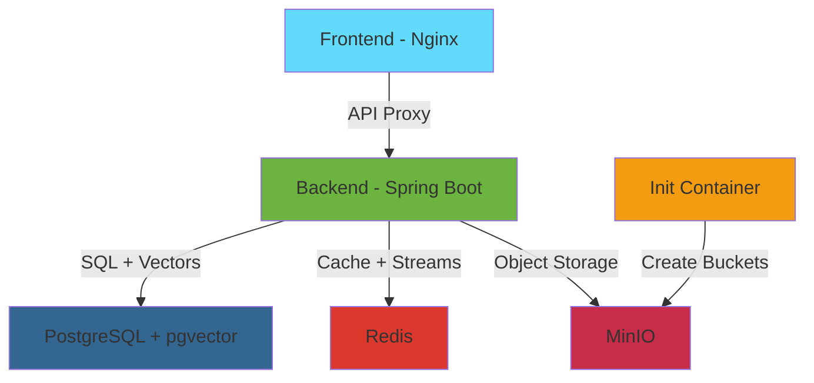

## Overview

Docker Compose deployment provides a production-like environment with all services containerized and orchestrated. This is the **recommended approach** for testing, staging, and small-to-medium production deployments.

## Architecture

The Docker Compose setup includes six services:



<CardGroup cols={3}>
  <Card title="postgres" icon="database">
    PostgreSQL 16 with pgvector extension for relational data and vector storage
  </Card>
  <Card title="redis" icon="bolt">
    Redis 7 for session caching and asynchronous job processing (Streams)
  </Card>
  <Card title="minio" icon="box">
    S3-compatible object storage for resumes, documents, and generated reports
  </Card>
  <Card title="createbuckets" icon="wrench">
    Init container that auto-creates storage buckets before app startup
  </Card>
  <Card title="app" icon="server">
    Spring Boot backend with AI integration and business logic
  </Card>
  <Card title="frontend" icon="window">
    React SPA served by Nginx with API reverse proxy
  </Card>
</CardGroup>

## Prerequisites

- **Docker**: 20.10+ ([Install Docker](https://docs.docker.com/get-docker/))
- **Docker Compose**: 2.0+ (included with Docker Desktop)
- **Alibaba Cloud DashScope API Key**: [Get API Key](https://bailian.console.aliyun.com/)

<Tip>
  Verify installation:
  ```bash
  docker --version
  docker compose version
  ```
</Tip>

## Quick Start

<Steps>
  <Step title="Clone the Repository">
    ```bash
    git clone https://github.com/Snailclimb/interview-guide.git
    cd interview-guide
    ```
  </Step>

  <Step title="Configure Environment Variables">
    ```bash
    # Copy example configuration
    cp .env.example .env

    # Edit .env file
    vim .env
    ```

    **Required Configuration**:
    ```bash .env
    # AI API Key (Required)
    AI_BAILIAN_API_KEY=sk-xxxxxxxxxxxxxxxxxxxxx

    # AI Model Selection (Optional)
    AI_MODEL=qwen-plus  # or qwen-max, qwen-long

    # Interview Parameters (Optional)
    APP_INTERVIEW_FOLLOW_UP_COUNT=1
    APP_INTERVIEW_EVALUATION_BATCH_SIZE=8

    # Structured Output Retry (Optional)
    APP_AI_STRUCTURED_MAX_ATTEMPTS=2
    APP_AI_STRUCTURED_INCLUDE_LAST_ERROR=true
    ```

    <Warning>
      Never commit `.env` files to version control. They contain sensitive credentials.
    </Warning>
  </Step>

  <Step title="Build and Start Services">
    ```bash
    # Build images and start all services
    docker compose up -d --build

    # First-time startup takes 3-5 minutes:
    # - Building backend (Gradle dependencies + compilation)
    # - Building frontend (npm install + Vite build)
    # - Pulling base images (postgres, redis, minio, nginx)
    ```

    <Tip>
      Subsequent starts are much faster (under 30 seconds) as images are cached:
      ```bash
      docker compose up -d
      ```
    </Tip>
  </Step>

  <Step title="Monitor Startup Progress">
    ```bash
    # Watch all service logs
    docker compose logs -f

    # Watch specific service
    docker compose logs -f app

    # Check service health
    docker compose ps
    ```

    **Healthy Output**:
    ```
    NAME                  STATUS          PORTS
    interview-postgres    Up (healthy)    5432->5432
    interview-redis       Up (healthy)    6379->6379
    interview-minio       Up (healthy)    9000->9000, 9001->9001
    interview-app         Up              8080->8080
    interview-frontend    Up              80->80
    ```
  </Step>

  <Step title="Access the Application">
    <CardGroup cols={2}>
      <Card title="Frontend" icon="globe" href="http://localhost">
        Main application interface
        
        `http://localhost`
      </Card>
      
      <Card title="Backend API" icon="code" href="http://localhost:8080">
        REST API endpoints
        
        `http://localhost:8080`
      </Card>
      
      <Card title="MinIO Console" icon="database" href="http://localhost:9001">
        Object storage management
        
        **User**: minioadmin  
        **Pass**: minioadmin
      </Card>
      
      <Card title="PostgreSQL" icon="server">
        Direct database access
        
        `localhost:5432`  
        **User**: postgres  
        **Pass**: password
      </Card>
    </CardGroup>
  </Step>
</Steps>

## Service Configuration

### Dependency Management

Services start in the correct order using health checks:

```yaml docker-compose.yml
app:
  depends_on:
    postgres:
      condition: service_healthy  # Wait for pg_isready
    redis:
      condition: service_healthy  # Wait for redis-cli ping
    minio:
      condition: service_healthy  # Wait for /minio/health/live
    createbuckets:
      condition: service_completed_successfully  # Wait for bucket creation
```

<Accordion title="Why use health checks instead of just depends_on?">
  Without health checks, `depends_on` only waits for the container to **start**, not be **ready**. This causes race conditions:
  
  - Backend tries to connect before PostgreSQL accepts connections → crash
  - Backend uploads file before bucket exists → 404 error
  
  Health checks ensure each dependency is fully operational before dependents start.
</Accordion>

### Health Check Configuration

<AccordionGroup>
  <Accordion title="PostgreSQL Health Check">
    ```yaml
    healthcheck:
      test: ["CMD-SHELL", "pg_isready -U postgres"]
      interval: 5s
      timeout: 5s
      retries: 5
    ```
    
    - **What it does**: Executes `pg_isready` to verify PostgreSQL accepts connections
    - **Why**: Prevents "connection refused" errors during backend startup
    - **Timing**: Checked every 5s, max 25s wait (5 retries × 5s)
  </Accordion>

  <Accordion title="Redis Health Check">
    ```yaml
    healthcheck:
      test: ["CMD", "redis-cli", "ping"]
      interval: 5s
      timeout: 3s
      retries: 5
    ```
    
    - **What it does**: Sends `PING` command, expects `PONG` response
    - **Why**: Ensures Redis is ready for Redisson connection
    - **Timing**: Checked every 5s, max 15s wait
  </Accordion>

  <Accordion title="MinIO Health Check">
    ```yaml
    healthcheck:
      test: ["CMD", "curl", "-f", "http://localhost:9000/minio/health/live"]
      interval: 5s
      timeout: 3s
      retries: 5
    ```
    
    - **What it does**: Calls MinIO's built-in health endpoint
    - **Why**: Ensures S3 API is ready before bucket creation
    - **Timing**: Checked every 5s, max 15s wait
  </Accordion>
</AccordionGroup>

### Init Container Pattern

The `createbuckets` service implements the **Init Container** pattern:

```yaml docker-compose.yml
createbuckets:
  image: minio/mc  # MinIO Client
  depends_on:
    minio:
      condition: service_healthy
  entrypoint: >
    /bin/sh -c "
    /usr/bin/mc alias set myminio http://minio:9000 minioadmin minioadmin;
    /usr/bin/mc mb myminio/interview-guide;
    /usr/bin/mc anonymous set public myminio/interview-guide;
    exit 0;
    "
```

<Steps>
  <Step title="Configure MinIO Client">
    ```bash
    mc alias set myminio http://minio:9000 minioadmin minioadmin
    ```
    Creates an alias for the MinIO server running at `minio:9000`
  </Step>

  <Step title="Create Storage Bucket">
    ```bash
    mc mb myminio/interview-guide
    ```
    Creates the `interview-guide` bucket if it doesn't exist
  </Step>

  <Step title="Set Bucket Policy">
    ```bash
    mc anonymous set public myminio/interview-guide
    ```
    Allows public read access for serving uploaded files (resumes, reports)
  </Step>

  <Step title="Exit Successfully">
    ```bash
    exit 0
    ```
    Container exits after completing setup, allowing dependent services to start
  </Step>
</Steps>

<Tip>
  **Why not create buckets manually?** 
  
  Init containers enable **infrastructure as code**. The entire stack can be deployed with zero manual configuration, making it ideal for CI/CD pipelines.
</Tip>

## Volume Management

### Data Persistence

Named volumes ensure data survives container restarts:

```yaml docker-compose.yml
volumes:
  postgres_data:  # Database tables and vector indexes
  redis_data:     # Cache and Stream data
  minio_data:     # Uploaded files and generated PDFs
```

<CodeGroup>
```bash List Volumes
docker volume ls | grep interview
```

```bash Inspect Volume
docker volume inspect interview-guide_postgres_data
```

```bash Backup Volume
# Backup PostgreSQL data
docker run --rm \
  -v interview-guide_postgres_data:/data \
  -v $(pwd):/backup \
  alpine tar czf /backup/postgres-backup.tar.gz /data
```

```bash Restore Volume
# Restore PostgreSQL data
docker run --rm \
  -v interview-guide_postgres_data:/data \
  -v $(pwd):/backup \
  alpine tar xzf /backup/postgres-backup.tar.gz -C /
```
</CodeGroup>

### Clean Up Volumes

<Warning>
  These commands **permanently delete all data**. Use with caution.
</Warning>

```bash
# Stop services and remove volumes
docker compose down -v

# Remove specific volume
docker volume rm interview-guide_postgres_data

# Remove all unused volumes
docker volume prune
```

## Networking

### Internal DNS Resolution

Docker Compose creates a default bridge network where services communicate using **service names** as hostnames:

```yaml
app:
  environment:
    POSTGRES_HOST: postgres  # Not localhost!
    REDIS_HOST: redis
    APP_STORAGE_ENDPOINT: http://minio:9000
```

<Accordion title="Why use service names instead of localhost?">
  In Docker, each container has its own network namespace:
  
  - `localhost` inside the `app` container refers to the **app container itself**
  - Service names (e.g., `postgres`) resolve to the container's internal IP via Docker's DNS
  
  This enables seamless communication without exposing ports to the host.
</Accordion>

### Port Mapping

| Service  | Internal Port | External Port | Access From        |
|----------|---------------|---------------|--------------------||
| frontend | 80            | 80            | Host browser       |
| app      | 8080          | 8080          | Host tools (curl)  |
| postgres | 5432          | 5432          | Host DB clients    |
| redis    | 6379          | 6379          | Host redis-cli     |
| minio    | 9000, 9001    | 9000, 9001    | Host browser       |

## Multi-Stage Builds

Both backend and frontend use multi-stage Dockerfiles to minimize image size:

### Backend Build Stages

<Steps>
  <Step title="Builder Stage (gradle:8.14-jdk21)">
    ```dockerfile
    FROM gradle:8.14-jdk21 AS builder
    WORKDIR /workspace
    
    # Copy Gradle config (cached layer)
    COPY settings.gradle gradlew ./
    COPY gradle gradle
    COPY app/build.gradle app/
    
    # Pre-download dependencies (cached layer)
    RUN gradle dependencies --no-daemon || true
    
    # Copy source and build
    COPY . .
    RUN gradle :app:bootJar --no-daemon -x test
    ```
    
    **Size**: ~800MB (includes JDK, Gradle, build cache)
  </Step>

  <Step title="Runtime Stage (eclipse-temurin:21-jre)">
    ```dockerfile
    FROM eclipse-temurin:21-jre
    WORKDIR /app
    
    # Copy only the JAR artifact
    COPY --from=builder /workspace/app/build/libs/*.jar app.jar
    
    EXPOSE 8080
    ENTRYPOINT ["java", "-jar", "app.jar"]
    ```
    
    **Size**: ~300MB (only JRE + JAR)
  </Step>
</Steps>

<Tip>
  **Result**: 60% smaller final image by excluding build tools and dependencies
</Tip>

### Frontend Build Stages

<Steps>
  <Step title="Builder Stage (node:20-alpine)">
    ```dockerfile
    FROM node:20-alpine AS builder
    WORKDIR /app
    
    # Install dependencies (cached layer)
    COPY package.json pnpm-lock.yaml ./
    RUN npm install -g pnpm && pnpm install --frozen-lockfile
    
    # Build static assets
    COPY . .
    RUN pnpm build
    ```
    
    **Size**: ~500MB (Node.js + npm packages + build tools)
  </Step>

  <Step title="Runtime Stage (nginx:alpine)">
    ```dockerfile
    FROM nginx:alpine
    
    # Copy built assets
    COPY --from=builder /app/dist /usr/share/nginx/html
    
    # Copy Nginx config
    COPY nginx.conf /etc/nginx/conf.d/default.conf
    
    EXPOSE 80
    CMD ["nginx", "-g", "daemon off;"]
    ```
    
    **Size**: ~25MB (Nginx + static files)
  </Step>
</Steps>

## Operations

### Common Commands

<AccordionGroup>
  <Accordion title="Start Services">
    ```bash
    # Start in background
    docker compose up -d
    
    # Start with live logs
    docker compose up
    
    # Start specific service
    docker compose up -d postgres redis
    ```
  </Accordion>

  <Accordion title="Stop Services">
    ```bash
    # Graceful stop (preserves volumes)
    docker compose stop
    
    # Stop and remove containers (preserves volumes)
    docker compose down
    
    # Stop and remove everything including volumes
    docker compose down -v
    ```
  </Accordion>

  <Accordion title="View Logs">
    ```bash
    # All services
    docker compose logs -f
    
    # Specific service
    docker compose logs -f app
    
    # Last 100 lines
    docker compose logs --tail=100 app
    
    # Since timestamp
    docker compose logs --since 2024-01-01T10:00:00 app
    ```
  </Accordion>

  <Accordion title="Restart Services">
    ```bash
    # Restart all
    docker compose restart
    
    # Restart specific service
    docker compose restart app
    
    # Rebuild and restart
    docker compose up -d --build app
    ```
  </Accordion>

  <Accordion title="Execute Commands Inside Containers">
    ```bash
    # PostgreSQL shell
    docker compose exec postgres psql -U postgres -d interview_guide
    
    # Redis CLI
    docker compose exec redis redis-cli
    
    # Backend shell
    docker compose exec app /bin/bash
    
    # Run SQL file
    docker compose exec -T postgres psql -U postgres -d interview_guide < backup.sql
    ```
  </Accordion>

  <Accordion title="View Resource Usage">
    ```bash
    # Real-time stats
    docker stats
    
    # Service-specific stats
    docker stats interview-app interview-postgres
    ```
  </Accordion>
</AccordionGroup>

### Updating the Application

```bash
# 1. Pull latest code
git pull origin main

# 2. Rebuild changed services
docker compose up -d --build app frontend

# 3. View startup logs
docker compose logs -f app frontend
```

<Warning>
  Always check `jpa.hibernate.ddl-auto` setting before updates:
  - **Development**: `update` (auto-migrate schema)
  - **Production**: `validate` or `none` (prevent auto-changes)
</Warning>

## Troubleshooting

<AccordionGroup>
  <Accordion title="Service Won't Start - 'unhealthy' Status">
    **Symptom**: `docker compose ps` shows service as `unhealthy`

    **Debug Steps**:
    ```bash
    # Check health check logs
    docker inspect interview-postgres --format='{{json .State.Health}}' | jq
    
    # View detailed logs
    docker compose logs postgres
    
    # Test health check manually
    docker compose exec postgres pg_isready -U postgres
    ```

    **Common Causes**:
    - PostgreSQL: Database initialization taking longer than health check timeout
    - Redis: Port conflict with host Redis instance
    - MinIO: Insufficient disk space in Docker volume
  </Accordion>

  <Accordion title="Backend Crashes on Startup">
    **Symptom**: `interview-app` container exits immediately

    **Debug Steps**:
    ```bash
    # View full startup logs
    docker compose logs app
    
    # Common error patterns:
    # - "Connection refused" → Check depends_on health checks
    # - "Bucket does not exist" → Verify createbuckets completed
    # - "Extension 'vector' does not exist" → Check postgres init script
    ```

    **Solutions**:
    1. Verify environment variables are set in `.env`
    2. Check all dependencies are healthy:
       ```bash
       docker compose ps
       ```
    3. Restart with clean state:
       ```bash
       docker compose down
       docker compose up -d
       ```
  </Accordion>

  <Accordion title="'Port already in use' Error">
    **Symptom**: `Error starting userland proxy: listen tcp4 0.0.0.0:5432: bind: address already in use`

    **Solutions**:
    1. Find conflicting process:
       ```bash
       lsof -i :5432  # Or :6379, :9000, :8080, :80
       ```
    2. Stop conflicting service:
       ```bash
       # Stop local PostgreSQL
       brew services stop postgresql
       
       # Or change port in docker-compose.yml
       ports:
         - "5433:5432"  # Map to different host port
       ```
  </Accordion>

  <Accordion title="High Memory Usage">
    **Symptom**: Docker Desktop shows high RAM usage or system slowdown

    **Optimize**:
    1. Set JVM heap limits for backend:
       ```yaml docker-compose.yml
       app:
         environment:
           JAVA_OPTS: "-Xmx1g -Xms512m"
       ```
    2. Limit container resources:
       ```yaml
       app:
         deploy:
           resources:
             limits:
               memory: 2G
               cpus: '1.0'
       ```
    3. Adjust Redis maxmemory:
       ```yaml
       redis:
         command: redis-server --maxmemory 256mb --maxmemory-policy allkeys-lru
       ```
  </Accordion>

  <Accordion title="Cannot Access Frontend at localhost">
    **Symptom**: Browser shows "Connection refused" or timeout

    **Debug Steps**:
    ```bash
    # Check if frontend container is running
    docker compose ps frontend
    
    # Check Nginx logs
    docker compose logs frontend
    
    # Test Nginx directly
    curl -I http://localhost
    ```

    **Common Issues**:
    - Port 80 requires admin privileges on some systems → Change to 8000:80
    - Firewall blocking localhost:80 → Check firewall rules
    - Build failed silently → Check `docker compose logs frontend` for errors
  </Accordion>
</AccordionGroup>

## Next Steps

<CardGroup cols={2}>
  <Card title="Production Deployment" icon="rocket" href="/deployment/production">
    Secure and optimize for production
  </Card>
  
  <Card title="Configuration Guide" icon="sliders" href="/configuration/environment">
    Customize environment variables
  </Card>
  
  <Card title="Backup & Recovery" icon="database">
    Database backup strategies
  </Card>
  
  <Card title="Monitoring Setup" icon="chart-line">
    Add observability stack
  </Card>
</CardGroup>
