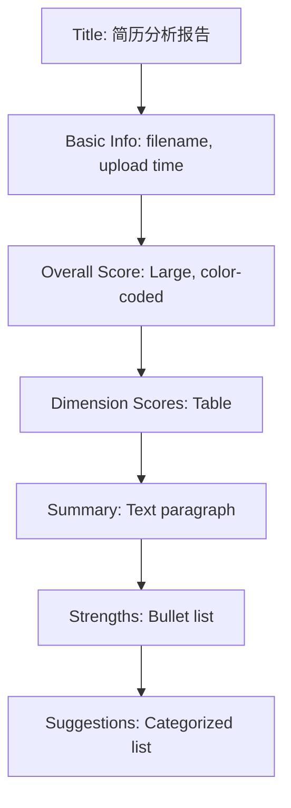
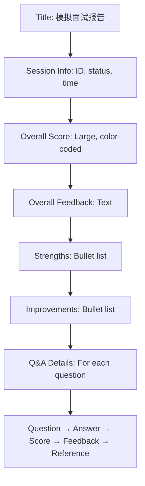

## Overview

The `PdfExportService` generates PDF reports for:
1. **Resume Analysis Reports**: Detailed scoring, strengths, and improvement suggestions
2. **Interview Reports**: Question-answer pairs, scores, and overall evaluation

**Location**: `infrastructure/export/PdfExportService.java:1`

### Key Features

<CardGroup cols={2}>
  <Card title="Chinese Font Support" icon="language">
    Embeds ZhuqueFangsong-Regular.ttf for full Chinese character rendering
  </Card>
  <Card title="Color-Coded Scoring" icon="palette">
    Green (≥80), yellow (60-79), red (below 60) for visual clarity
  </Card>
  <Card title="Structured Layout" icon="table">
    Uses tables, paragraphs, and sections for professional appearance
  </Card>
  <Card title="Error Handling" icon="shield-check">
    Gracefully handles missing fonts and sanitizes text content
  </Card>
</CardGroup>

---

## Dependencies

### Maven Configuration

```xml
<!-- iText 8 Core (in pom.xml) -->
<dependency>
    <groupId>com.itextpdf</groupId>
    <artifactId>kernel</artifactId>
    <version>8.0.3</version>
</dependency>
<dependency>
    <groupId>com.itextpdf</groupId>
    <artifactId>layout</artifactId>
    <version>8.0.3</version>
</dependency>
```

<Info>
  iText 8 is a major rewrite from iText 5/7 with improved API design and performance. It's licensed under AGPL v3 (or commercial license).
</Info>

---

## Chinese Font Handling

### Font File Location

**Path**: `src/main/resources/fonts/ZhuqueFangsong-Regular.ttf`

```
app/src/main/resources/
├── fonts/
│   └── ZhuqueFangsong-Regular.ttf  (8.4 MB)
├── prompts/
└── application.yml
```

<Warning>
  The font file must be included in the JAR during build. Verify with:
  
  ```bash
  jar tf target/app.jar | grep fonts
  ```
</Warning>

### Creating the Font

```java
// infrastructure/export/PdfExportService.java:50
private PdfFont createChineseFont() {
    try {
        // Load embedded font from resources
        var fontStream = getClass().getClassLoader()
            .getResourceAsStream("fonts/ZhuqueFangsong-Regular.ttf");
        
        if (fontStream != null) {
            byte[] fontBytes = fontStream.readAllBytes();
            fontStream.close();
            
            log.debug("Using embedded font: fonts/ZhuqueFangsong-Regular.ttf");
            
            // Create font with Identity-H encoding (supports CJK)
            return PdfFontFactory.createFont(
                fontBytes, 
                PdfEncodings.IDENTITY_H, 
                EmbeddingStrategy.FORCE_EMBEDDED
            );
        }
        
        // Font file not found
        log.error("Font file missing: fonts/ZhuqueFangsong-Regular.ttf");
        throw new BusinessException(ErrorCode.EXPORT_PDF_FAILED, 
            "字体文件缺失，请联系管理员");
        
    } catch (BusinessException e) {
        throw e;
    } catch (Exception e) {
        log.error("Failed to create Chinese font: {}", e.getMessage(), e);
        throw new BusinessException(ErrorCode.EXPORT_PDF_FAILED, 
            "创建字体失败: " + e.getMessage());
    }
}
```

<Tip>
  **Why IDENTITY_H?** It's a CJK-friendly encoding that maps Unicode characters directly to glyph IDs, supporting Chinese, Japanese, and Korean characters.
</Tip>

### Text Sanitization

Remove problematic characters (emoji, special symbols) that may not render:

```java
// infrastructure/export/PdfExportService.java:76
private String sanitizeText(String text) {
    if (text == null) return "";
    
    // Remove emoji and control characters
    return text.replaceAll("[\\p{So}\\p{Cs}]", "").trim();
}
```

**Regex Explanation**:
- `\p{So}`: Other Symbols (emoji, icons)
- `\p{Cs}`: Surrogate characters (private use area)

---

## Resume Analysis Export

### Method Signature

```java
// infrastructure/export/PdfExportService.java:85
public byte[] exportResumeAnalysis(ResumeEntity resume, 
                                   ResumeAnalysisResponse analysis)
```

### PDF Structure



### Implementation

```java
// infrastructure/export/PdfExportService.java:85
public byte[] exportResumeAnalysis(ResumeEntity resume, 
                                   ResumeAnalysisResponse analysis) {
    ByteArrayOutputStream baos = new ByteArrayOutputStream();
    PdfWriter writer = new PdfWriter(baos);
    PdfDocument pdfDoc = new PdfDocument(writer);
    Document document = new Document(pdfDoc);
    
    // Set Chinese font globally
    PdfFont font = createChineseFont();
    document.setFont(font);
    
    // ===== TITLE =====
    Paragraph title = new Paragraph("简历分析报告")
        .setFontSize(24)
        .setBold()
        .setTextAlignment(TextAlignment.CENTER)
        .setFontColor(HEADER_COLOR);  // RGB(41, 128, 185)
    document.add(title);
    
    // ===== BASIC INFO =====
    document.add(new Paragraph("\n"));
    document.add(createSectionTitle("基本信息"));
    document.add(new Paragraph("文件名: " + resume.getOriginalFilename()));
    document.add(new Paragraph("上传时间: " + 
        (resume.getUploadedAt() != null 
            ? DATE_FORMAT.format(resume.getUploadedAt()) 
            : "未知")));
    
    // ===== OVERALL SCORE =====
    document.add(new Paragraph("\n"));
    document.add(createSectionTitle("综合评分"));
    Paragraph scoreP = new Paragraph("总分: " + analysis.overallScore() + " / 100")
        .setFontSize(18)
        .setBold()
        .setFontColor(getScoreColor(analysis.overallScore()));
    document.add(scoreP);
    
    // ===== DIMENSION SCORES (TABLE) =====
    if (analysis.scoreDetail() != null) {
        document.add(new Paragraph("\n"));
        document.add(createSectionTitle("各维度评分"));
        
        Table scoreTable = new Table(UnitValue.createPercentArray(new float[]{2, 1}))
            .useAllAvailableWidth();
        
        addScoreRow(scoreTable, "项目经验", 
            analysis.scoreDetail().projectScore(), 40);
        addScoreRow(scoreTable, "技能匹配度", 
            analysis.scoreDetail().skillMatchScore(), 20);
        addScoreRow(scoreTable, "内容完整性", 
            analysis.scoreDetail().contentScore(), 15);
        addScoreRow(scoreTable, "结构清晰度", 
            analysis.scoreDetail().structureScore(), 15);
        addScoreRow(scoreTable, "表达专业性", 
            analysis.scoreDetail().expressionScore(), 10);
        
        document.add(scoreTable);
    }
    
    // ===== SUMMARY =====
    if (analysis.summary() != null) {
        document.add(new Paragraph("\n"));
        document.add(createSectionTitle("简历摘要"));
        document.add(new Paragraph(sanitizeText(analysis.summary())));
    }
    
    // ===== STRENGTHS (BULLET LIST) =====
    if (analysis.strengths() != null && !analysis.strengths().isEmpty()) {
        document.add(new Paragraph("\n"));
        document.add(createSectionTitle("优势亮点"));
        for (String strength : analysis.strengths()) {
            document.add(new Paragraph("• " + sanitizeText(strength)));
        }
    }
    
    // ===== SUGGESTIONS (CATEGORIZED) =====
    if (analysis.suggestions() != null && !analysis.suggestions().isEmpty()) {
        document.add(new Paragraph("\n"));
        document.add(createSectionTitle("改进建议"));
        for (ResumeAnalysisResponse.Suggestion suggestion : analysis.suggestions()) {
            document.add(new Paragraph(
                "【" + suggestion.priority() + "】" + sanitizeText(suggestion.category())
            ).setBold());
            document.add(new Paragraph("问题: " + sanitizeText(suggestion.issue())));
            document.add(new Paragraph("建议: " + sanitizeText(suggestion.recommendation())));
            document.add(new Paragraph("\n"));
        }
    }
    
    document.close();
    return baos.toByteArray();
}
```

### Dimension Score Table

```java
// infrastructure/export/PdfExportService.java:293
private void addScoreRow(Table table, String dimension, int score, int maxScore) {
    table.addCell(new Cell().add(new Paragraph(dimension)));
    table.addCell(new Cell().add(new Paragraph(score + " / " + maxScore)
        .setFontColor(getScoreColor(score * 100 / maxScore))));
}
```

**Example Output**:

| 维度       | 得分       |
|------------|------------|
| 项目经验   | 35 / 40    |
| 技能匹配度 | 16 / 20    |
| 内容完整性 | 12 / 15    |
| 结构清晰度 | 13 / 15    |
| 表达专业性 | 8 / 10     |

---

## Interview Report Export

### Method Signature

```java
// infrastructure/export/PdfExportService.java:170
public byte[] exportInterviewReport(InterviewSessionEntity session)
```

### PDF Structure



### Implementation Highlights

```java
// infrastructure/export/PdfExportService.java:170
public byte[] exportInterviewReport(InterviewSessionEntity session) {
    ByteArrayOutputStream baos = new ByteArrayOutputStream();
    PdfWriter writer = new PdfWriter(baos);
    PdfDocument pdfDoc = new PdfDocument(writer);
    Document document = new Document(pdfDoc);
    
    PdfFont font = createChineseFont();
    document.setFont(font);
    
    // ===== TITLE =====
    Paragraph title = new Paragraph("模拟面试报告")
        .setFontSize(24)
        .setBold()
        .setTextAlignment(TextAlignment.CENTER)
        .setFontColor(HEADER_COLOR);
    document.add(title);
    
    // ===== SESSION INFO =====
    document.add(new Paragraph("\n"));
    document.add(createSectionTitle("面试信息"));
    document.add(new Paragraph("会话ID: " + session.getSessionId()));
    document.add(new Paragraph("题目数量: " + session.getTotalQuestions()));
    document.add(new Paragraph("面试状态: " + getStatusText(session.getStatus())));
    document.add(new Paragraph("开始时间: " + 
        (session.getCreatedAt() != null 
            ? DATE_FORMAT.format(session.getCreatedAt()) 
            : "未知")));
    
    if (session.getCompletedAt() != null) {
        document.add(new Paragraph("完成时间: " + 
            DATE_FORMAT.format(session.getCompletedAt())));
    }
    
    // ===== OVERALL SCORE =====
    if (session.getOverallScore() != null) {
        document.add(new Paragraph("\n"));
        document.add(createSectionTitle("综合评分"));
        Paragraph scoreP = new Paragraph(
            "总分: " + session.getOverallScore() + " / 100"
        )
            .setFontSize(18)
            .setBold()
            .setFontColor(getScoreColor(session.getOverallScore()));
        document.add(scoreP);
    }
    
    // ===== OVERALL FEEDBACK =====
    if (session.getOverallFeedback() != null) {
        document.add(new Paragraph("\n"));
        document.add(createSectionTitle("总体评价"));
        document.add(new Paragraph(sanitizeText(session.getOverallFeedback())));
    }
    
    // ===== STRENGTHS (from JSON) =====
    if (session.getStrengthsJson() != null) {
        try {
            List<String> strengths = objectMapper.readValue(
                session.getStrengthsJson(),
                new TypeReference<>() {}
            );
            if (!strengths.isEmpty()) {
                document.add(new Paragraph("\n"));
                document.add(createSectionTitle("表现优势"));
                for (String s : strengths) {
                    document.add(new Paragraph("• " + sanitizeText(s)));
                }
            }
        } catch (Exception e) {
            log.error("Failed to parse strengths JSON", e);
        }
    }
    
    // ===== IMPROVEMENTS (from JSON) =====
    if (session.getImprovementsJson() != null) {
        try {
            List<String> improvements = objectMapper.readValue(
                session.getImprovementsJson(),
                new TypeReference<>() {}
            );
            if (!improvements.isEmpty()) {
                document.add(new Paragraph("\n"));
                document.add(createSectionTitle("改进建议"));
                for (String s : improvements) {
                    document.add(new Paragraph("• " + sanitizeText(s)));
                }
            }
        } catch (Exception e) {
            log.error("Failed to parse improvements JSON", e);
        }
    }
    
    // ===== Q&A DETAILS =====
    List<InterviewAnswerEntity> answers = session.getAnswers();
    if (answers != null && !answers.isEmpty()) {
        document.add(new Paragraph("\n"));
        document.add(createSectionTitle("问答详情"));
        
        for (InterviewAnswerEntity answer : answers) {
            document.add(new Paragraph("\n"));
            
            // Question header
            document.add(new Paragraph(
                "问题 " + (answer.getQuestionIndex() + 1) + 
                " [" + (answer.getCategory() != null ? answer.getCategory() : "综合") + "]"
            ).setBold().setFontSize(12));
            
            // Question text
            document.add(new Paragraph("Q: " + sanitizeText(answer.getQuestion())));
            
            // User's answer
            document.add(new Paragraph("A: " + sanitizeText(
                answer.getUserAnswer() != null ? answer.getUserAnswer() : "未回答"
            )));
            
            // Score (color-coded)
            document.add(new Paragraph("得分: " + answer.getScore() + "/100")
                .setFontColor(getScoreColor(answer.getScore())));
            
            // Feedback
            if (answer.getFeedback() != null) {
                document.add(new Paragraph("评价: " + sanitizeText(answer.getFeedback()))
                    .setItalic());
            }
            
            // Reference answer (green color)
            if (answer.getReferenceAnswer() != null) {
                document.add(new Paragraph(
                    "参考答案: " + sanitizeText(answer.getReferenceAnswer())
                ).setFontColor(new DeviceRgb(39, 174, 96)));
            }
        }
    }
    
    document.close();
    return baos.toByteArray();
}
```

---

## Styling Utilities

### Color Definitions

```java
// infrastructure/export/PdfExportService.java:42
private static final DeviceRgb HEADER_COLOR = new DeviceRgb(41, 128, 185);   // Blue
private static final DeviceRgb SECTION_COLOR = new DeviceRgb(52, 73, 94);    // Dark gray
```

### Section Title

```java
// infrastructure/export/PdfExportService.java:285
private Paragraph createSectionTitle(String title) {
    return new Paragraph(title)
        .setFontSize(14)
        .setBold()
        .setFontColor(SECTION_COLOR)
        .setMarginTop(10);
}
```

### Score Color Coding

```java
// infrastructure/export/PdfExportService.java:299
private DeviceRgb getScoreColor(int score) {
    if (score >= 80) return new DeviceRgb(39, 174, 96);   // Green
    if (score >= 60) return new DeviceRgb(241, 196, 15);  // Yellow
    return new DeviceRgb(231, 76, 60);                    // Red
}
```

**Visual Reference**:

<Frame>
  
  
  
</Frame>

### Status Text Mapping

```java
// infrastructure/export/PdfExportService.java:305
private String getStatusText(InterviewSessionEntity.SessionStatus status) {
    return switch (status) {
        case CREATED -> "已创建";
        case IN_PROGRESS -> "进行中";
        case COMPLETED -> "已完成";
        case EVALUATED -> "已评估";
    };
}
```

---

## Usage in Controllers

### Resume Analysis Export Endpoint

```java
// Example from ResumeController
@GetMapping("/{id}/export")
public ResponseEntity<byte[]> exportResume(@PathVariable Long id) {
    ResumeEntity resume = resumeRepository.findById(id)
        .orElseThrow(() -> new BusinessException(ErrorCode.RESUME_NOT_FOUND));
    
    ResumeAnalysisResponse analysis = persistenceService
        .getLatestAnalysisAsDTO(id)
        .orElseThrow(() -> new BusinessException(
            ErrorCode.RESUME_ANALYSIS_NOT_FOUND, 
            "简历尚未分析完成"
        ));
    
    // Generate PDF
    byte[] pdfBytes = pdfExportService.exportResumeAnalysis(resume, analysis);
    
    // Return as downloadable file
    return ResponseEntity.ok()
        .header(HttpHeaders.CONTENT_DISPOSITION, 
            "attachment; filename=\"" + resume.getOriginalFilename() + "-analysis.pdf\"")
        .contentType(MediaType.APPLICATION_PDF)
        .body(pdfBytes);
}
```

### Interview Report Export Endpoint

```java
// Example from InterviewController
@GetMapping("/sessions/{sessionId}/export")
public ResponseEntity<byte[]> exportInterview(@PathVariable String sessionId) {
    InterviewSessionEntity session = persistenceService.findBySessionId(sessionId)
        .orElseThrow(() -> new BusinessException(
            ErrorCode.INTERVIEW_SESSION_NOT_FOUND
        ));
    
    if (session.getOverallScore() == null) {
        throw new BusinessException(
            ErrorCode.INTERVIEW_NOT_EVALUATED, 
            "面试尚未评估完成"
        );
    }
    
    // Generate PDF
    byte[] pdfBytes = pdfExportService.exportInterviewReport(session);
    
    // Return as downloadable file
    return ResponseEntity.ok()
        .header(HttpHeaders.CONTENT_DISPOSITION, 
            "attachment; filename=\"interview-report-" + sessionId + ".pdf\"")
        .contentType(MediaType.APPLICATION_PDF)
        .body(pdfBytes);
}
```

---

## Error Handling

### Font Loading Failure

```java
if (fontStream == null) {
    log.error("Font file missing: fonts/ZhuqueFangsong-Regular.ttf");
    throw new BusinessException(ErrorCode.EXPORT_PDF_FAILED, 
        "字体文件缺失，请联系管理员");
}
```

<Warning>
  If the font file is missing, the entire export operation fails. Ensure the font is packaged in the JAR during build.
</Warning>

### JSON Parsing Errors

```java
try {
    List<String> strengths = objectMapper.readValue(
        session.getStrengthsJson(),
        new TypeReference<>() {}
    );
    // ... use strengths
} catch (Exception e) {
    log.error("Failed to parse strengths JSON", e);
    // Continue without strengths section
}
```

<Info>
  JSON parsing errors are logged but don't stop PDF generation. Missing sections are simply omitted.
</Info>

---

## Troubleshooting

<AccordionGroup>
  <Accordion title="Chinese Characters Display as Boxes">
    **Cause**: Font not embedded or encoding issue
    
    **Solutions**:
    - Verify font file exists: `ls src/main/resources/fonts/`
    - Check embedding strategy: `EmbeddingStrategy.FORCE_EMBEDDED`
    - Confirm encoding: `PdfEncodings.IDENTITY_H`
  </Accordion>

  <Accordion title="PDF Layout Breaks">
    **Cause**: Long text without line breaks
    
    **Solutions**:
    - Use `sanitizeText()` to remove problematic characters
    - Set explicit column widths for tables
    - Add manual line breaks for long paragraphs
  </Accordion>

  <Accordion title="Large File Size">
    **Cause**: High-resolution images or uncompressed fonts
    
    **Solutions**:
    - Compress images before embedding
    - Use subset fonts (only include used glyphs)
    - Enable PDF compression: `pdfDoc.getWriter().setCompressionLevel(9)`
  </Accordion>

  <Accordion title="OutOfMemoryError">
    **Cause**: Generating too many PDFs concurrently
    
    **Solutions**:
    - Increase JVM heap size: `-Xmx2G`
    - Limit concurrent export requests with rate limiting
    - Generate PDFs asynchronously with Redis Streams
  </Accordion>
</AccordionGroup>

---

## Best Practices

<Steps>
  <Step title="Always Embed Fonts">
    Use `EmbeddingStrategy.FORCE_EMBEDDED` to ensure cross-platform compatibility:
    
    ```java
    PdfFontFactory.createFont(
        fontBytes, 
        PdfEncodings.IDENTITY_H, 
        EmbeddingStrategy.FORCE_EMBEDDED
    )
    ```
  </Step>

  <Step title="Sanitize User Input">
    Remove emoji and special characters that may not render:
    
    ```java
    document.add(new Paragraph(sanitizeText(userInput)));
    ```
  </Step>

  <Step title="Use Color for Emphasis">
    Color-code scores and important information:
    
    ```java
    .setFontColor(getScoreColor(score))
    ```
  </Step>

  <Step title="Close Documents Properly">
    Always close the document to flush buffers:
    
    ```java
    document.close();
    return baos.toByteArray();
    ```
  </Step>

  <Step title="Handle Missing Data">
    Check for null values before rendering:
    
    ```java
    if (session.getOverallFeedback() != null) {
        document.add(new Paragraph(sanitizeText(session.getOverallFeedback())));
    }
    ```
  </Step>
</Steps>

---

## Advanced Customization

### Custom Headers and Footers

```java
// Add page numbers to footer
pdfDoc.addEventHandler(PdfDocumentEvent.END_PAGE, new IEventHandler() {
    @Override
    public void handleEvent(Event event) {
        PdfDocumentEvent docEvent = (PdfDocumentEvent) event;
        PdfDocument pdf = docEvent.getDocument();
        PdfPage page = docEvent.getPage();
        
        int pageNumber = pdf.getPageNumber(page);
        Paragraph footer = new Paragraph("第 " + pageNumber + " 页")
            .setFontSize(10)
            .setTextAlignment(TextAlignment.CENTER);
        
        // Position at bottom
        Canvas canvas = new Canvas(page, page.getPageSize());
        canvas.add(footer);
        canvas.close();
    }
});
```

### Adding Images

```java
// Add company logo
ImageData imageData = ImageDataFactory.create("path/to/logo.png");
Image logo = new Image(imageData).scaleToFit(100, 50);
document.add(logo);
```

### Custom Fonts

To use a different font:

1. Add font file to `src/main/resources/fonts/`
2. Update `createChineseFont()` to load the new font
3. Test with Chinese characters to verify rendering

---

## See Also

<CardGroup cols={2}>
  <Card title="Service Layer" icon="layer-group" href="./services">
    How services coordinate export operations
  </Card>
  <Card title="Resume Analysis" icon="file-text" href="../../features/resume-analysis">
    Understanding the analysis data structure
  </Card>
  <Card title="Mock Interview" icon="message-question" href="../../features/mock-interview">
    Interview report data format
  </Card>
  <Card title="API Reference" icon="code" href="../../api/resume/export">
    Export endpoint documentation
  </Card>
</CardGroup>