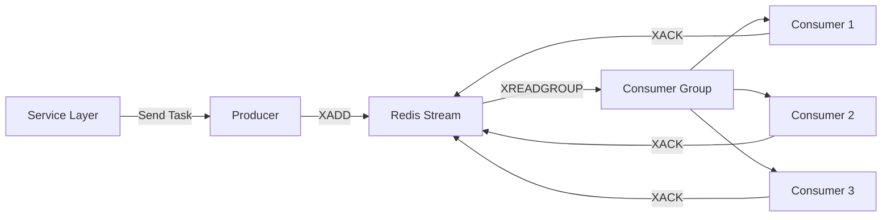
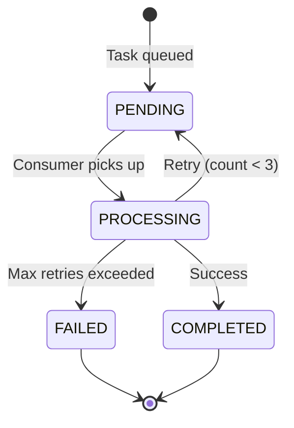

## Overview

InterviewGuide uses **Redis Streams** for asynchronous processing of long-running AI tasks. This allows the API to return immediately while work continues in the background.

### Why Redis Streams?

<CardGroup cols={2}>
  <Card title="Consumer Groups" icon="users">
    Multiple consumers can process tasks in parallel with automatic load balancing
  </Card>
  <Card title="At-Least-Once Delivery" icon="check-double">
    Messages are acknowledged (ACK) after processing, ensuring no task is lost
  </Card>
  <Card title="Retry Support" icon="rotate">
    Failed tasks are automatically retried with exponential backoff
  </Card>
  <Card title="Persistence" icon="database">
    Redis persists streams to disk, surviving restarts
  </Card>
</CardGroup>

---

## Architecture

### Producer-Consumer Pattern



### Three Task Types

| Stream | Purpose | Producer | Consumer |
|--------|---------|----------|----------|
| `resume:analyze:stream` | AI resume analysis | `AnalyzeStreamProducer` | `AnalyzeStreamConsumer` |
| `knowledgebase:vectorize:stream` | Document vectorization | `VectorizeStreamProducer` | `VectorizeStreamConsumer` |
| `interview:evaluate:stream` | Interview evaluation | `EvaluateStreamProducer` | `EvaluateStreamConsumer` |

---

## AbstractStreamProducer

Base class for all producers, providing a consistent message sending pattern.

**Location**: `common/async/AbstractStreamProducer.java:1`

### Template Method Pattern

```java
// common/async/AbstractStreamProducer.java:14
public abstract class AbstractStreamProducer<T> {

    private final RedisService redisService;

    protected void sendTask(T payload) {
        try {
            String messageId = redisService.streamAdd(
                streamKey(),
                buildMessage(payload),
                AsyncTaskStreamConstants.STREAM_MAX_LEN
            );
            log.info("{}任务已发送到Stream: {}, messageId={}",
                taskDisplayName(), payloadIdentifier(payload), messageId);
        } catch (Exception e) {
            log.error("发送{}任务失败: {}, error={}",
                taskDisplayName(), payloadIdentifier(payload), e.getMessage(), e);
            onSendFailed(payload, "任务入队失败: " + e.getMessage());
        }
    }

    // Template methods for subclasses to implement
    protected abstract String taskDisplayName();
    protected abstract String streamKey();
    protected abstract Map<String, String> buildMessage(T payload);
    protected abstract String payloadIdentifier(T payload);
    protected abstract void onSendFailed(T payload, String error);
}
```

<Info>
  Subclasses only need to implement the abstract methods. The `sendTask` method handles Redis communication, logging, and error handling.
</Info>

### Message Structure

All messages include:
- **Entity ID**: Resume ID, KB ID, or Session ID
- **Content**: The data to process (resume text, document content, etc.)
- **Retry Count**: Tracks how many times this task has been retried

---

## AnalyzeStreamProducer

Produces resume analysis tasks.

**Location**: `modules/resume/listener/AnalyzeStreamProducer.java:1`

### Implementation

```java
// modules/resume/listener/AnalyzeStreamProducer.java:19
@Component
public class AnalyzeStreamProducer extends AbstractStreamProducer<AnalyzeTaskPayload> {

    private final ResumeRepository resumeRepository;

    record AnalyzeTaskPayload(Long resumeId, String content) {}

    public void sendAnalyzeTask(Long resumeId, String content) {
        sendTask(new AnalyzeTaskPayload(resumeId, content));
    }

    @Override
    protected String taskDisplayName() {
        return "分析";
    }

    @Override
    protected String streamKey() {
        return AsyncTaskStreamConstants.RESUME_ANALYZE_STREAM_KEY;
    }

    @Override
    protected Map<String, String> buildMessage(AnalyzeTaskPayload payload) {
        return Map.of(
            AsyncTaskStreamConstants.FIELD_RESUME_ID, payload.resumeId().toString(),
            AsyncTaskStreamConstants.FIELD_CONTENT, payload.content(),
            AsyncTaskStreamConstants.FIELD_RETRY_COUNT, "0"
        );
    }

    @Override
    protected String payloadIdentifier(AnalyzeTaskPayload payload) {
        return "resumeId=" + payload.resumeId();
    }

    @Override
    protected void onSendFailed(AnalyzeTaskPayload payload, String error) {
        // Update database to mark task as failed
        resumeRepository.findById(payload.resumeId()).ifPresent(resume -> {
            resume.setAnalyzeStatus(AsyncTaskStatus.FAILED);
            resume.setAnalyzeError(truncateError(error));
            resumeRepository.save(resume);
        });
    }
}
```

### Usage in Service Layer

```java
// Called from ResumeUploadService after file upload
analyzeStreamProducer.sendAnalyzeTask(savedResume.getId(), resumeText);
```

---

## AbstractStreamConsumer

Base class for all consumers, managing the consumption loop, ACK, and retry logic.

**Location**: `common/async/AbstractStreamConsumer.java:1`

### Lifecycle Management

```java
// common/async/AbstractStreamConsumer.java:22
public abstract class AbstractStreamConsumer<T> {

    private final RedisService redisService;
    private final AtomicBoolean running = new AtomicBoolean(false);
    private ExecutorService executorService;
    private String consumerName;

    @PostConstruct
    public void init() {
        // Generate unique consumer name
        this.consumerName = consumerPrefix() + UUID.randomUUID().toString().substring(0, 8);

        // Create consumer group (idempotent)
        try {
            redisService.createStreamGroup(streamKey(), groupName());
            log.info("Redis Stream group created or exists: {}", groupName());
        } catch (Exception e) {
            log.warn("Group creation exception (may already exist): {}", e.getMessage());
        }

        // Start consumer thread
        this.executorService = Executors.newSingleThreadExecutor(r -> {
            Thread t = new Thread(r, threadName());
            t.setDaemon(true);
            return t;
        });

        running.set(true);
        executorService.submit(this::consumeLoop);
        log.info("{}消费者已启动: consumerName={}", taskDisplayName(), consumerName);
    }

    @PreDestroy
    public void shutdown() {
        running.set(false);
        if (executorService != null) {
            executorService.shutdown();
        }
        log.info("{}消费者已关闭: consumerName={}", taskDisplayName(), consumerName);
    }
}
```

<Note>
  Each consumer runs in a dedicated daemon thread. On application shutdown, the `@PreDestroy` hook gracefully stops the consumer loop.
</Note>

### Consumption Loop

```java
// common/async/AbstractStreamConsumer.java:64
private void consumeLoop() {
    while (running.get()) {
        try {
            redisService.streamConsumeMessages(
                streamKey(),
                groupName(),
                consumerName,
                AsyncTaskStreamConstants.BATCH_SIZE,        // 10 messages per poll
                AsyncTaskStreamConstants.POLL_INTERVAL_MS,  // 1 second timeout
                this::processMessage
            );
        } catch (Exception e) {
            if (Thread.currentThread().isInterrupted()) {
                log.info("Consumer thread interrupted");
                break;
            }
            log.error("Error consuming messages: {}", e.getMessage(), e);
        }
    }
}
```

### Message Processing with Retry

```java
// common/async/AbstractStreamConsumer.java:85
private void processMessage(StreamMessageId messageId, Map<String, String> data) {
    T payload = parsePayload(messageId, data);
    if (payload == null) {
        ackMessage(messageId);
        return;
    }

    int retryCount = parseRetryCount(data);
    log.info("Processing {}: {}, messageId={}, retryCount={}",
        taskDisplayName(), payloadIdentifier(payload), messageId, retryCount);

    try {
        markProcessing(payload);
        processBusiness(payload);  // Subclass implements business logic
        markCompleted(payload);
        ackMessage(messageId);
        log.info("{}任务完成: {}", taskDisplayName(), payloadIdentifier(payload));
    } catch (Exception e) {
        log.error("{}任务失败: {}, error={}", 
            taskDisplayName(), payloadIdentifier(payload), e.getMessage(), e);
        
        if (retryCount < AsyncTaskStreamConstants.MAX_RETRY_COUNT) {
            // Retry by re-adding to stream
            retryMessage(payload, retryCount + 1);
        } else {
            // Max retries exceeded, mark as failed
            markFailed(payload, truncateError(
                taskDisplayName() + "失败(已重试" + retryCount + "次): " + e.getMessage()
            ));
        }
        ackMessage(messageId);
    }
}
```

<Warning>
  **ACK Always**: Messages are acknowledged even on failure to prevent infinite retries. The retry logic re-adds the message with an incremented retry count.
</Warning>

---

## AnalyzeStreamConsumer

Consumes resume analysis tasks and invokes AI grading service.

**Location**: `modules/resume/listener/AnalyzeStreamConsumer.java:1`

### Implementation

```java
// modules/resume/listener/AnalyzeStreamConsumer.java:24
@Component
public class AnalyzeStreamConsumer extends AbstractStreamConsumer<AnalyzePayload> {

    private final ResumeGradingService gradingService;
    private final ResumePersistenceService persistenceService;
    private final ResumeRepository resumeRepository;

    record AnalyzePayload(Long resumeId, String content) {}

    @Override
    protected String taskDisplayName() {
        return "简历分析";
    }

    @Override
    protected String streamKey() {
        return AsyncTaskStreamConstants.RESUME_ANALYZE_STREAM_KEY;
    }

    @Override
    protected String groupName() {
        return AsyncTaskStreamConstants.RESUME_ANALYZE_GROUP_NAME;
    }

    @Override
    protected AnalyzePayload parsePayload(StreamMessageId messageId, Map<String, String> data) {
        String resumeIdStr = data.get(AsyncTaskStreamConstants.FIELD_RESUME_ID);
        String content = data.get(AsyncTaskStreamConstants.FIELD_CONTENT);
        if (resumeIdStr == null || content == null) {
            log.warn("Invalid message format, skipping: messageId={}", messageId);
            return null;
        }
        return new AnalyzePayload(Long.parseLong(resumeIdStr), content);
    }

    @Override
    protected void markProcessing(AnalyzePayload payload) {
        updateAnalyzeStatus(payload.resumeId(), AsyncTaskStatus.PROCESSING, null);
    }

    @Override
    protected void processBusiness(AnalyzePayload payload) {
        Long resumeId = payload.resumeId();
        
        // Check if resume still exists (user may have deleted it)
        if (!resumeRepository.existsById(resumeId)) {
            log.warn("Resume deleted, skipping analysis: resumeId={}", resumeId);
            return;
        }

        // Call AI service to analyze resume
        ResumeAnalysisResponse analysis = gradingService.analyzeResume(payload.content());
        
        // Save results to database
        ResumeEntity resume = resumeRepository.findById(resumeId).orElse(null);
        if (resume == null) {
            log.warn("Resume deleted during analysis, skipping save: resumeId={}", resumeId);
            return;
        }
        persistenceService.saveAnalysis(resume, analysis);
    }

    @Override
    protected void markCompleted(AnalyzePayload payload) {
        updateAnalyzeStatus(payload.resumeId(), AsyncTaskStatus.COMPLETED, null);
    }

    @Override
    protected void markFailed(AnalyzePayload payload, String error) {
        updateAnalyzeStatus(payload.resumeId(), AsyncTaskStatus.FAILED, error);
    }

    @Override
    protected void retryMessage(AnalyzePayload payload, int retryCount) {
        try {
            Map<String, String> message = Map.of(
                AsyncTaskStreamConstants.FIELD_RESUME_ID, payload.resumeId().toString(),
                AsyncTaskStreamConstants.FIELD_CONTENT, payload.content(),
                AsyncTaskStreamConstants.FIELD_RETRY_COUNT, String.valueOf(retryCount)
            );

            redisService().streamAdd(
                AsyncTaskStreamConstants.RESUME_ANALYZE_STREAM_KEY,
                message,
                AsyncTaskStreamConstants.STREAM_MAX_LEN
            );
            log.info("Resume analysis task re-queued: resumeId={}, retryCount={}", 
                payload.resumeId(), retryCount);
        } catch (Exception e) {
            log.error("Retry enqueue failed: resumeId={}, error={}", 
                payload.resumeId(), e.getMessage(), e);
            updateAnalyzeStatus(payload.resumeId(), AsyncTaskStatus.FAILED, 
                truncateError("重试入队失败: " + e.getMessage()));
        }
    }

    private void updateAnalyzeStatus(Long resumeId, AsyncTaskStatus status, String error) {
        try {
            resumeRepository.findById(resumeId).ifPresent(resume -> {
                resume.setAnalyzeStatus(status);
                resume.setAnalyzeError(error);
                resumeRepository.save(resume);
                log.debug("Analysis status updated: resumeId={}, status={}", resumeId, status);
            });
        } catch (Exception e) {
            log.error("Failed to update analysis status: resumeId={}, status={}, error={}", 
                resumeId, status, e.getMessage(), e);
        }
    }
}
```

### State Transitions



---

## VectorizeStreamProducer & Consumer

Handles asynchronous document vectorization for the knowledge base.

### Producer

**Location**: `modules/knowledgebase/listener/VectorizeStreamProducer.java:1`

```java
// modules/knowledgebase/listener/VectorizeStreamProducer.java:19
@Component
public class VectorizeStreamProducer extends AbstractStreamProducer<VectorizeTaskPayload> {

    record VectorizeTaskPayload(Long kbId, String content) {}

    public void sendVectorizeTask(Long kbId, String content) {
        sendTask(new VectorizeTaskPayload(kbId, content));
    }

    @Override
    protected String streamKey() {
        return AsyncTaskStreamConstants.KB_VECTORIZE_STREAM_KEY;
    }

    @Override
    protected Map<String, String> buildMessage(VectorizeTaskPayload payload) {
        return Map.of(
            AsyncTaskStreamConstants.FIELD_KB_ID, payload.kbId().toString(),
            AsyncTaskStreamConstants.FIELD_CONTENT, payload.content(),
            AsyncTaskStreamConstants.FIELD_RETRY_COUNT, "0"
        );
    }
}
```

### Consumer

**Location**: `modules/knowledgebase/listener/VectorizeStreamConsumer.java:1`

```java
// modules/knowledgebase/listener/VectorizeStreamConsumer.java:21
@Component
public class VectorizeStreamConsumer extends AbstractStreamConsumer<VectorizePayload> {

    private final KnowledgeBaseVectorService vectorService;

    record VectorizePayload(Long kbId, String content) {}

    @Override
    protected void processBusiness(VectorizePayload payload) {
        // Split document into chunks, generate embeddings, and store in pgvector
        vectorService.vectorizeAndStore(payload.kbId(), payload.content());
    }

    @Override
    protected void markProcessing(VectorizePayload payload) {
        updateVectorStatus(payload.kbId(), VectorStatus.PROCESSING, null);
    }

    @Override
    protected void markCompleted(VectorizePayload payload) {
        updateVectorStatus(payload.kbId(), VectorStatus.COMPLETED, null);
    }

    @Override
    protected void markFailed(VectorizePayload payload, String error) {
        updateVectorStatus(payload.kbId(), VectorStatus.FAILED, error);
    }
}
```

---

## Configuration Constants

**Location**: `common/constant/AsyncTaskStreamConstants.java:1`

```java
// common/constant/AsyncTaskStreamConstants.java:7
public final class AsyncTaskStreamConstants {

    // ========== General Configuration ==========
    
    public static final String FIELD_RETRY_COUNT = "retryCount";
    public static final String FIELD_CONTENT = "content";
    public static final int MAX_RETRY_COUNT = 3;
    public static final int BATCH_SIZE = 10;              // Messages per poll
    public static final long POLL_INTERVAL_MS = 1000;     // 1 second
    public static final int STREAM_MAX_LEN = 1000;        // Auto-trim old messages

    // ========== Resume Analysis Stream ==========
    
    public static final String RESUME_ANALYZE_STREAM_KEY = "resume:analyze:stream";
    public static final String RESUME_ANALYZE_GROUP_NAME = "analyze-group";
    public static final String RESUME_ANALYZE_CONSUMER_PREFIX = "analyze-consumer-";
    public static final String FIELD_RESUME_ID = "resumeId";

    // ========== Knowledge Base Vectorization Stream ==========
    
    public static final String KB_VECTORIZE_STREAM_KEY = "knowledgebase:vectorize:stream";
    public static final String KB_VECTORIZE_GROUP_NAME = "vectorize-group";
    public static final String KB_VECTORIZE_CONSUMER_PREFIX = "vectorize-consumer-";
    public static final String FIELD_KB_ID = "kbId";

    // ========== Interview Evaluation Stream ==========
    
    public static final String INTERVIEW_EVALUATE_STREAM_KEY = "interview:evaluate:stream";
    public static final String INTERVIEW_EVALUATE_GROUP_NAME = "evaluate-group";
    public static final String INTERVIEW_EVALUATE_CONSUMER_PREFIX = "evaluate-consumer-";
    public static final String FIELD_SESSION_ID = "sessionId";
}
```

---

## Message Format

### Example: Resume Analysis Message

```json
{
  "resumeId": "12345",
  "content": "张三，5年Java开发经验...",
  "retryCount": "0"
}
```

### Example: Vectorization Message

```json
{
  "kbId": "67890",
  "content": "Redis Streams provide a powerful...",
  "retryCount": "0"
}
```

---

## Monitoring & Debugging

### Redis CLI Commands

<CodeGroup>
```bash Stream Info
# View stream length and consumer groups
redis-cli XINFO STREAM resume:analyze:stream
```

```bash Consumer Group Info
# View consumers in a group
redis-cli XINFO GROUPS resume:analyze:stream
redis-cli XINFO CONSUMERS resume:analyze:stream analyze-group
```

```bash Pending Messages
# View messages not yet ACKed
redis-cli XPENDING resume:analyze:stream analyze-group
```

```bash Read Messages
# Manually read from stream (debugging)
redis-cli XREAD COUNT 10 STREAMS resume:analyze:stream 0
```
</CodeGroup>

### Application Logs

Look for these log patterns:

```
[INFO] 分析任务已发送到Stream: resumeId=12345, messageId=1678901234567-0
[INFO] 开始处理简历分析任务: resumeId=12345, messageId=1678901234567-0, retryCount=0
[INFO] 简历分析任务完成: resumeId=12345
```

Failure logs:

```
[ERROR] 简历分析任务失败: resumeId=12345, error=AI service timeout
[INFO] 简历分析任务已重新入队: resumeId=12345, retryCount=1
```

---

## Best Practices

<AccordionGroup>
  <Accordion title="Keep Messages Small">
    Avoid embedding large payloads in messages. Store large data in the database and pass only IDs in the message.
    
    **Exception**: Resume text is passed directly because it's needed for AI analysis and may not be cached in DB.
  </Accordion>

  <Accordion title="Idempotent Processing">
    Consumers should handle duplicate processing gracefully. Check entity state before processing.
    
    ```java
    if (!resumeRepository.existsById(resumeId)) {
        log.warn("Resume deleted, skipping");
        return;
    }
    ```
  </Accordion>

  <Accordion title="Status Tracking">
    Always update entity status in the database:
    - **PENDING**: Task queued
    - **PROCESSING**: Consumer working
    - **COMPLETED**: Success
    - **FAILED**: All retries exhausted
  </Accordion>

  <Accordion title="Error Truncation">
    Limit error message length to avoid database column overflow:
    
    ```java
    protected String truncateError(String error) {
        if (error == null) return null;
        return error.length() > 500 ? error.substring(0, 500) : error;
    }
    ```
  </Accordion>

  <Accordion title="Graceful Shutdown">
    Use `@PreDestroy` to stop consumers cleanly:
    
    ```java
    @PreDestroy
    public void shutdown() {
        running.set(false);
        executorService.shutdown();
    }
    ```
  </Accordion>
</AccordionGroup>

---

## See Also

<CardGroup cols={2}>
  <Card title="Service Layer" icon="layer-group" href="./services">
    How services coordinate with Redis Streams
  </Card>
  <Card title="Vector Store" icon="database" href="./vector-store">
    Async vectorization with VectorizeStreamConsumer
  </Card>
  <Card title="Async Processing" icon="bolt" href="../../architecture/async-processing">
    High-level architecture overview
  </Card>
  <Card title="Configuration" icon="gear" href="../../configuration/environment">
    Redis connection and stream settings
  </Card>
</CardGroup>