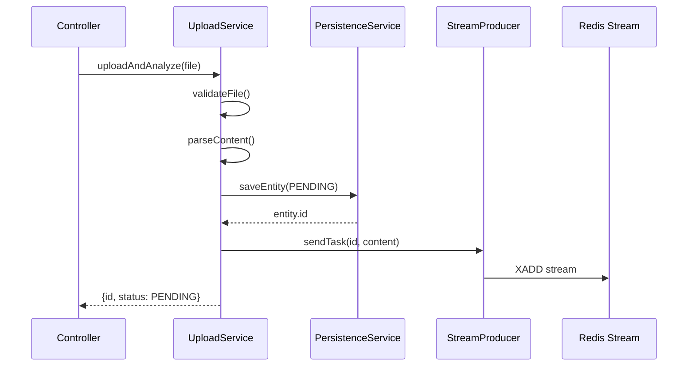
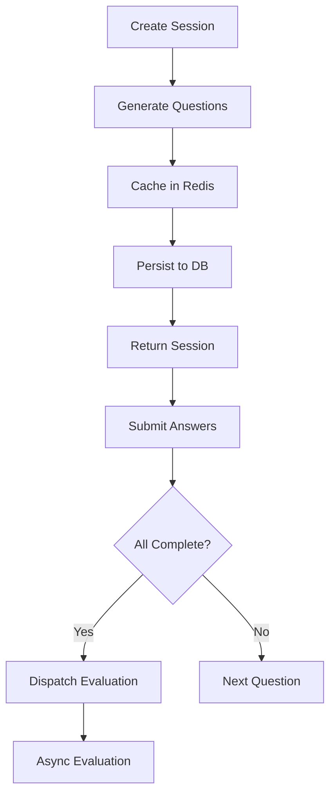

## Overview

The InterviewGuide backend follows a layered service architecture with clear separation of concerns. Services orchestrate business logic, manage transactions, and coordinate asynchronous processing through Redis Streams.

### Key Design Principles

<CardGroup cols={2}>
  <Card title="Single Responsibility" icon="cube">
    Each service handles a specific domain concern (upload, analysis, persistence)
  </Card>
  <Card title="Transaction Boundaries" icon="database">
    Services define clear transaction scopes with `@Transactional` annotations
  </Card>
  <Card title="Async Coordination" icon="bolt">
    Long-running AI tasks are dispatched to Redis Streams for async processing
  </Card>
  <Card title="Error Handling" icon="shield-check">
    Consistent error handling with `BusinessException` and status tracking
  </Card>
</CardGroup>

## Service Architecture Pattern

### Upload → Persist → Dispatch Flow

The typical flow for AI-powered features follows this pattern:



<Note>
  The service returns immediately with `PENDING` status. The client polls for completion using the returned ID.
</Note>

---

## ResumeUploadService

Handles resume upload, parsing, deduplication, and async analysis dispatch.

**Location**: `modules/resume/service/ResumeUploadService.java:1`

### Core Workflow

<Steps>
  <Step title="Validate File">
    Check file size (max 10MB) and content type (PDF, DOCX, DOC, TXT)
  </Step>
  <Step title="Check Duplicates">
    Use file hash to detect previously uploaded resumes
  </Step>
  <Step title="Parse Content">
    Extract text from document using Apache Tika
  </Step>
  <Step title="Store File">
    Upload to MinIO/S3-compatible storage
  </Step>
  <Step title="Persist Entity">
    Save to database with `analyzeStatus = PENDING`
  </Step>
  <Step title="Dispatch Analysis">
    Send task to `resume:analyze:stream` via `AnalyzeStreamProducer`
  </Step>
</Steps>

### Implementation Example

```java
// modules/resume/service/ResumeUploadService.java:47
public Map<String, Object> uploadAndAnalyze(MultipartFile file) {
    // 1. Validate file
    fileValidationService.validateFile(file, MAX_FILE_SIZE, "简历");
    String contentType = parseService.detectContentType(file);
    validateContentType(contentType);

    // 2. Check for duplicates (deduplication by file hash)
    Optional<ResumeEntity> existingResume = persistenceService.findExistingResume(file);
    if (existingResume.isPresent()) {
        return handleDuplicateResume(existingResume.get());
    }

    // 3. Parse resume text
    String resumeText = parseService.parseResume(file);
    if (resumeText == null || resumeText.trim().isEmpty()) {
        throw new BusinessException(ErrorCode.RESUME_PARSE_FAILED, 
            "无法从文件中提取文本内容，请确保文件不是扫描版PDF");
    }

    // 4. Save to storage (MinIO/S3)
    String fileKey = storageService.uploadResume(file);
    String fileUrl = storageService.getFileUrl(fileKey);

    // 5. Persist to database with PENDING status
    ResumeEntity savedResume = persistenceService.saveResume(
        file, resumeText, fileKey, fileUrl
    );

    // 6. Dispatch async analysis task
    analyzeStreamProducer.sendAnalyzeTask(savedResume.getId(), resumeText);

    // 7. Return immediately with PENDING status
    return Map.of(
        "resume", Map.of(
            "id", savedResume.getId(),
            "filename", savedResume.getOriginalFilename(),
            "analyzeStatus", AsyncTaskStatus.PENDING.name()
        ),
        "duplicate", false
    );
}
```

### Deduplication Strategy

**File Hash-Based Detection**: Uses SHA-256 hash to identify duplicate uploads.

```java
// modules/resume/service/ResumeUploadService.java:59
Optional<ResumeEntity> existingResume = persistenceService.findExistingResume(file);
if (existingResume.isPresent()) {
    // Return cached analysis result instead of re-analyzing
    return handleDuplicateResume(existingResume.get());
}
```

<Warning>
  Duplicate detection saves AI costs by reusing previous analysis results. The hash is computed during upload and stored in the `file_hash` column.
</Warning>

### Manual Reanalysis

Allows users to re-trigger analysis for failed or outdated results:

```java
// modules/resume/service/ResumeUploadService.java:150
@Transactional
public void reanalyze(Long resumeId) {
    ResumeEntity resume = resumeRepository.findById(resumeId)
        .orElseThrow(() -> new BusinessException(ErrorCode.RESUME_NOT_FOUND));

    String resumeText = resume.getResumeText();
    if (resumeText == null || resumeText.trim().isEmpty()) {
        // Re-parse from storage if text cache is missing
        resumeText = parseService.downloadAndParseContent(
            resume.getStorageKey(), 
            resume.getOriginalFilename()
        );
        resume.setResumeText(resumeText);
    }

    // Reset status to PENDING
    resume.setAnalyzeStatus(AsyncTaskStatus.PENDING);
    resume.setAnalyzeError(null);
    resumeRepository.save(resume);

    // Dispatch to stream
    analyzeStreamProducer.sendAnalyzeTask(resumeId, resumeText);
}
```

---

## InterviewSessionService

Manages interview session lifecycle with Redis caching and database persistence.

**Location**: `modules/interview/service/InterviewSessionService.java:1`

### Session State Management

<Info>
  Sessions are cached in Redis (TTL: 2 hours) and persisted to PostgreSQL for durability. The service automatically restores sessions from the database if cache expires.
</Info>

### Architecture



### Creating Interview Sessions

```java
// modules/interview/service/InterviewSessionService.java:43
public InterviewSessionDTO createSession(CreateInterviewRequest request) {
    // Check for unfinished sessions (avoid duplicates)
    if (request.resumeId() != null && !Boolean.TRUE.equals(request.forceCreate())) {
        Optional<InterviewSessionDTO> unfinishedOpt = 
            findUnfinishedSession(request.resumeId());
        if (unfinishedOpt.isPresent()) {
            return unfinishedOpt.get(); // Resume existing session
        }
    }

    String sessionId = UUID.randomUUID().toString()
        .replace("-", "").substring(0, 16);

    // Get historical questions to avoid repetition
    List<String> historicalQuestions = null;
    if (request.resumeId() != null) {
        historicalQuestions = persistenceService
            .getHistoricalQuestionsByResumeId(request.resumeId());
    }

    // Generate interview questions using AI
    List<InterviewQuestionDTO> questions = questionService.generateQuestions(
        request.resumeText(),
        request.questionCount(),
        historicalQuestions
    );

    // Save to Redis cache (fast access)
    sessionCache.saveSession(
        sessionId,
        request.resumeText(),
        request.resumeId(),
        questions,
        0,
        SessionStatus.CREATED
    );

    // Save to database (durability)
    if (request.resumeId() != null) {
        persistenceService.saveSession(
            sessionId, 
            request.resumeId(),
            questions.size(), 
            questions
        );
    }

    return new InterviewSessionDTO(sessionId, request.resumeText(), 
        questions.size(), 0, questions, SessionStatus.CREATED);
}
```

### Cache-First with Database Fallback

```java
// modules/interview/service/InterviewSessionService.java:105
public InterviewSessionDTO getSession(String sessionId) {
    // 1. Try Redis cache first (fast path)
    Optional<CachedSession> cachedOpt = sessionCache.getSession(sessionId);
    if (cachedOpt.isPresent()) {
        return toDTO(cachedOpt.get());
    }

    // 2. Cache miss - restore from database (slow path)
    CachedSession restoredSession = restoreSessionFromDatabase(sessionId);
    if (restoredSession == null) {
        throw new BusinessException(ErrorCode.INTERVIEW_SESSION_NOT_FOUND);
    }

    return toDTO(restoredSession);
}
```

<Tip>
  The cache-first pattern reduces database load for active sessions while ensuring data durability through database persistence.
</Tip>

### Submitting Answers

Answers are submitted incrementally. When the last question is answered, evaluation is automatically dispatched:

```java
// modules/interview/service/InterviewSessionService.java:277
public SubmitAnswerResponse submitAnswer(SubmitAnswerRequest request) {
    CachedSession session = getOrRestoreSession(request.sessionId());
    List<InterviewQuestionDTO> questions = session.getQuestions(objectMapper);

    // Update question with user's answer
    InterviewQuestionDTO question = questions.get(request.questionIndex());
    InterviewQuestionDTO answeredQuestion = question.withAnswer(request.answer());
    questions.set(request.questionIndex(), answeredQuestion);

    // Move to next question
    int newIndex = request.questionIndex() + 1;
    boolean hasNextQuestion = newIndex < questions.size();
    SessionStatus newStatus = hasNextQuestion 
        ? SessionStatus.IN_PROGRESS 
        : SessionStatus.COMPLETED;

    // Update Redis cache
    sessionCache.updateQuestions(request.sessionId(), questions);
    sessionCache.updateCurrentIndex(request.sessionId(), newIndex);
    if (newStatus == SessionStatus.COMPLETED) {
        sessionCache.updateSessionStatus(request.sessionId(), SessionStatus.COMPLETED);
    }

    // Persist answer to database
    persistenceService.saveAnswer(
        request.sessionId(), 
        request.questionIndex(),
        question.question(), 
        question.category(),
        request.answer(), 
        0, 
        null
    );

    // If last question, trigger async evaluation
    if (!hasNextQuestion) {
        persistenceService.updateEvaluateStatus(
            request.sessionId(), 
            AsyncTaskStatus.PENDING, 
            null
        );
        evaluateStreamProducer.sendEvaluateTask(request.sessionId());
        log.info("Session {} completed, evaluation task queued", request.sessionId());
    }

    return new SubmitAnswerResponse(
        hasNextQuestion,
        hasNextQuestion ? questions.get(newIndex) : null,
        newIndex,
        questions.size()
    );
}
```

---

## KnowledgeBaseQueryService

Implements RAG (Retrieval-Augmented Generation) for knowledge base Q&A.

**Location**: `modules/knowledgebase/service/KnowledgeBaseQueryService.java:1`

### RAG Pipeline

<Steps>
  <Step title="Query Rewriting">
    Use AI to expand and clarify user queries for better retrieval
  </Step>
  <Step title="Vector Search">
    Retrieve top-K relevant document chunks using pgvector similarity search
  </Step>
  <Step title="Context Building">
    Merge retrieved chunks into a coherent context
  </Step>
  <Step title="Response Generation">
    Use AI to generate answers based on the context
  </Step>
</Steps>

### Query Rewriting

Improves retrieval quality by rewriting ambiguous queries:

```java
// modules/knowledgebase/service/KnowledgeBaseQueryService.java:285
private String rewriteQuestion(String question) {
    if (!rewriteEnabled || question.isBlank()) {
        return question;
    }
    try {
        Map<String, Object> variables = new HashMap<>();
        variables.put("question", question);
        String rewritePrompt = rewritePromptTemplate.render(variables);
        
        String rewritten = chatClient.prompt()
            .user(rewritePrompt)
            .call()
            .content();
        
        log.info("Query rewrite: origin='{}', rewritten='{}'", 
            question, rewritten);
        return rewritten.trim();
    } catch (Exception e) {
        log.warn("Query rewrite failed, using original: {}", e.getMessage());
        return question;
    }
}
```

### Dynamic Search Parameters

Adjusts `topK` and `minScore` based on query length:

```java
// modules/knowledgebase/service/KnowledgeBaseQueryService.java:274
private SearchParams resolveSearchParams(String question) {
    int compactLength = question.replaceAll("\\s+", "").length();
    
    if (compactLength <= shortQueryLength) {
        // Short queries: cast wider net with lower threshold
        return new SearchParams(topkShort, minScoreShort); // 20, 0.18
    }
    if (compactLength <= 12) {
        // Medium queries: balanced approach
        return new SearchParams(topkMedium, minScoreDefault); // 12, 0.28
    }
    // Long queries: focus on top matches
    return new SearchParams(topkLong, minScoreDefault); // 8, 0.28
}
```

<Info>
  Short queries like "Redis" need more retrieval candidates because semantic similarity is harder to determine. Longer queries have more context, allowing tighter filtering.
</Info>

### Streaming Responses (SSE)

Supports real-time streaming for better UX:

```java
// modules/knowledgebase/service/KnowledgeBaseQueryService.java:190
public Flux<String> answerQuestionStream(List<Long> knowledgeBaseIds, String question) {
    // 1. Validate and update counters
    countService.updateQuestionCounts(knowledgeBaseIds);

    // 2. Query rewrite + vector search
    QueryContext queryContext = buildQueryContext(question);
    List<Document> relevantDocs = retrieveRelevantDocs(queryContext, knowledgeBaseIds);

    if (!hasEffectiveHit(question, relevantDocs)) {
        return Flux.just(NO_RESULT_RESPONSE);
    }

    // 3. Build context from retrieved documents
    String context = relevantDocs.stream()
        .map(Document::getText)
        .collect(Collectors.joining("\n\n---\n\n"));

    // 4. Stream AI response with normalization
    String systemPrompt = buildSystemPrompt();
    String userPrompt = buildUserPrompt(context, question);

    Flux<String> responseFlux = chatClient.prompt()
        .system(systemPrompt)
        .user(userPrompt)
        .stream()
        .content();

    return normalizeStreamOutput(responseFlux)
        .doOnComplete(() -> log.info("Stream completed: kbIds={}", knowledgeBaseIds))
        .onErrorResume(e -> {
            log.error("Stream failed: {}", e.getMessage(), e);
            return Flux.just("【错误】知识库查询失败：AI服务暂时不可用");
        });
}
```

### Early Response Detection

Detects "no information" responses early to avoid streaming unhelpful content:

```java
// modules/knowledgebase/service/KnowledgeBaseQueryService.java:367
private Flux<String> normalizeStreamOutput(Flux<String> rawFlux) {
    return Flux.create(sink -> {
        StringBuilder probeBuffer = new StringBuilder();
        AtomicBoolean passthrough = new AtomicBoolean(false);

        rawFlux.subscribe(
            chunk -> {
                if (passthrough.get()) {
                    sink.next(chunk); // Stream directly
                    return;
                }

                probeBuffer.append(chunk);
                String probeText = probeBuffer.toString();
                
                // Check for "no result" patterns in first 120 chars
                if (isNoResultLike(probeText)) {
                    sink.next(NO_RESULT_RESPONSE);
                    sink.complete();
                    return;
                }

                // After 120 chars, switch to passthrough mode
                if (probeBuffer.length() >= STREAM_PROBE_CHARS) {
                    passthrough.set(true);
                    sink.next(probeText);
                    probeBuffer.setLength(0);
                }
            },
            sink::error,
            sink::complete
        );
    });
}
```

---

## Transaction Management

### Service-Level Transactions

Use `@Transactional` for operations that must be atomic:

```java
@Transactional
public void reanalyze(Long resumeId) {
    ResumeEntity resume = resumeRepository.findById(resumeId)
        .orElseThrow(() -> new BusinessException(ErrorCode.RESUME_NOT_FOUND));
    
    // Multiple database operations in one transaction
    resume.setAnalyzeStatus(AsyncTaskStatus.PENDING);
    resume.setAnalyzeError(null);
    resumeRepository.save(resume);
    
    // This runs AFTER transaction commit to avoid race conditions
    analyzeStreamProducer.sendAnalyzeTask(resumeId, resumeText);
}
```

<Warning>
  **Transaction Boundaries**: Async task dispatch should happen AFTER the transaction commits to ensure the entity state is persisted before processing begins.
</Warning>

### Error Handling Pattern

Consistent exception handling across services:

```java
try {
    // Business logic
} catch (IllegalArgumentException e) {
    throw new BusinessException(ErrorCode.INVALID_PARAMETER, e.getMessage());
} catch (Exception e) {
    log.error("Unexpected error: {}", e.getMessage(), e);
    throw new BusinessException(ErrorCode.INTERNAL_ERROR, "操作失败");
}
```

### Status Tracking

All async operations track state using enum-based status fields:

```java
public enum AsyncTaskStatus {
    PENDING,    // Task queued, not started
    PROCESSING, // Consumer picked up task
    COMPLETED,  // Task finished successfully
    FAILED      // Task failed after retries
}
```

---

## Best Practices

<AccordionGroup>
  <Accordion title="Keep Services Focused">
    Each service should have a single, well-defined responsibility. Split large services into smaller, composable units.
    
    **Example**: `ResumeUploadService` handles upload/dispatch, while `ResumeGradingService` handles AI analysis.
  </Accordion>

  <Accordion title="Use Async for Long Operations">
    Operations taking >5 seconds should be asynchronous. Use Redis Streams for task queuing.
    
    **Pattern**: Synchronous endpoint returns `PENDING` status + task ID, client polls for completion.
  </Accordion>

  <Accordion title="Implement Idempotency">
    Services should handle duplicate requests gracefully, especially for state-changing operations.
    
    **Example**: Resume upload uses file hash to detect duplicates and return cached results.
  </Accordion>

  <Accordion title="Cache Hot Data">
    Use Redis for frequently accessed data with short lifecycles (e.g., interview sessions).
    
    **Pattern**: Cache-first with database fallback for durability.
  </Accordion>
</AccordionGroup>

---

## See Also

<CardGroup cols={2}>
  <Card title="Redis Streams" icon="bolt" href="./redis-streams">
    Learn about async task processing with Redis Streams
  </Card>
  <Card title="Vector Store" icon="database" href="./vector-store">
    Understand pgvector integration for RAG
  </Card>
  <Card title="PDF Export" icon="file-pdf" href="./pdf-export">
    Generate PDF reports with iText 8
  </Card>
  <Card title="Project Structure" icon="folder-tree" href="../project-structure">
    Explore the overall codebase organization
  </Card>
</CardGroup>