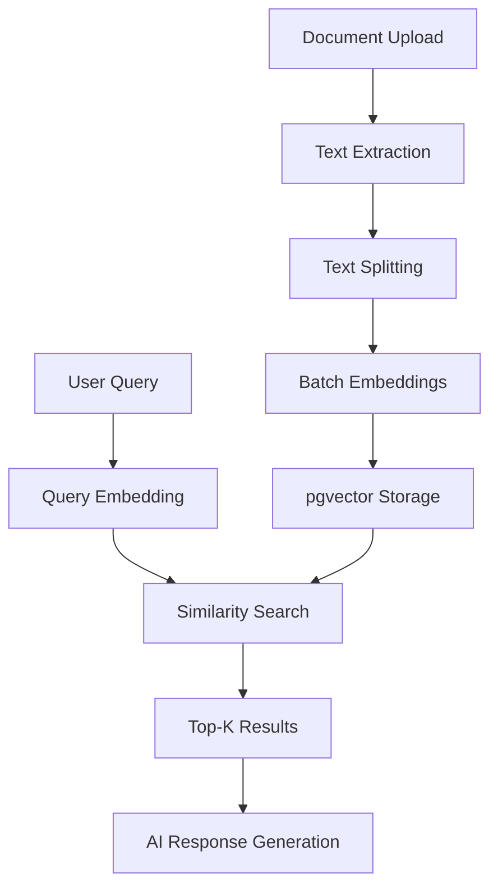

## Overview

InterviewGuide uses **pgvector** (a PostgreSQL extension) for vector storage and similarity search. This enables RAG (Retrieval-Augmented Generation) for the knowledge base feature.

### Architecture



---

## Spring AI Configuration

### application.yml

**Location**: `src/main/resources/application.yml:52`

```yaml
spring:
  ai:
    openai:
      # Alibaba Cloud DashScope (OpenAI-compatible mode)
      base-url: https://dashscope.aliyuncs.com/compatible-mode
      api-key: ${AI_BAILIAN_API_KEY}
      
      # Embedding model: text-embedding-v3
      embedding:
        options:
          model: text-embedding-v3
    
    # pgvector configuration
    vectorstore:
      pgvector:
        index-type: HNSW                    # Hierarchical Navigable Small World
        distance-type: COSINE_DISTANCE       # Cosine similarity
        dimensions: 1024                     # text-embedding-v3 dimension
        initialize-schema: true              # Auto-create tables (dev only)
        remove-existing-vector-store-table: false  # Keep existing data
```

<Info>
  **text-embedding-v3** generates 1024-dimensional embeddings. The HNSW index provides fast approximate nearest neighbor search.
</Info>

### Database Schema

Spring AI automatically creates the `vector_store` table:

```sql
CREATE TABLE vector_store (
    id UUID PRIMARY KEY DEFAULT gen_random_uuid(),
    content TEXT,                          -- Original text chunk
    metadata JSON,                         -- Metadata (kb_id, filename, etc.)
    embedding vector(1024)                 -- 1024-dim embedding vector
);

-- HNSW index for fast similarity search
CREATE INDEX vector_store_embedding_idx 
    ON vector_store 
    USING hnsw (embedding vector_cosine_ops);
```

<Warning>
  In production, set `initialize-schema: false` and manage schema migrations manually to avoid accidental data loss.
</Warning>

---

## KnowledgeBaseVectorService

Core service for document vectorization and similarity search.

**Location**: `modules/knowledgebase/service/KnowledgeBaseVectorService.java:1`

### Text Splitting

Large documents are split into smaller chunks for better retrieval:

```java
// modules/knowledgebase/service/KnowledgeBaseVectorService.java:23
@Service
public class KnowledgeBaseVectorService {
    
    private static final int MAX_BATCH_SIZE = 10;  // Alibaba Cloud limit
    private final VectorStore vectorStore;
    private final TextSplitter textSplitter;
    private final VectorRepository vectorRepository;

    public KnowledgeBaseVectorService(VectorStore vectorStore, 
                                      VectorRepository vectorRepository) {
        this.vectorStore = vectorStore;
        this.vectorRepository = vectorRepository;
        
        // TokenTextSplitter: ~500 tokens per chunk, 50 token overlap
        this.textSplitter = new TokenTextSplitter();
    }
}
```

<Tip>
  **Why chunk overlap?** Overlapping chunks ensure context isn't lost at chunk boundaries. A 50-token overlap means the last 50 tokens of chunk N appear at the start of chunk N+1.
</Tip>

### Vectorization and Storage

```java
// modules/knowledgebase/service/KnowledgeBaseVectorService.java:44
@Transactional
public void vectorizeAndStore(Long knowledgeBaseId, String content) {
    log.info("Starting vectorization: kbId={}, contentLength={}", 
        knowledgeBaseId, content.length());
    
    try {
        // 1. Delete old vectors for this knowledge base
        deleteByKnowledgeBaseId(knowledgeBaseId);
        
        // 2. Split text into chunks
        List<Document> chunks = textSplitter.apply(
            List.of(new Document(content))
        );
        
        log.info("Text split into {} chunks", chunks.size());
        
        // 3. Add metadata (kb_id) to each chunk
        chunks.forEach(chunk -> 
            chunk.getMetadata().put("kb_id", knowledgeBaseId.toString())
        );
        
        // 4. Batch process (Alibaba Cloud limit: 10 per batch)
        int totalChunks = chunks.size();
        int batchCount = (totalChunks + MAX_BATCH_SIZE - 1) / MAX_BATCH_SIZE;
        
        log.info("Processing {} batches ({} chunks per batch)", 
            batchCount, MAX_BATCH_SIZE);
        
        for (int i = 0; i < batchCount; i++) {
            int start = i * MAX_BATCH_SIZE;
            int end = Math.min(start + MAX_BATCH_SIZE, totalChunks);
            List<Document> batch = chunks.subList(start, end);
            
            log.debug("Processing batch {}/{}: chunks {}-{}", 
                i + 1, batchCount, start + 1, end);
            
            // Generate embeddings and store
            vectorStore.add(batch);
        }
        
        log.info("Vectorization complete: kbId={}, chunks={}, batches={}",
            knowledgeBaseId, totalChunks, batchCount);
    } catch (Exception e) {
        log.error("Vectorization failed: kbId={}, error={}", 
            knowledgeBaseId, e.getMessage(), e);
        throw new RuntimeException("向量化失败: " + e.getMessage(), e);
    }
}
```

### What Happens in `vectorStore.add(batch)`?

<Steps>
  <Step title="Embedding Generation">
    Spring AI calls Alibaba Cloud's `text-embedding-v3` API to generate embeddings for each chunk
  </Step>
  <Step title="Database Insert">
    Inserts records into the `vector_store` table with content, metadata, and embedding vector
  </Step>
  <Step title="Index Update">
    PostgreSQL automatically updates the HNSW index for fast similarity search
  </Step>
</Steps>

---

## Similarity Search

### Basic Search

```java
// modules/knowledgebase/service/KnowledgeBaseVectorService.java:88
public List<Document> similaritySearch(String query, 
                                       List<Long> knowledgeBaseIds, 
                                       int topK, 
                                       double minScore) {
    log.info("Vector similarity search: query={}, kbIds={}, topK={}, minScore={}",
        query, knowledgeBaseIds, topK, minScore);
    
    try {
        SearchRequest.Builder builder = SearchRequest.builder()
            .query(query)
            .topK(Math.max(topK, 1));

        if (minScore > 0) {
            builder.similarityThreshold(minScore);
        }

        // Filter by knowledge base IDs
        if (knowledgeBaseIds != null && !knowledgeBaseIds.isEmpty()) {
            builder.filterExpression(buildKbFilterExpression(knowledgeBaseIds));
        }

        List<Document> results = vectorStore.similaritySearch(builder.build());
        if (results == null) {
            return List.of();
        }
        
        log.info("Search complete: found {} relevant documents", results.size());
        return results;
        
    } catch (Exception e) {
        log.warn("Filter-based search failed, falling back to local filtering: {}", 
            e.getMessage());
        return similaritySearchFallback(query, knowledgeBaseIds, topK, minScore);
    }
}
```

### Filter Expressions

Filters restrict search to specific knowledge bases:

```java
// modules/knowledgebase/service/KnowledgeBaseVectorService.java:167
private String buildKbFilterExpression(List<Long> knowledgeBaseIds) {
    String values = knowledgeBaseIds.stream()
        .filter(Objects::nonNull)
        .map(String::valueOf)
        .map(id -> "'" + id + "'")  // Quote string values
        .collect(Collectors.joining(", "));
    
    return "kb_id in [" + values + "]";
}
```

**Example**: `kb_id in ['123', '456', '789']`

<Info>
  The filter uses the `metadata` JSON field. Spring AI translates this to a PostgreSQL JSON query:
  
  ```sql
  WHERE metadata->>'kb_id' IN ('123', '456', '789')
  ```
</Info>

### Fallback Strategy

If filter-based search fails (e.g., due to database limitations), the service falls back to local filtering:

```java
// modules/knowledgebase/service/KnowledgeBaseVectorService.java:119
private List<Document> similaritySearchFallback(String query, 
                                                List<Long> knowledgeBaseIds, 
                                                int topK, 
                                                double minScore) {
    try {
        // Fetch more results (3x topK) and filter locally
        SearchRequest.Builder builder = SearchRequest.builder()
            .query(query)
            .topK(Math.max(topK * 3, topK));
        
        if (minScore > 0) {
            builder.similarityThreshold(minScore);
        }

        List<Document> allResults = vectorStore.similaritySearch(builder.build());
        if (allResults == null || allResults.isEmpty()) {
            return List.of();
        }

        // Filter by knowledge base IDs in application code
        if (knowledgeBaseIds != null && !knowledgeBaseIds.isEmpty()) {
            allResults = allResults.stream()
                .filter(doc -> isDocInKnowledgeBases(doc, knowledgeBaseIds))
                .collect(Collectors.toList());
        }

        List<Document> results = allResults.stream()
            .limit(topK)
            .collect(Collectors.toList());

        log.info("Fallback search complete: found {} documents", results.size());
        return results;
    } catch (Exception e) {
        log.error("Fallback search failed: {}", e.getMessage(), e);
        throw new RuntimeException("向量搜索失败: " + e.getMessage(), e);
    }
}
```

---

## VectorRepository

Handles direct SQL operations for vector data.

**Location**: `modules/knowledgebase/repository/VectorRepository.java:1`

### Deleting Vectors by Knowledge Base

```java
// modules/knowledgebase/repository/VectorRepository.java:16
@Repository
public class VectorRepository {
    
    private final JdbcTemplate jdbcTemplate;
    
    @Transactional(rollbackFor = Exception.class)
    public int deleteByKnowledgeBaseId(Long knowledgeBaseId) {
        log.info("Deleting vector data for kbId={}", knowledgeBaseId);
        
        /* 
         * PostgreSQL JSON query:
         * - metadata->>'kb_id' extracts kb_id as text
         * - Supports both string and numeric kb_id storage
         */
        String sql = """
            DELETE FROM vector_store
            WHERE metadata->>'kb_id' = ?
               OR (metadata->>'kb_id_long' IS NOT NULL 
                   AND (metadata->>'kb_id_long')::bigint = ?)
            """;
        
        try {
            int deletedRows = jdbcTemplate.update(sql, 
                knowledgeBaseId.toString(),  // String match
                knowledgeBaseId);             // Numeric match
            
            if (deletedRows > 0) {
                log.info("Deleted {} vector rows for kbId={}", deletedRows, knowledgeBaseId);
            } else {
                log.info("No vector data found for kbId={}", knowledgeBaseId);
            }
            
            return deletedRows;
            
        } catch (Exception e) {
            log.error("Failed to delete vectors: kbId={}, error={}", 
                knowledgeBaseId, e.getMessage());
            throw new RuntimeException("删除向量数据失败", e);
        }
    }
}
```

<Warning>
  **Metadata Type Handling**: The query checks both `kb_id` (string) and `kb_id_long` (numeric) to handle different storage formats. This ensures compatibility across schema versions.
</Warning>

---

## Metadata Structure

### Example Metadata

```json
{
  "kb_id": "12345",
  "filename": "redis-guide.pdf",
  "upload_time": "2024-03-10T08:30:00Z",
  "chunk_index": 3
}
```

### Accessing Metadata in Code

```java
Document doc = searchResults.get(0);
Map<String, Object> metadata = doc.getMetadata();

String kbId = (String) metadata.get("kb_id");
String filename = (String) metadata.get("filename");
```

---

## RAG Integration

The vector store integrates with `KnowledgeBaseQueryService` for RAG:

```java
// From KnowledgeBaseQueryService.java
public String answerQuestion(List<Long> knowledgeBaseIds, String question) {
    // 1. Query rewriting (optional)
    String rewrittenQuery = rewriteQuestion(question);
    
    // 2. Vector similarity search
    List<Document> relevantDocs = vectorService.similaritySearch(
        rewrittenQuery,
        knowledgeBaseIds,
        topK,
        minScore
    );
    
    // 3. Build context from retrieved documents
    String context = relevantDocs.stream()
        .map(Document::getText)
        .collect(Collectors.joining("\n\n---\n\n"));
    
    // 4. Generate AI response with context
    String systemPrompt = buildSystemPrompt();
    String userPrompt = buildUserPrompt(context, question);
    
    String answer = chatClient.prompt()
        .system(systemPrompt)
        .user(userPrompt)
        .call()
        .content();
    
    return answer;
}
```

---

## Chunk Management

### Optimal Chunk Size

<CardGroup cols={2}>
  <Card title="Too Small" icon="down">
    - **Problem**: Lack of context, poor retrieval quality
    - **Example**: Single sentences or short paragraphs
  </Card>
  <Card title="Too Large" icon="up">
    - **Problem**: Noisy results, irrelevant content mixed in
    - **Example**: Entire documents or long sections
  </Card>
  <Card title="Just Right" icon="check">
    - **Size**: 400-600 tokens (~300-450 words)
    - **Overlap**: 50-100 tokens for context preservation
  </Card>
  <Card title="Configuration" icon="gear">
    - **Splitter**: `TokenTextSplitter` (default settings)
    - **Embedder**: text-embedding-v3 (1024 dims)
  </Card>
</CardGroup>

### Chunk Statistics

Typical document statistics:

```
Document Size: 50KB
Total Tokens: ~12,500
Chunks: ~25 (500 tokens each)
Overlap: 50 tokens per boundary
Embedding API Calls: 3 batches (10 chunks per batch)
```

---

## Performance Optimization

### HNSW Index Parameters

The HNSW (Hierarchical Navigable Small World) index balances speed and accuracy:

```sql
-- Default HNSW parameters (configured by Spring AI)
CREATE INDEX vector_store_embedding_idx 
    ON vector_store 
    USING hnsw (embedding vector_cosine_ops)
    WITH (m = 16, ef_construction = 64);
```

<Info>
  - **m**: Number of connections per layer (higher = more accurate, slower)
  - **ef_construction**: Search width during index build (higher = better quality, slower build)
  - **Defaults**: Good balance for most use cases
</Info>

### Query Optimization

```sql
-- Efficient query with filter
SELECT id, content, metadata, embedding
FROM vector_store
WHERE metadata->>'kb_id' IN ('123', '456')
ORDER BY embedding <=> '[0.1, 0.2, ..., 0.9]'  -- Cosine distance
LIMIT 10;
```

### Batch Processing

<Tip>
  Always batch embedding API calls to reduce latency. Alibaba Cloud `text-embedding-v3` supports up to 10 texts per request.
</Tip>

```java
// Good: Batch of 10
vectorStore.add(chunks.subList(0, 10));

// Bad: One at a time
for (Document chunk : chunks) {
    vectorStore.add(List.of(chunk));  // 10x slower!
}
```

---

## Troubleshooting

<AccordionGroup>
  <Accordion title="No Results Returned">
    **Possible Causes**:
    - `minScore` threshold too high
    - No vectors for specified `kb_id`
    - Query embedding fails to match any documents
    
    **Solutions**:
    - Lower `minScore` (try 0.2-0.3 for initial testing)
    - Check if vectorization completed successfully
    - Verify `kb_id` metadata is correct
  </Accordion>

  <Accordion title="Slow Search Performance">
    **Possible Causes**:
    - Missing HNSW index
    - Large result set (high `topK`)
    - Complex filter expressions
    
    **Solutions**:
    - Verify index exists: `\d vector_store` in psql
    - Reduce `topK` to minimum needed
    - Simplify filters or use fallback strategy
  </Accordion>

  <Accordion title="Embedding API Errors">
    **Possible Causes**:
    - Invalid API key
    - Rate limit exceeded
    - Batch size > 10
    
    **Solutions**:
    - Check `AI_BAILIAN_API_KEY` environment variable
    - Add retry logic with exponential backoff
    - Ensure `MAX_BATCH_SIZE = 10`
  </Accordion>

  <Accordion title="Metadata Filter Not Working">
    **Possible Causes**:
    - Metadata stored as wrong type (string vs. number)
    - PostgreSQL JSON syntax issues
    
    **Solutions**:
    - Store `kb_id` as string: `knowledgeBaseId.toString()`
    - Use fallback strategy for broader compatibility
  </Accordion>
</AccordionGroup>

---

## Best Practices

<Steps>
  <Step title="Normalize Metadata">
    Always store `kb_id` as a string for consistent filtering:
    
    ```java
    chunk.getMetadata().put("kb_id", knowledgeBaseId.toString());
    ```
  </Step>

  <Step title="Delete Before Re-Vectorizing">
    Always delete old vectors before adding new ones to avoid duplicates:
    
    ```java
    deleteByKnowledgeBaseId(knowledgeBaseId);
    vectorizeAndStore(knowledgeBaseId, newContent);
    ```
  </Step>

  <Step title="Monitor Chunk Count">
    Track the number of chunks per document to detect anomalies:
    
    ```java
    log.info("Document vectorized: kbId={}, chunks={}", kbId, chunks.size());
    ```
  </Step>

  <Step title="Use Appropriate Thresholds">
    Adjust `minScore` based on query type:
    - Short queries (1-4 chars): 0.18
    - Medium queries (5-12 chars): 0.28
    - Long queries (>12 chars): 0.28
  </Step>

  <Step title="Handle Missing Results">
    Always check for empty results and provide user-friendly fallback:
    
    ```java
    if (relevantDocs.isEmpty()) {
        return "抱歉，未找到相关信息";
    }
    ```
  </Step>
</Steps>

---

## See Also

<CardGroup cols={2}>
  <Card title="Service Layer" icon="layer-group" href="./services">
    How KnowledgeBaseQueryService orchestrates RAG
  </Card>
  <Card title="Redis Streams" icon="bolt" href="./redis-streams">
    Async vectorization with VectorizeStreamConsumer
  </Card>
  <Card title="Database Config" icon="database" href="../../configuration/database">
    PostgreSQL and pgvector setup
  </Card>
  <Card title="AI Model Config" icon="brain" href="../../configuration/ai-model">
    Embedding model and API configuration
  </Card>
</CardGroup>