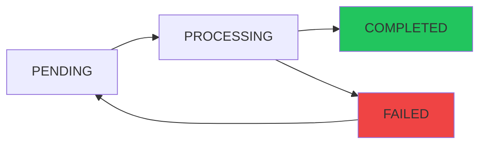
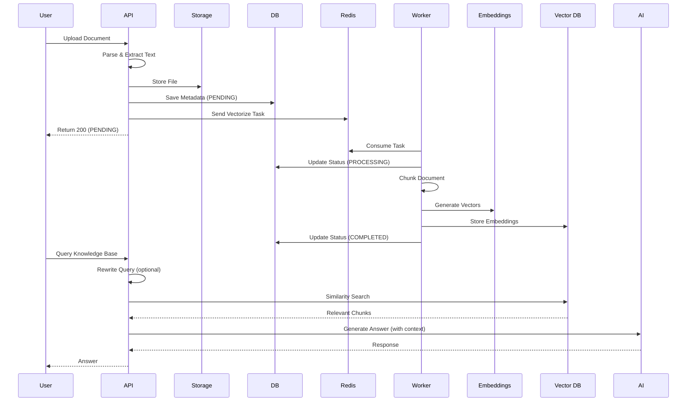

## Overview

The Knowledge Base feature enables users to upload documents that are automatically parsed, chunked, and vectorized for Retrieval-Augmented Generation (RAG). The system uses PostgreSQL with pgvector extension for vector storage and supports streaming responses via Server-Sent Events (SSE) for real-time AI interactions.

<Note>
All vectorization operations are processed asynchronously using Redis Streams to handle large documents efficiently.
</Note>

## Supported Document Formats

<CardGroup cols={2}>
  <Card title="PDF Documents" icon="file-pdf">
    Adobe PDF files with text layer support
  </Card>
  <Card title="Word Documents" icon="file-word">
    Microsoft Word (DOCX, DOC)
  </Card>
  <Card title="Text Files" icon="file-text">
    Plain text (TXT) and Markdown (MD)
  </Card>
  <Card title="Max File Size" icon="database">
    Up to 50MB per document
  </Card>
</CardGroup>

## Upload and Vectorization Workflow

The knowledge base follows an asynchronous processing pipeline:

<Steps>
  <Step title="Upload Document">
    Users upload a document with optional metadata:
    ```typescript
    POST /api/knowledgebase/upload
    Content-Type: multipart/form-data
    ```
    
    **Form Parameters**:
    - `file`: Document file (required)
    - `name`: Custom name (optional, defaults to filename)
    - `category`: Classification tag (optional, e.g., "Java", "System Design")
    
    **Validation**:
    ```java
    // KnowledgeBaseUploadService.java:38
    private static final long MAX_FILE_SIZE = 50 * 1024 * 1024; // 50MB
    ```
  </Step>
  
  <Step title="Duplicate Detection">
    The system calculates a SHA-256 hash to prevent duplicate uploads:
    ```java
    // KnowledgeBaseEntity.java:21-23
    @Column(nullable = false, unique = true, length = 64)
    private String fileHash;
    ```
    
    If a duplicate is detected, the existing knowledge base entry is returned immediately.
  </Step>
  
  <Step title="Content Extraction">
    Apache Tika parses the document and extracts text:
    ```java
    // KnowledgeBaseUploadService.java:68-71
    String content = parseService.parseContent(file);
    if (content == null || content.trim().isEmpty()) {
        throw new BusinessException(ErrorCode.INTERNAL_ERROR, "无法从文件中提取文本内容");
    }
    ```
  </Step>
  
  <Step title="File Storage">
    Original file is uploaded to S3-compatible storage:
    ```java
    // KnowledgeBaseUploadService.java:74-76
    String fileKey = storageService.uploadKnowledgeBase(file);
    String fileUrl = storageService.getFileUrl(fileKey);
    ```
  </Step>
  
  <Step title="Metadata Persistence">
    Knowledge base entity is saved with status **PENDING**:
    ```java
    // KnowledgeBaseEntity.java:64-67
    @Enumerated(EnumType.STRING)
    private VectorStatus vectorStatus = VectorStatus.PENDING;
    ```
  </Step>
  
  <Step title="Vectorization Task">
    A task is sent to Redis Stream for async processing:
    ```java
    // KnowledgeBaseUploadService.java:82
    vectorizeStreamProducer.sendVectorizeTask(savedKb.getId(), content);
    ```
    
    The API returns immediately with status **PENDING**.
  </Step>
  
  <Step title="Background Vectorization">
    A consumer worker:
    - Updates status to **PROCESSING**
    - Chunks the document using `TokenTextSplitter`
    - Generates embeddings for each chunk
    - Stores vectors in PostgreSQL (pgvector)
    - Updates status to **COMPLETED** or **FAILED**
  </Step>
</Steps>

## Vectorization Status Flow



<Accordion title="Status Definitions">
  ```java
  public enum VectorStatus {
      PENDING,      // Document uploaded, awaiting vectorization
      PROCESSING,   // Chunking and embedding in progress
      COMPLETED,    // Successfully vectorized and stored
      FAILED        // Vectorization failed (check vectorError field)
  }
  ```
</Accordion>

## Document Chunking Strategy

Large documents are split into smaller chunks for effective embedding:

<CardGroup cols={2}>
  <Card title="Chunking Method" icon="scissors">
    **TokenTextSplitter** from Spring AI
    
    Splits text based on token count rather than character count for accurate embedding.
  </Card>
  
  <Card title="Chunk Metadata" icon="tags">
    Each chunk stores:
    - Original document ID
    - Chunk index
    - Document metadata (name, category)
    - Embedding vector
  </Card>
</CardGroup>

<Note>
Chunk count is tracked in `KnowledgeBaseEntity.chunkCount` for statistics and debugging.
</Note>

## Category Management

Organize knowledge bases with categories:

### List All Categories

```typescript
GET /api/knowledgebase/categories
```

**Response**:
```json
["Java", "System Design", "Databases", "Algorithms"]
```

### Filter by Category

```typescript
GET /api/knowledgebase/category/{category}
```

### Update Category

```typescript
PUT /api/knowledgebase/{id}/category
```

```json
{
  "category": "Spring Framework"
}
```

## RAG Query Flow

The system uses Retrieval-Augmented Generation to answer questions based on uploaded documents:

<Steps>
  <Step title="Query Submission">
    Users submit a question with selected knowledge base IDs:
    ```typescript
    POST /api/knowledgebase/query
    ```
    
    ```json
    {
      "knowledgeBaseIds": [1, 2, 3],
      "question": "How does Redis handle persistence?"
    }
    ```
  </Step>
  
  <Step title="Knowledge Base Validation">
    System validates that all IDs exist and increments question counters:
    ```java
    // KnowledgeBaseQueryService.java:111
    countService.updateQuestionCounts(knowledgeBaseIds);
    ```
  </Step>
  
  <Step title="Query Rewriting (Optional)">
    If enabled, the question is rewritten for better retrieval:
    
    ```yaml
    # application.yml
    app:
      ai:
        rag:
          rewrite:
            enabled: true
    ```
    
    <Accordion title="Why Query Rewriting?">
    User questions are often:
    - Too vague ("tell me about Redis")
    - Contain typos or colloquialisms
    - Missing key technical terms
    
    The AI rewrites the query to:
    - Add relevant technical keywords
    - Clarify ambiguous terms
    - Optimize for vector similarity search
    
    **Example**:
    ```
    Original:  "How to make Redis not lose data?"
    Rewritten: "Redis persistence mechanisms: RDB snapshots and AOF append-only file"
    ```
    
    ```java
    // KnowledgeBaseQueryService.java:285-306
    private String rewriteQuestion(String question) {
        String rewritePrompt = rewritePromptTemplate.render(variables);
        String rewritten = chatClient.prompt()
            .user(rewritePrompt)
            .call()
            .content();
        return normalized;
    }
    ```
    </Accordion>
  </Step>
  
  <Step title="Dynamic Search Parameters">
    Search parameters adapt based on query length:
    
    ```java
    // KnowledgeBaseQueryService.java:274-283
    private SearchParams resolveSearchParams(String question) {
        int compactLength = question.replaceAll("\\s+", "").length();
        if (compactLength <= shortQueryLength) {
            return new SearchParams(topkShort, minScoreShort);
        }
        if (compactLength <= 12) {
            return new SearchParams(topkMedium, minScoreDefault);
        }
        return new SearchParams(topkLong, minScoreDefault);
    }
    ```
    
    <CardGroup cols={3}>
      <Card title="Short Query">
        ≤4 characters
        
        **topK**: 20  
        **minScore**: 0.18
      </Card>
      <Card title="Medium Query">
        5-12 characters
        
        **topK**: 12  
        **minScore**: 0.28
      </Card>
      <Card title="Long Query">
        >12 characters
        
        **topK**: 8  
        **minScore**: 0.28
      </Card>
    </CardGroup>
  </Step>
  
  <Step title="Vector Similarity Search">
    The system performs vector search across selected knowledge bases:
    
    ```java
    // KnowledgeBaseQueryService.java:260-271
    List<Document> docs = vectorService.similaritySearch(
        candidateQuery,
        knowledgeBaseIds,
        queryContext.searchParams().topK(),
        queryContext.searchParams().minScore()
    );
    ```
    
    Uses pgvector's cosine similarity:
    ```sql
    SELECT * FROM vector_store
    WHERE metadata->>'kb_id' IN (1, 2, 3)
    ORDER BY embedding <=> query_embedding
    LIMIT topK;
    ```
  </Step>
  
  <Step title="Effective Hit Validation">
    For short queries, the system validates that retrieved chunks actually contain the search term:
    
    ```java
    // KnowledgeBaseQueryService.java:313-333
    private boolean hasEffectiveHit(String question, List<Document> docs) {
        if (!isShortTokenQuery(normalized)) {
            return true;
        }
        
        String loweredToken = normalized.toLowerCase();
        for (Document doc : docs) {
            if (text != null && text.toLowerCase().contains(loweredToken)) {
                return true;
            }
        }
        return false;
    }
    ```
    
    <Note>
    This prevents the AI from generating vague "information not found" responses when vector similarity produces false positives.
    </Note>
  </Step>
  
  <Step title="Context Construction">
    Retrieved document chunks are merged:
    
    ```java
    // KnowledgeBaseQueryService.java:122-124
    String context = relevantDocs.stream()
        .map(Document::getText)
        .collect(Collectors.joining("\n\n---\n\n"));
    ```
  </Step>
  
  <Step title="AI Response Generation">
    The context and question are sent to the AI model:
    
    ```java
    // KnowledgeBaseQueryService.java:134-138
    String answer = chatClient.prompt()
        .system(systemPrompt)
        .user(userPrompt)
        .call()
        .content();
    ```
    
    **System Prompt**: Instructs the AI to answer based only on provided context
    
    **User Prompt**: Template with context and question variables
  </Step>
  
  <Step title="Response Normalization">
    The answer is validated and normalized:
    
    ```java
    // KnowledgeBaseQueryService.java:343-352
    private String normalizeAnswer(String answer) {
        if (answer == null || answer.isBlank()) {
            return NO_RESULT_RESPONSE;
        }
        if (isNoResultLike(normalized)) {
            return NO_RESULT_RESPONSE;
        }
        return normalized;
    }
    ```
    
    If the AI indicates "no information found," a standardized message is returned:
    ```
    "抱歉，在选定的知识库中未检索到相关信息。请换一个更具体的关键词或补充上下文后再试。"
    ```
  </Step>
</Steps>

## Streaming SSE Responses

For real-time, typewriter-style responses, use the streaming endpoint:

```typescript
POST /api/knowledgebase/query/stream
Content-Type: application/json
Accept: text/event-stream
```

```json
{
  "knowledgeBaseIds": [1, 2],
  "question": "Explain Redis persistence"
}
```

### SSE Response Format

```
data: Redis

data:  provides

data:  two

data:  main

data:  persistence

data:  mechanisms

data: ...

data: [DONE]
```

<Tabs>
  <Tab title="Client Implementation">
    ```typescript
    const eventSource = new EventSource(
      '/api/knowledgebase/query/stream',
      {
        method: 'POST',
        body: JSON.stringify({
          knowledgeBaseIds: [1, 2],
          question: 'How does Redis work?'
        })
      }
    );
    
    eventSource.onmessage = (event) => {
      if (event.data === '[DONE]') {
        eventSource.close();
      } else {
        appendToChat(event.data);
      }
    };
    
    eventSource.onerror = (error) => {
      console.error('SSE error:', error);
      eventSource.close();
    };
    ```
  </Tab>
  
  <Tab title="Stream Probing">
    The system uses a probe window to detect "no result" patterns early:
    
    ```java
    // KnowledgeBaseQueryService.java:367-420
    private Flux<String> normalizeStreamOutput(Flux<String> rawFlux) {
        return Flux.create(sink -> {
            StringBuilder probeBuffer = new StringBuilder();
            AtomicBoolean passthrough = new AtomicBoolean(false);
            
            rawFlux.subscribe(
                chunk -> {
                    probeBuffer.append(chunk);
                    String probeText = probeBuffer.toString();
                    
                    // Early detection of "no result" patterns
                    if (isNoResultLike(probeText)) {
                        sink.next(NO_RESULT_RESPONSE);
                        sink.complete();
                        return;
                    }
                    
                    // After probe window, stream directly
                    if (probeBuffer.length() >= STREAM_PROBE_CHARS) {
                        passthrough.set(true);
                        sink.next(probeText);
                    }
                }
            );
        });
    }
    ```
    
    **Probe Window**: 120 characters
    
    <Note>
    This prevents streaming long "information not found" explanations. The system detects these patterns in the first ~120 characters and returns the standard message instead.
    </Note>
  </Tab>
</Tabs>

## Listing Knowledge Bases

Retrieve all uploaded knowledge bases:

```typescript
GET /api/knowledgebase/list?sortBy=uploadedAt&vectorStatus=COMPLETED
```

**Query Parameters**:
- `sortBy`: Sort field (`uploadedAt`, `name`, `questionCount`)
- `vectorStatus`: Filter by status (`PENDING`, `PROCESSING`, `COMPLETED`, `FAILED`)

**Response**:
```json
[
  {
    "id": 1,
    "name": "Redis in Action",
    "category": "Databases",
    "originalFilename": "redis_guide.pdf",
    "fileSize": 2048576,
    "uploadedAt": "2026-03-10T10:00:00",
    "vectorStatus": "COMPLETED",
    "chunkCount": 42,
    "questionCount": 15,
    "accessCount": 30
  }
]
```

## Searching Knowledge Bases

Search by filename or content:

```typescript
GET /api/knowledgebase/search?keyword=redis
```

Searches across:
- Knowledge base name
- Original filename
- Category tags

## Downloading Documents

Retrieve the original uploaded file:

```typescript
GET /api/knowledgebase/{id}/download
```

**Response Headers**:
```
Content-Disposition: attachment; filename="redis_guide.pdf"
Content-Type: application/pdf
```

## Statistics Dashboard

Get aggregated statistics:

```typescript
GET /api/knowledgebase/stats
```

**Response**:
```json
{
  "totalKnowledgeBases": 25,
  "totalQuestions": 342,
  "totalChunks": 1580,
  "statusBreakdown": {
    "COMPLETED": 22,
    "PENDING": 2,
    "FAILED": 1
  },
  "topCategories": [
    {"category": "Java", "count": 8},
    {"category": "System Design", "count": 6}
  ]
}
```

## Manual Re-vectorization

If vectorization fails, users can retry:

```typescript
POST /api/knowledgebase/{id}/revectorize
```

<Steps>
  <Step title="Reset Status">
    Update `vectorStatus` to **PENDING** and clear error message
  </Step>
  
  <Step title="Re-download File">
    Fetch original file from storage and re-parse
  </Step>
  
  <Step title="Re-queue Task">
    Send new vectorization task to Redis Stream
  </Step>
</Steps>

<Note>
This endpoint is rate-limited to 2 requests per IP to prevent abuse.
</Note>

## Deleting Knowledge Bases

Remove a knowledge base and all associated vectors:

```typescript
DELETE /api/knowledgebase/{id}
```

This operation:
- Deletes the entity from the database
- Removes all vector embeddings from pgvector
- Does **not** delete the original file from storage (for audit purposes)

## Rate Limiting

Protection mechanisms:

```java
// KnowledgeBaseController.java
@RateLimit(dimensions = {RateLimit.Dimension.GLOBAL, RateLimit.Dimension.IP}, count = 3)
public Result<Map<String, Object>> uploadKnowledgeBase(...) { ... }

@RateLimit(dimensions = {RateLimit.Dimension.GLOBAL, RateLimit.Dimension.IP}, count = 10)
public Result<QueryResponse> queryKnowledgeBase(...) { ... }

@RateLimit(dimensions = {RateLimit.Dimension.GLOBAL, RateLimit.Dimension.IP}, count = 5)
public Flux<String> queryKnowledgeBaseStream(...) { ... }
```

<CardGroup cols={3}>
  <Card title="Upload" icon="upload">
    3 uploads per window
  </Card>
  <Card title="Query" icon="magnifying-glass">
    10 queries per window
  </Card>
  <Card title="Streaming" icon="stream">
    5 streams per window
  </Card>
</CardGroup>

## Error Handling

<AccordionGroup>
  <Accordion title="Vectorization Failed">
    **Status**: `FAILED`
    
    **Common Causes**:
    - Document too large for embedding model
    - Invalid UTF-8 encoding
    - AI API rate limit or timeout
    - Database connection failure
    
    **Solution**: Check `vectorError` field for details and use manual re-vectorization.
  </Accordion>
  
  <Accordion title="No Results Found">
    **Response**: Standard "no information found" message
    
    **Causes**:
    - Question topic not covered in uploaded documents
    - Query rewriting produced poor keywords
    - Vector similarity threshold too strict
    
    **Solution**: 
    - Rephrase the question with more specific terms
    - Adjust `minScore` parameters (requires config change)
    - Upload more relevant documents
  </Accordion>
  
  <Accordion title="File Parse Failed">
    **Error**: `无法从文件中提取文本内容`
    
    **Causes**:
    - Scanned PDF without OCR
    - Corrupted or encrypted file
    - Unsupported document structure
    
    **Solution**: Convert to text-based format or perform OCR preprocessing.
  </Accordion>
</AccordionGroup>

## Best Practices

<CardGroup cols={2}>
  <Card title="Optimize Document Structure" icon="file-lines">
    Use clear headings and sections. Well-structured documents chunk better and retrieve more accurately.
  </Card>
  
  <Card title="Use Descriptive Names" icon="tag">
    Name knowledge bases descriptively (e.g., "Spring Boot 3.0 Official Guide" vs. "doc.pdf").
  </Card>
  
  <Card title="Organize with Categories" icon="folder-tree">
    Assign categories consistently to enable filtered searches and multi-KB queries.
  </Card>
  
  <Card title="Monitor Chunk Count" icon="chart-line">
    If `chunkCount` is very low (< 5), the document may be too short or poorly parsed.
  </Card>
  
  <Card title="Poll Vectorization Status" icon="rotate">
    Implement polling (every 3-5 seconds) after upload:
    ```typescript
    while (kb.vectorStatus !== 'COMPLETED') {
      await sleep(3000);
      kb = await getKnowledgeBase(id);
    }
    ```
  </Card>
  
  <Card title="Handle Streaming Errors" icon="triangle-exclamation">
    Always implement `onerror` handlers for SSE connections and provide fallback UI.
  </Card>
</CardGroup>

## Architecture Diagram



## Configuration Reference

```yaml
# application.yml
spring:
  ai:
    vectorstore:
      pgvector:
        initialize-schema: true  # Auto-create vector_store table
        index-type: HNSW         # Vector index type
        distance-type: COSINE_DISTANCE
        dimensions: 1536         # Embedding dimension

app:
  ai:
    rag:
      rewrite:
        enabled: true
      search:
        short-query-length: 4
        topk-short: 20
        topk-medium: 12
        topk-long: 8
        min-score-short: 0.18
        min-score-default: 0.28
```

## Related API Endpoints

For complete API reference, see:
- [Upload Document](/api/knowledgebase/upload)
- [Query Knowledge Base](/api/knowledgebase/query)
- [List Knowledge Bases](/api/knowledgebase/list)
- [Download Document](/api/knowledgebase/download)
- [Delete Knowledge Base](/api/knowledgebase/delete)