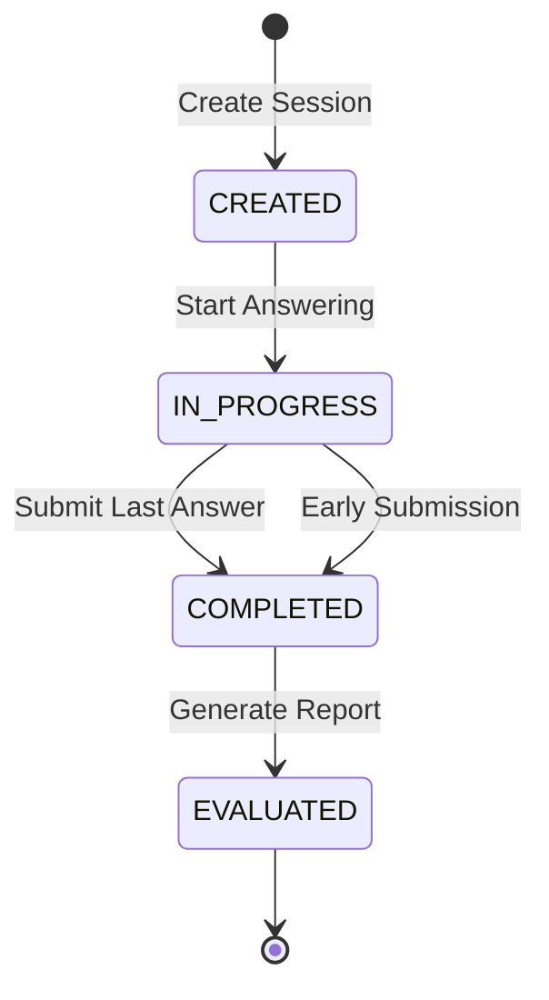
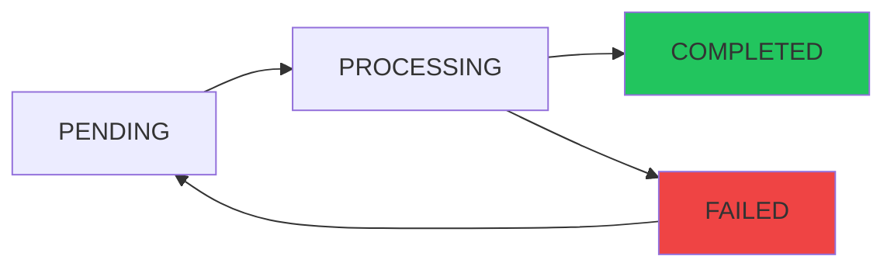
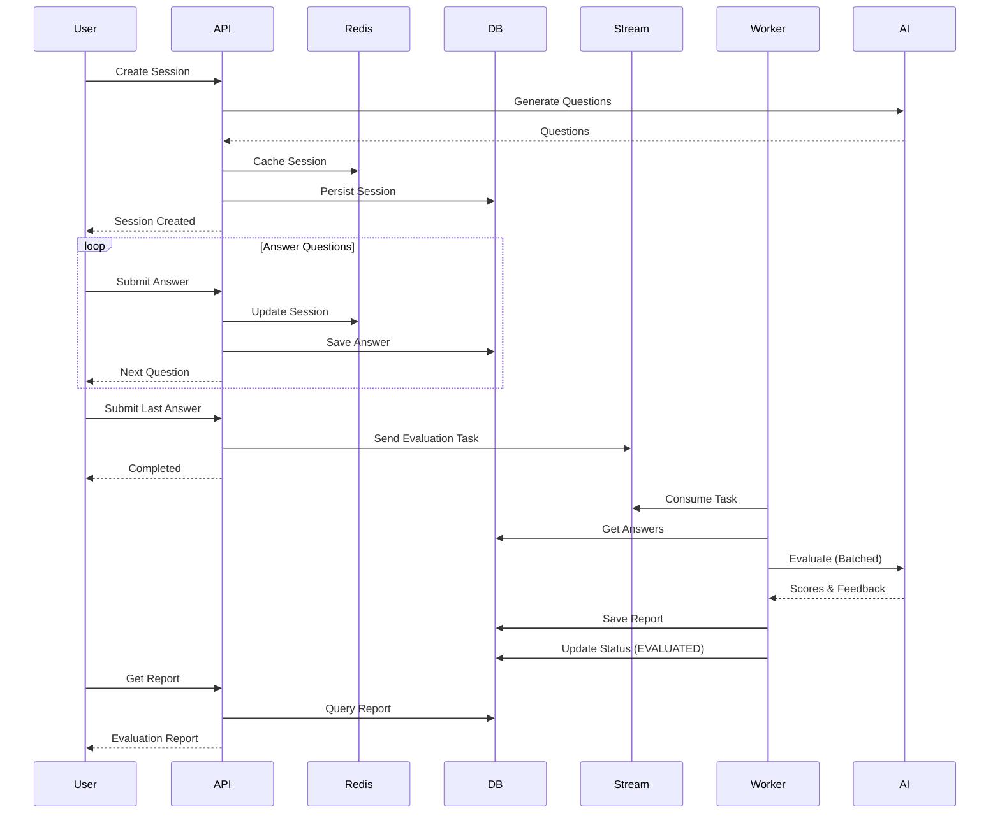

## Overview

The Mock Interview feature provides a realistic interview simulation experience by generating personalized questions based on resume content, supporting multi-round intelligent follow-up questions, and delivering detailed performance evaluations. All session state is managed via Redis cache with database persistence for recovery.

<Note>
Interview sessions are cached in Redis for fast access, with automatic fallback to database when cache expires.
</Note>

## Creating an Interview Session

Users can start a mock interview based on an analyzed resume:

```typescript
POST /api/interview/sessions
```

<Tabs>
  <Tab title="Request Body">
    ```json
    {
      "resumeText": "Full resume content...",
      "resumeId": 123,
      "questionCount": 5,
      "forceCreate": false
    }
    ```
    
    **Parameters**:
    - `resumeText`: Required, extracted text from resume
    - `resumeId`: Optional, links session to a specific resume
    - `questionCount`: Number of questions (default: 5)
    - `forceCreate`: If false, returns existing unfinished session
  </Tab>
  
  <Tab title="Response">
    ```json
    {
      "sessionId": "abc123def456",
      "resumeText": "...",
      "totalQuestions": 5,
      "currentIndex": 0,
      "questions": [
        {
          "index": 0,
          "question": "Describe your experience with Spring Boot microservices",
          "category": "TECHNICAL",
          "answer": null
        }
      ],
      "status": "CREATED"
    }
    ```
  </Tab>
</Tabs>

### Session Creation Flow

<Steps>
  <Step title="Check for Existing Session">
    If `forceCreate` is false and `resumeId` is provided, the system checks for unfinished sessions:
    ```java
    // InterviewSessionService.java:45-51
    if (request.resumeId() != null && !Boolean.TRUE.equals(request.forceCreate())) {
        Optional<InterviewSessionDTO> unfinishedOpt = findUnfinishedSession(request.resumeId());
        if (unfinishedOpt.isPresent()) {
            return unfinishedOpt.get();
        }
    }
    ```
  </Step>
  
  <Step title="Generate Session ID">
    A unique 16-character session identifier is created:
    ```java
    // InterviewSessionService.java:54
    String sessionId = UUID.randomUUID().toString().replace("-", "").substring(0, 16);
    ```
  </Step>
  
  <Step title="Generate Questions">
    The AI generates personalized questions based on resume content, avoiding previously asked questions:
    ```java
    // InterviewSessionService.java:60-70
    List<String> historicalQuestions = persistenceService.getHistoricalQuestionsByResumeId(resumeId);
    List<InterviewQuestionDTO> questions = questionService.generateQuestions(
        request.resumeText(),
        request.questionCount(),
        historicalQuestions
    );
    ```
  </Step>
  
  <Step title="Cache in Redis">
    Session data is stored in Redis with TTL:
    ```java
    // InterviewSessionService.java:73-80
    sessionCache.saveSession(
        sessionId, resumeText, resumeId,
        questions, 0, SessionStatus.CREATED
    );
    ```
  </Step>
  
  <Step title="Persist to Database">
    Session metadata is saved for recovery:
    ```java
    // InterviewSessionService.java:84-89
    persistenceService.saveSession(
        sessionId, request.resumeId(),
        questions.size(), questions
    );
    ```
  </Step>
</Steps>

## Session Status Lifecycle

Interview sessions progress through four distinct states:



<Accordion title="Status Definitions">
  ```java
  // InterviewSessionEntity.java:88-93
  public enum SessionStatus {
      CREATED,      // Session initialized, no answers yet
      IN_PROGRESS,  // User is answering questions
      COMPLETED,    // All questions answered or early submission
      EVALUATED     // AI evaluation report generated
  }
  ```
</Accordion>

## Intelligent Question Generation

The system generates questions with optional follow-up questions:

<CardGroup cols={2}>
  <Card title="Main Questions" icon="question">
    Core interview questions based on:
    - Resume skills and experience
    - Project descriptions
    - Technical keywords
    - Job level indicators
  </Card>
  
  <Card title="Follow-up Questions" icon="comments">
    Intelligent follow-ups that:
    - Dive deeper into main topics
    - Challenge assumptions
    - Test practical knowledge
    - Configurable count (default: 1)
  </Card>
</CardGroup>

### Configuration

```yaml
# application.yml
app:
  interview:
    follow-up-count: 1  # Number of follow-ups per main question
```

<Note>
Follow-up questions are generated in sequence after the main question is answered, creating a natural interview flow.
</Note>

## Answering Questions

### Get Current Question

```typescript
GET /api/interview/sessions/{sessionId}/question
```

**Response**:
```json
{
  "completed": false,
  "question": {
    "index": 0,
    "question": "Explain the benefits of using Redis in your architecture",
    "category": "TECHNICAL",
    "answer": null
  }
}
```

### Save Answer (Draft)

Save an answer without progressing to the next question:

```typescript
PUT /api/interview/sessions/{sessionId}/answers
```

```json
{
  "questionIndex": 0,
  "answer": "Redis provides..."
}
```

<Note>
This allows users to save progress without committing. The `currentIndex` remains unchanged.
</Note>

### Submit Answer

Submit an answer and move to the next question:

```typescript
POST /api/interview/sessions/{sessionId}/answers
```

```json
{
  "questionIndex": 0,
  "answer": "Redis provides in-memory caching, pub/sub messaging, and supports various data structures..."
}
```

<Tabs>
  <Tab title="Submission Flow">
    <Steps>
      <Step title="Validate Question Index">
        Ensure the index is valid and matches current position
      </Step>
      
      <Step title="Update Answer">
        Store the answer in the question object:
        ```java
        // InterviewSessionService.java:287-289
        InterviewQuestionDTO answeredQuestion = question.withAnswer(request.answer());
        questions.set(index, answeredQuestion);
        ```
      </Step>
      
      <Step title="Move to Next Question">
        Increment `currentIndex` by 1
      </Step>
      
      <Step title="Check Completion">
        If this was the last question:
        - Update status to **COMPLETED**
        - Set evaluation status to **PENDING**
        - Send evaluation task to Redis Stream
      </Step>
      
      <Step title="Update Cache and Database">
        Persist answer and update session state in both Redis and database
      </Step>
    </Steps>
  </Tab>
  
  <Tab title="Response">
    ```json
    {
      "hasNextQuestion": true,
      "nextQuestion": {
        "index": 1,
        "question": "How did you handle database transaction management?",
        "category": "TECHNICAL",
        "answer": null
      },
      "currentIndex": 1,
      "totalQuestions": 5
    }
    ```
  </Tab>
</Tabs>

### Early Submission

Users can submit the interview before answering all questions:

```typescript
POST /api/interview/sessions/{sessionId}/complete
```

This:
1. Updates status to **COMPLETED**
2. Triggers asynchronous evaluation for answered questions
3. Unanswered questions are scored as 0

<Warning>
Early submission cannot be undone. Ensure users confirm this action.
</Warning>

## Evaluation Process

Evaluation happens asynchronously after the interview is completed:

<Steps>
  <Step title="Evaluation Task Queued">
    When the last answer is submitted or interview is completed early:
    ```java
    // InterviewSessionService.java:322-324
    persistenceService.updateEvaluateStatus(sessionId, AsyncTaskStatus.PENDING, null);
    evaluateStreamProducer.sendEvaluateTask(sessionId);
    ```
  </Step>
  
  <Step title="Batch Evaluation Strategy">
    To avoid token limits, answers are evaluated in batches:
    
    ```yaml
    # application.yml
    app:
      interview:
        evaluation:
          batch-size: 8  # Evaluate 8 answers per AI call
    ```
    
    <Accordion title="Why Batch Evaluation?">
    Large interviews (10+ questions) can exceed AI model token limits. The system:
    - Divides answers into configurable batches (default: 8)
    - Evaluates each batch independently
    - Aggregates scores and feedback
    - Generates a final summary report
    
    This ensures stable evaluation even for lengthy interviews.
    </Accordion>
  </Step>
  
  <Step title="Individual Answer Scoring">
    Each answer is scored on:
    - **Accuracy** (0-40 points): Technical correctness
    - **Completeness** (0-30 points): Coverage of key points
    - **Clarity** (0-30 points): Communication effectiveness
    
    Total per answer: **0-100 points**
  </Step>
  
  <Step title="Overall Report Generation">
    The system generates:
    - **Overall score**: Weighted average of all answers
    - **Strengths**: List of strong points across answers
    - **Improvements**: Actionable suggestions for weak areas
    - **Reference answers**: Model answers for each question
  </Step>
  
  <Step title="Status Update">
    Evaluation status transitions:
    ```
    PENDING → PROCESSING → COMPLETED
    ```
    
    Session status updates to **EVALUATED** when report is ready.
  </Step>
</Steps>

### Evaluation Status Flow



## Viewing Interview Reports

Retrieve the comprehensive evaluation report:

```typescript
GET /api/interview/sessions/{sessionId}/report
```

<Tabs>
  <Tab title="Response Structure">
    ```json
    {
      "sessionId": "abc123def456",
      "overallScore": 78,
      "overallFeedback": "Strong technical knowledge with room for improvement in communication...",
      "strengths": [
        "Deep understanding of microservices architecture",
        "Practical experience with Redis and PostgreSQL",
        "Clear explanation of trade-offs"
      ],
      "improvements": [
        "Provide more specific examples from projects",
        "Structure answers with introduction-body-conclusion",
        "Quantify impact with metrics when possible"
      ],
      "questionEvaluations": [
        {
          "questionIndex": 0,
          "question": "Describe your experience with Spring Boot",
          "userAnswer": "I have used Spring Boot for...",
          "score": 85,
          "feedback": "Excellent explanation with practical examples",
          "referenceAnswer": "Spring Boot simplifies..."
        }
      ]
    }
    ```
  </Tab>
  
  <Tab title="Frontend Display">
    The report page typically shows:
    - **Overall score gauge** (0-100)
    - **Strengths and improvements** sections
    - **Question-by-question breakdown** with:
      - User answer
      - Score and feedback
      - Reference answer (collapsed by default)
    - **Export button** to download PDF
    - **Start new interview** action
  </Tab>
</Tabs>

## PDF Export

Generate a professional PDF report:

```typescript
GET /api/interview/sessions/{sessionId}/export
```

<Accordion title="PDF Report Contents">
The exported PDF includes:

1. **Cover Page**
   - Session ID and timestamp
   - Resume reference (if linked)
   - Overall score

2. **Executive Summary**
   - Overall feedback
   - Key strengths
   - Priority improvements

3. **Detailed Evaluation**
   - Each question with:
     - Question text and category
     - User's answer
     - Score breakdown
     - Detailed feedback
     - Reference answer

4. **Performance Trends** (if multiple sessions)
   - Score progression
   - Category strengths

Generated using **iText 8** with Chinese font support.
</Accordion>

## Session Recovery

Sessions are automatically recovered from the database if Redis cache expires:

```java
// InterviewSessionService.java:165-216
private CachedSession restoreSessionFromDatabase(String sessionId) {
    Optional<InterviewSessionEntity> entityOpt = persistenceService.findBySessionId(sessionId);
    return entityOpt.map(this::restoreSessionFromEntity).orElse(null);
}
```

<Steps>
  <Step title="Cache Miss Detection">
    When Redis cache doesn't contain the session
  </Step>
  
  <Step title="Database Query">
    Retrieve session entity by sessionId
  </Step>
  
  <Step title="Restore Questions">
    Deserialize questions from JSON
  </Step>
  
  <Step title="Restore Answers">
    Load saved answers and merge with questions
  </Step>
  
  <Step title="Re-cache">
    Save restored session back to Redis
  </Step>
</Steps>

<Note>
Users experience seamless continuity even if Redis is restarted or cache expires.
</Note>

## Deleting Sessions

Remove an interview session and all associated data:

```typescript
DELETE /api/interview/sessions/{sessionId}
```

This deletes:
- Session entity
- All answer records
- Cached data in Redis

## Rate Limiting

Protection against abuse:

```java
// InterviewController.java:37
@RateLimit(dimensions = {RateLimit.Dimension.GLOBAL, RateLimit.Dimension.IP}, count = 5)
```

- **Session creation**: 5 per time window
- **Answer submission**: 10 per time window (global)

## Best Practices

<CardGroup cols={2}>
  <Card title="Check for Unfinished Sessions" icon="clock-rotate-left">
    Before creating a new session, call `/sessions/unfinished/{resumeId}` to resume existing sessions.
  </Card>
  
  <Card title="Implement Auto-save" icon="floppy-disk">
    Use the PUT `/answers` endpoint to periodically save drafts as users type.
  </Card>
  
  <Card title="Poll Evaluation Status" icon="rotate">
    After completion, poll every 3-5 seconds for evaluation completion:
    ```typescript
    while (session.evaluateStatus !== 'COMPLETED') {
      await sleep(3000);
      session = await getSession(sessionId);
    }
    ```
  </Card>
  
  <Card title="Handle Long Evaluations" icon="hourglass">
    Evaluation can take 30-60 seconds for large interviews. Show progress indicators.
  </Card>
</CardGroup>

## Error Handling

<AccordionGroup>
  <Accordion title="Session Not Found">
    **Error**: `INTERVIEW_SESSION_NOT_FOUND`
    
    **Causes**:
    - Invalid session ID
    - Session deleted
    - Session expired (both Redis and DB)
    
    **Solution**: Start a new interview session.
  </Accordion>
  
  <Accordion title="Interview Already Completed">
    **Error**: `INTERVIEW_ALREADY_COMPLETED`
    
    **Cause**: Attempting to submit answers to a completed session
    
    **Solution**: View the report instead of trying to submit more answers.
  </Accordion>
  
  <Accordion title="Evaluation Failed">
    **Error**: `evaluateStatus = FAILED`
    
    **Causes**:
    - AI API timeout
    - Token limit exceeded (despite batching)
    - Invalid answer format
    
    **Solution**: Check `evaluateError` field for details. Users can manually trigger re-evaluation (if endpoint exists).
  </Accordion>
</AccordionGroup>

## Architecture Diagram



## Related API Endpoints

For complete API reference, see:
- [Create Session](/api/interview/create-session)
- [Submit Answer](/api/interview/submit-answer)
- [Get Report](/api/interview/get-report)
- [Export Report](/api/interview/export)
- [Delete Session](/api/interview/delete)