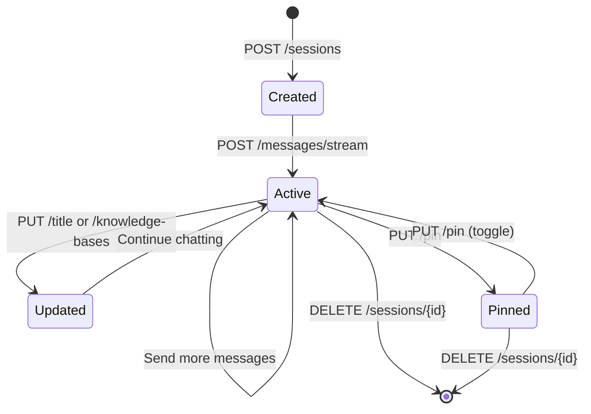

The RAG Chat feature provides a persistent, session-based chat interface similar to ChatGPT, where users can have multi-turn conversations with AI that's grounded in uploaded knowledge base documents. Unlike the stateless knowledge base query API, RAG Chat maintains conversation history and context across messages.

## Overview

RAG Chat sessions allow users to:
- Create persistent chat sessions with custom titles
- Have multi-turn conversations with full message history
- Pin important sessions for quick access
- Switch between different knowledge bases mid-conversation
- Stream AI responses in real-time with SSE
- Manage and organize chat sessions

<CardGroup cols={2}>
  <Card title="Persistent Context" icon="messages">
    Full conversation history maintained across sessions
  </Card>
  <Card title="Knowledge Base Integration" icon="database">
    Query multiple knowledge bases with vector search
  </Card>
  <Card title="Real-time Streaming" icon="bolt">
    Server-Sent Events for typewriter-style responses
  </Card>
  <Card title="Session Management" icon="folder">
    Organize chats with titles, pinning, and deletion
  </Card>
</CardGroup>

## Session Lifecycle



## Creating a Session

Create a new RAG Chat session with initial knowledge bases:

```typescript
interface CreateSessionRequest {
  knowledgeBaseIds: number[];  // Knowledge bases to query
  title?: string;               // Optional custom title
}

// Example
const response = await fetch('http://localhost:8080/api/rag-chat/sessions', {
  method: 'POST',
  headers: { 'Content-Type': 'application/json' },
  body: JSON.stringify({
    knowledgeBaseIds: [1, 2],
    title: 'Java Spring Boot Questions'
  })
});

const { data } = await response.json();
// data: { sessionId: 123, title: 'Java Spring Boot Questions', ... }
```

## Sending Messages

Send a message and receive streaming AI response:

<Tabs>
  <Tab title="JavaScript (EventSource)">
    ```javascript
    const sessionId = 123;
    const question = "How does Spring AI handle embeddings?";

    // Create EventSource for SSE
    const eventSource = new EventSource(
      `http://localhost:8080/api/rag-chat/sessions/${sessionId}/messages/stream?` +
      new URLSearchParams({ question })
    );

    let fullResponse = '';

    eventSource.onmessage = (event) => {
      const chunk = event.data.replace(/\\n/g, '\n').replace(/\\r/g, '\r');
      fullResponse += chunk;
      console.log('Chunk:', chunk);
    };

    eventSource.onerror = (error) => {
      console.error('Stream error:', error);
      eventSource.close();
    };

    // EventSource doesn't emit a 'complete' event, so track readyState
    const checkComplete = setInterval(() => {
      if (eventSource.readyState === EventSource.CLOSED) {
        clearInterval(checkComplete);
        console.log('Full response:', fullResponse);
      }
    }, 100);
    ```
  </Tab>
  
  <Tab title="React Hook">
    ```typescript
    import { useState, useEffect, useRef } from 'react';

    function useRagChat(sessionId: number) {
      const [messages, setMessages] = useState<Message[]>([]);
      const [isStreaming, setIsStreaming] = useState(false);
      const eventSourceRef = useRef<EventSource | null>(null);

      const sendMessage = (question: string) => {
        setIsStreaming(true);
        
        const url = `http://localhost:8080/api/rag-chat/sessions/${sessionId}/messages/stream`;
        const params = new URLSearchParams({ question });
        
        eventSourceRef.current = new EventSource(`${url}?${params}`);
        
        let aiResponse = '';
        
        eventSourceRef.current.onmessage = (event) => {
          const chunk = event.data.replace(/\\n/g, '\n');
          aiResponse += chunk;
          
          setMessages(prev => {
            const updated = [...prev];
            const lastMsg = updated[updated.length - 1];
            
            if (lastMsg?.role === 'assistant' && !lastMsg.completed) {
              lastMsg.content = aiResponse;
            } else {
              updated.push({
                role: 'assistant',
                content: aiResponse,
                completed: false
              });
            }
            return updated;
          });
        };
        
        eventSourceRef.current.onerror = () => {
          setIsStreaming(false);
          setMessages(prev => {
            const updated = [...prev];
            const lastMsg = updated[updated.length - 1];
            if (lastMsg) lastMsg.completed = true;
            return updated;
          });
          eventSourceRef.current?.close();
        };
      };

      useEffect(() => {
        return () => eventSourceRef.current?.close();
      }, []);

      return { messages, isStreaming, sendMessage };
    }
    ```
  </Tab>
</Tabs>

<Note>
The streaming endpoint uses Server-Sent Events (SSE) with newline escaping (`\n` → `\\n`). Make sure to unescape when displaying.
</Note>

## Managing Sessions

### List All Sessions

```bash
curl 'http://localhost:8080/api/rag-chat/sessions'
```

```json
{
  "code": 200,
  "message": "success",
  "data": [
    {
      "sessionId": 123,
      "title": "Java Spring Boot Questions",
      "isPinned": true,
      "messageCount": 15,
      "lastMessageAt": "2024-03-10T10:30:00",
      "createdAt": "2024-03-10T09:00:00"
    }
  ]
}
```

### Get Session Details

Retrieve full conversation history:

```bash
curl 'http://localhost:8080/api/rag-chat/sessions/123'
```

```json
{
  "code": 200,
  "data": {
    "sessionId": 123,
    "title": "Java Spring Boot Questions",
    "isPinned": true,
    "knowledgeBaseIds": [1, 2],
    "messages": [
      {
        "messageId": 1,
        "role": "user",
        "content": "How does Spring AI work?",
        "createdAt": "2024-03-10T09:05:00"
      },
      {
        "messageId": 2,
        "role": "assistant",
        "content": "Spring AI provides...",
        "createdAt": "2024-03-10T09:05:15"
      }
    ]
  }
}
```

### Update Session Title

```bash
curl -X PUT 'http://localhost:8080/api/rag-chat/sessions/123/title' \
  -H 'Content-Type: application/json' \
  -d '{"title":"Spring AI Deep Dive"}'
```

### Pin/Unpin Session

Toggle pin status for quick access:

```bash
curl -X PUT 'http://localhost:8080/api/rag-chat/sessions/123/pin'
```

### Switch Knowledge Bases

Change which knowledge bases the session queries:

```bash
curl -X PUT 'http://localhost:8080/api/rag-chat/sessions/123/knowledge-bases' \
  -H 'Content-Type: application/json' \
  -d '{"knowledgeBaseIds":[3,4,5]}'
```

### Delete Session

```bash
curl -X DELETE 'http://localhost:8080/api/rag-chat/sessions/123'
```

<Warning>
Deleting a session permanently removes all messages and conversation history.
</Warning>

## Streaming Implementation Details

<Accordion title="How SSE Streaming Works">
  1. **Request**: Client sends POST to `/messages/stream` with question
  2. **Prepare**: Backend saves user message and creates AI message placeholder
  3. **Stream**: AI response chunks streamed as SSE events with escaped newlines
  4. **Complete**: After stream ends, full response saved to database
  5. **Error Handling**: If stream fails, partial content still saved

  **SSE Format**:
  ```
  data: This is a chunk\\nwith escaped newlines
  
  data: Next chunk here
  
  ```

  The backend escapes `\n` as `\\n` and `\r` as `\\r` to preserve SSE protocol.
</Accordion>

<Accordion title="Message Persistence">
  - User messages saved immediately when request received
  - AI messages created as placeholders before streaming starts
  - Full AI response updated after stream completes
  - Partial responses saved even if stream errors
  - Message IDs returned in session detail endpoint
</Accordion>

## Use Cases

<CardGroup cols={2}>
  <Card title="Research & Learning" icon="graduation-cap">
    Students exploring documentation with follow-up questions and clarifications
  </Card>
  <Card title="Technical Support" icon="headset">
    Engineers querying internal knowledge bases with conversation context
  </Card>
  <Card title="Documentation Q&A" icon="book">
    Developers asking questions about codebases with multi-turn debugging
  </Card>
  <Card title="Interview Prep" icon="clipboard-question">
    Job seekers practicing with knowledge base of common interview questions
  </Card>
</CardGroup>

## Comparison with Knowledge Base Query

| Feature | RAG Chat Sessions | Knowledge Base Query |
|---------|------------------|---------------------|
| **State** | Stateful (persistent history) | Stateless (one-off query) |
| **Context** | Multi-turn conversation | Single question |
| **History** | Full message history saved | No history |
| **Use Case** | Interactive exploration | Quick lookups |
| **API** | `/api/rag-chat/*` | `/api/knowledgebase/query` |

Use RAG Chat for interactive, exploratory conversations. Use Knowledge Base Query for quick, one-off lookups.

## See Also

<CardGroup cols={2}>
  <Card title="Knowledge Base" icon="database" href="/features/knowledge-base">
    Upload and manage knowledge base documents
  </Card>
  <Card title="RAG Chat API" icon="code" href="/api/rag-chat/endpoints">
    Complete API reference for RAG Chat endpoints
  </Card>
</CardGroup>
