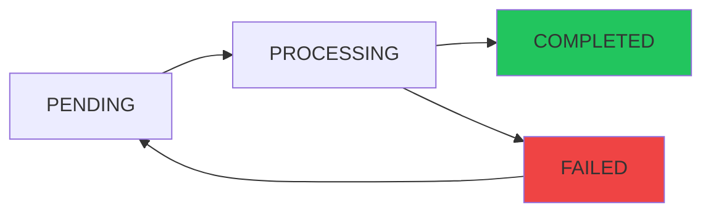
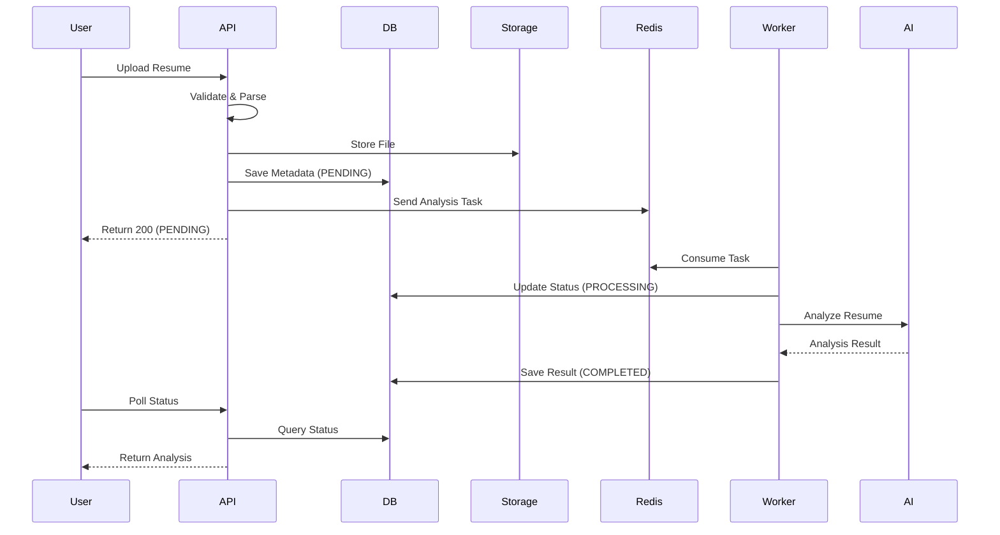

## Overview

The Resume Analysis feature uses AI to evaluate uploaded resumes across multiple dimensions, providing detailed scoring, strengths identification, and actionable improvement suggestions. The system supports multiple file formats and processes analysis asynchronously using Redis Streams for optimal performance.

<Note>
All resume analysis operations are processed asynchronously to ensure fast response times and handle large files efficiently.
</Note>

## Supported File Formats

The system accepts the following resume formats:

<CardGroup cols={2}>
  <Card title="PDF Documents" icon="file-pdf">
    Native PDF parsing with text extraction support
  </Card>
  <Card title="Word Documents" icon="file-word">
    DOCX and DOC format support
  </Card>
  <Card title="Text Files" icon="file-text">
    Plain text (TXT) and Markdown (MD) files
  </Card>
  <Card title="Max File Size" icon="database">
    Up to 10MB per resume file
  </Card>
</CardGroup>

## Upload and Analysis Workflow

The resume analysis follows an asynchronous processing pattern for reliability and scalability:

<Steps>
  <Step title="Upload Resume">
    Users upload a resume file through the web interface. The system validates:
    - File size (max 10MB)
    - File type (PDF, DOCX, DOC, TXT, MD)
    - File content integrity
  </Step>

  <Step title="Duplicate Detection">
    The system calculates a SHA-256 hash of the file content to detect duplicates:
    ```java
    // ResumeEntity.java:23
    @Column(nullable = false, unique = true, length = 64)
    private String fileHash;
    ```
    If an identical resume was previously uploaded, the system returns the existing analysis immediately.
  </Step>

  <Step title="Text Extraction">
    Apache Tika parses the resume and extracts text content:
    ```java
    // ResumeUploadService.java:65
    String resumeText = parseService.parseResume(file);
    ```
    <Warning>
    Scanned PDFs without text layers cannot be parsed. Ensure your PDF contains selectable text.
    </Warning>
  </Step>

  <Step title="Storage">
    The original file is uploaded to S3-compatible storage (RustFS or MinIO):
    ```java
    // ResumeUploadService.java:71
    String fileKey = storageService.uploadResume(file);
    String fileUrl = storageService.getFileUrl(fileKey);
    ```
  </Step>

  <Step title="Database Persistence">
    Resume metadata is saved with status **PENDING**:
    ```java
    // ResumeEntity.java:58-61
    @Enumerated(EnumType.STRING)
    private AsyncTaskStatus analyzeStatus = AsyncTaskStatus.PENDING;
    ```
  </Step>

  <Step title="Async Analysis Queue">
    An analysis task is sent to Redis Stream:
    ```java
    // ResumeUploadService.java:79
    analyzeStreamProducer.sendAnalyzeTask(savedResume.getId(), resumeText);
    ```
    The API returns immediately with status **PENDING**.
  </Step>

  <Step title="AI Analysis Processing">
    A background consumer picks up the task and:
    - Updates status to **PROCESSING**
    - Sends resume text to AI model (Alibaba Cloud DashScope)
    - Receives structured analysis response
    - Updates status to **COMPLETED** or **FAILED**
  </Step>
</Steps>

## Status Flow

The analysis progresses through the following states:



<Accordion title="Status Definitions">
  - **PENDING**: Resume uploaded, awaiting analysis worker
  - **PROCESSING**: AI model is analyzing the resume
  - **COMPLETED**: Analysis finished successfully
  - **FAILED**: Analysis encountered an error (automatic retry up to 3 times)
</Accordion>

## Analysis Dimensions

The AI evaluates resumes across five key dimensions, with a total score out of 100:

<CardGroup cols={2}>
  <Card title="Content Completeness" icon="list-check">
    **0-25 points**
    
    Evaluates completeness of work experience, education, projects, and personal information.
  </Card>
  
  <Card title="Structure Clarity" icon="sitemap">
    **0-20 points**
    
    Assesses logical organization, section hierarchy, and readability.
  </Card>
  
  <Card title="Skill Matching" icon="bullseye">
    **0-25 points**
    
    Analyzes relevance of technical skills, certifications, and domain expertise.
  </Card>
  
  <Card title="Professional Expression" icon="pen-fancy">
    **0-15 points**
    
    Reviews language quality, grammar, conciseness, and professionalism.
  </Card>
  
  <Card title="Project Experience" icon="code">
    **0-15 points**
    
    Evaluates project descriptions, technical depth, and measurable achievements.
  </Card>
</CardGroup>

### Analysis Entity Structure

```java
// ResumeAnalysisEntity.java:24-45
private Integer overallScore;      // Total score (0-100)
private Integer contentScore;      // Content completeness (0-25)
private Integer structureScore;    // Structure clarity (0-20)
private Integer skillMatchScore;   // Skill matching (0-25)
private Integer expressionScore;   // Professional expression (0-15)
private Integer projectScore;      // Project experience (0-15)
private String summary;            // AI-generated summary
private String strengthsJson;      // List of strengths (JSON)
private String suggestionsJson;    // Improvement suggestions (JSON)
```

## Viewing Analysis Results

### Resume List

Access all uploaded resumes via the **Resume History** page:

```typescript
GET /api/resumes
```

Returns:
- Resume ID and filename
- Upload timestamp
- Current analysis status
- Overall score (when completed)

### Resume Detail

View comprehensive analysis for a specific resume:

```typescript
GET /api/resumes/{id}/detail
```

<Tabs>
  <Tab title="Response Structure">
    ```json
    {
      "id": 123,
      "filename": "john_doe_resume.pdf",
      "uploadedAt": "2026-03-10T14:30:00",
      "analyzeStatus": "COMPLETED",
      "analysis": {
        "overallScore": 82,
        "contentScore": 22,
        "structureScore": 18,
        "skillMatchScore": 23,
        "expressionScore": 12,
        "projectScore": 14,
        "summary": "Strong technical background...",
        "strengths": [
          "Solid Java and Spring Boot experience",
          "Clear project descriptions with metrics"
        ],
        "suggestions": [
          "Add more quantifiable achievements",
          "Include certification details"
        ]
      }
    }
    ```
  </Tab>
  
  <Tab title="Frontend Display">
    The detail page shows:
    - **Overall score** with visual gauge
    - **Dimension breakdown** as radar chart
    - **Summary section** with AI insights
    - **Strengths** as bulleted list
    - **Improvement suggestions** as actionable items
    - **Export button** to download PDF report
  </Tab>
</Tabs>

## PDF Export

Generate a professional PDF report of the analysis:

```typescript
GET /api/resumes/{id}/export
```

<Accordion title="PDF Generation Details">
The system uses **iText 8** to generate structured PDF reports:

```java
// ResumeController.java:74-88
@GetMapping("/api/resumes/{id}/export")
public ResponseEntity<byte[]> exportAnalysisPdf(@PathVariable Long id) {
    var result = historyService.exportAnalysisPdf(id);
    String filename = URLEncoder.encode(result.filename(), StandardCharsets.UTF_8);
    
    return ResponseEntity.ok()
        .header(HttpHeaders.CONTENT_DISPOSITION, "attachment; filename*=UTF-8''" + filename)
        .contentType(MediaType.APPLICATION_PDF)
        .body(result.pdfBytes());
}
```

The PDF includes:
- **Cover page** with resume metadata
- **Score summary** with visual charts
- **Detailed analysis** for each dimension
- **Strengths and suggestions** sections
- **Chinese font support** (ZhuqueFangsong-Regular.ttf)
</Accordion>

## Manual Reanalysis

If analysis fails, users can manually trigger a retry:

```typescript
POST /api/resumes/{id}/reanalyze
```

<Note>
This endpoint is rate-limited to 2 requests per IP to prevent abuse.
</Note>

The reanalysis process:
1. Resets status to **PENDING**
2. Clears previous error message
3. Retrieves cached resume text (or re-downloads from storage)
4. Sends new analysis task to Redis Stream

## Deleting Resumes

Remove a resume and all associated analysis data:

```typescript
DELETE /api/resumes/{id}
```

This operation:
- Deletes the resume entity from the database
- Removes all analysis records
- Does **not** delete the file from object storage (for audit trail)

## Rate Limiting

The upload endpoint is protected by rate limiting:

```java
// ResumeController.java:43
@RateLimit(dimensions = {RateLimit.Dimension.GLOBAL, RateLimit.Dimension.IP}, count = 5)
```

<Warning>
Users are limited to **5 resume uploads per time window** (both globally and per IP address).
</Warning>

## Error Handling

Common error scenarios:

<AccordionGroup>
  <Accordion title="Resume Parse Failed">
    **Error**: `无法从文件中提取文本内容`
    
    **Causes**:
    - Scanned PDF without text layer
    - Corrupted or password-protected file
    - Unsupported file encoding
    
    **Solution**: Convert to a text-based format or use OCR preprocessing.
  </Accordion>
  
  <Accordion title="Analysis Failed">
    **Error**: Analysis status stuck at `FAILED`
    
    **Causes**:
    - AI API key invalid or expired
    - AI model timeout or rate limit
    - Resume text too long (exceeds token limit)
    
    **Solution**: Check `analyzeError` field for details and use manual reanalysis.
  </Accordion>
  
  <Accordion title="File Too Large">
    **Error**: `文件大小超过限制`
    
    **Limit**: 10MB
    
    **Solution**: Compress or optimize the resume file.
  </Accordion>
</AccordionGroup>

## Best Practices

<CardGroup cols={2}>
  <Card title="Optimize File Size" icon="compress">
    Keep resumes under 5MB for faster processing. Use PDF compression tools if needed.
  </Card>
  
  <Card title="Use Text-Based PDFs" icon="file-lines">
    Avoid scanned images. Ensure PDF text is selectable before upload.
  </Card>
  
  <Card title="Monitor Status" icon="clock">
    Implement polling (every 3-5 seconds) to check analysis status until completion.
  </Card>
  
  <Card title="Handle Failures Gracefully" icon="triangle-exclamation">
    Display error messages clearly and provide a retry button for failed analyses.
  </Card>
</CardGroup>

## Architecture Diagram



## Related API Endpoints

For complete API reference, see:
- [Upload Resume](/api/resume/upload)
- [List Resumes](/api/resume/list)
- [Resume Detail](/api/resume/detail)
- [Export PDF](/api/resume/export)
- [Delete Resume](/api/resume/delete)